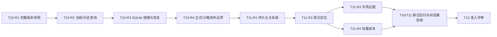

# T10、T11 修改建议及验收标准

## 1. 文档信息

| 项目 | 内容 |
|---|---|
| 项目 | 产品智策轻量交付版，路线 A |
| 文档用途 | 指导 T10、T11 整改，并作为进入 T12 前的统一验收依据 |
| 检查日期 | 2026-08-04 |
| 当前分支 | `codex/t11-trace` |
| 当前 HEAD | `3b20512 feat: add atomic governed baseline release` |
| 交付目标 | 2026-08-30 正式演示版就绪，9 月现场实时演示完整流程 |
| 范围约束 | 保留轻量成本联动；不做损益测算；不增加 AI 自动审批或自动发布 |

本文档只定义整改方案和验收门槛，不代表 T10、T11 已通过验收。开发 Agent 应以本文档、总计划和两份开发/设计文档为共同约束；发生冲突时，优先保证 Manifest 权威、人工批准、来源可信、正式/沙箱隔离和历史版本可复现。

## 2. 当前结论与基线

### 2.1 当前状态

| 节点 | 当前状态 | 结论 |
|---|---|---|
| T10 | 已提交到 `3b20512`，原子发布、复核、恢复和发布页面主体已实现 | 存在发布后版本快照不一致、当前查询为空、正式/沙箱边界缺失等阻断问题，未完成 |
| T11 | 代码位于未提交工作区，专项功能和测试主体已实现 | 追溯链不是由持久化 Relation 构建，原文定位、市场证据和成本来源校验不足，未完成 |
| T12 | 依赖 T06-T11 完成 | 当前不得开始制作正式演示快照；可阅读计划，但不得冻结错误数据结构 |

### 2.2 2026-08-04 验证结果

| 检查项 | 结果 |
|---|---|
| T10/T11 重点测试 | `98 passed` |
| 全量测试 | `569 passed` |
| Python `compileall` | 通过 |
| `git diff --check` | 通过 |
| Ruff check | 失败，3 个 `E501` |
| Ruff format check | 失败，3 个文件待格式化 |
| T11 Git 状态 | 6 个已跟踪文件修改，9 个未跟踪文件，尚未形成提交 |
| T11 实施报告/进度台账 | 缺失 |
| T10/T11 真实浏览器验收 | T10 的 1440x1024 和 390x844 尚未完成；T11 也尚无真实浏览器证据 |

当前自动化测试通过不能替代业务验收。现有测试没有覆盖“真实发布后立即查询当前版本和历史版本”的跨用例流程，因此没有发现发布后的空结果问题。

## 3. 整改原则与依赖顺序



必须按上述顺序推进。T11 依赖 T10 发布后产生一致的新基线；若先用当前错误快照制作 T11 或 T12 数据，后续会同时返工查询、追溯、缓存和快照。

通用不变量：

1. Manifest 是当前生效基线的唯一权威，SQLite 只能作为可重建镜像。
2. 每个版本目录必须是完整快照，不是只包含变更卡片的增量包。
3. 当前查询和历史查询必须读取各自版本的数据，不得混用版本。
4. 正式结论必须能解析到真实 SourceRecord 和引用位置；仅有字符串 ID 不等于有证据。
5. Relation 只能来自已持久化事实，展示层不得自行猜测关系。
6. 缺少正式成本参数时只允许明确沙箱数据，系统自动标记，不由用户用复选框自行声明。
7. 轻量成本联动只输出确定性成本提示，不输出收入、利润、ROI 或损益结论。

## 4. T10 修改建议

### T10-R1：修复完整版本快照

**现状问题**

- `MarkdownStore.build_release_cards()` 只给目标卡更新 `product_version`，未变化卡仍保留父版本。
- `build_release_full_document()` 只替换业务正文，没有把 `full.md` 的“当前版本”更新为目标版本。
- 当前测试明确断言未变化卡保留旧版本，实际上固化了错误行为。
- 混合版本快照会触发 `VER-001`，也会让按目标版本筛选的查询和追溯返回空结果或缺卡。

**指定修改**

1. 修改 `src/infrastructure/files/markdown_store.py`：
   - 读取父版本 `cards.json` 后，校验所有卡都属于 Manifest 当前版本；混合版本输入直接 fail closed。
   - 只修改目标卡的 `content`；所有进入新快照的卡统一把 `product_version` 设置为 `change.target_version`。
   - 未变化卡保留业务内容和原业务更新时间；目标卡的 `updated_at` 使用发布时间。
   - 校验卡片 ID 在快照内唯一，且恰好一个目标卡匹配 `before_content`。
2. 更新 `full.md`：
   - 精确识别且只允许一个版本声明，例如 `当前版本：{parent_version}`。
   - 同时完成版本声明和目标正文替换；任一位置为 0 个或多于 1 个时发布失败。
   - 生成后断言父版本声明不再存在，目标版本声明恰好出现一次。
3. `release.json` 保留父版本、目标版本以及 `full.md`、`cards.json`、`diff.md` 三个内容文件的哈希；建议增加 `card_count`。`release.json` 自身的完整性由外层候选清单或目录快照校验，不能在自身内容中记录自身哈希。
4. 修改现有成功测试，不再允许未变化卡保留父版本。

**必须新增的测试**

| 用例 ID | 场景 | 通过条件 |
|---|---|---|
| T10-A01 | 两张卡只修改一张并发布 | 新 `cards.json` 两张卡均为目标版本，只有目标卡正文变化 |
| T10-A02 | 发布后检查 `full.md` | 目标版本声明恰好一次，父版本声明为零次 |
| T10-A03 | 父快照本身混合版本 | 发布失败，Manifest 和 SQLite 均不变 |
| T10-A04 | 版本声明缺失或重复 | 发布失败，目标目录未生效 |
| T10-A05 | 卡片 ID 重复、目标卡缺失或重复 | fail closed，不允许发布 |

### T10-R2：补齐发布后当前查询与历史查询

**现状问题**

- `RunQuery` 按 `product_version` 从 SQLite `knowledge_cards` 读取卡片。
- 发布事务没有把新版本完整卡片镜像到 SQLite，因此发布后当前查询得到 0 张生效卡。
- 若直接把 SQLite 卡片全部覆盖为新版本，历史查询又会失去旧版本卡片。
- T10 现有测试没有覆盖 `PublishBaseline -> RunQuery(current) -> RunQuery(historical)`。

**推荐实现**

1. 新增窄端口 `BaselineCardReader`，将不可变版本目录中的 `cards.json` 作为版本查询来源：
   - 当前版本由 Manifest 提供路径和 SHA-256。
   - 历史版本由 Baseline 的不可变资产元数据提供路径和 SHA-256。
   - 每次读取必须执行路径约束、文件哈希和 `KnowledgeCard` 结构校验。
2. 为历史版本保存可验证的 `full_document_sha256` 和 `card_snapshot_sha256`：
   - 优先在 `Baseline`/SQLite 中增加这两个字段并迁移；或者建立等价的只读资产清单表。
   - 不允许为了省事无哈希读取历史 `cards.json`。
3. `RunQuery` 的 effective/historical 卡片改由 `BaselineCardReader` 提供；候选和冲突提示仍可由 SQLite 当前工作数据提供，但必须明确版本范围。
4. 当前发布成功后，SQLite 仍需镜像目标版本完整卡片，供 Lint、追溯和本地列表使用；历史查询不依赖这份当前镜像。

**必须新增的跨用例测试**

| 用例 ID | 场景 | 通过条件 |
|---|---|---|
| T10-A06 | 从 `LLD-724_1` 发布到 `LLD-724_2` 后立即当前查询 | 返回两张当前卡；目标卡为新正文；未变化卡仍可用；返回版本为 `_2` |
| T10-A07 | 同一环境查询历史 `_1` | 返回父版本两张卡；目标卡为旧正文；不得混入 `_2` 内容 |
| T10-A08 | 篡改历史 `cards.json` | 返回完整性错误，不调用模型，不降级成无验证读取 |
| T10-A09 | 当前查询后切换历史再切回当前 | 三次结果版本和引用始终匹配所选版本 |

测试应使用真实 `PublishBaseline` 和真实 `RunQuery` 组合，不得直接插入“已经发布”的 Baseline 来绕过发布过程。

### T10-R3：同步 SQLite 当前卡片镜像和启动恢复

**指定修改**

1. 扩展 `ReleaseUnitOfWork.publish()`，接收已校验的新版本完整卡片集合。
2. 在同一个 `BEGIN IMMEDIATE` 事务内完成：
   - 父 Baseline 置为 `superseded`；
   - 新 Baseline 置为 `effective`；
   - ChangeRequest 置为 `published`；
   - Project 当前基线更新；
   - 当前 `knowledge_cards` 镜像更新为新快照；
   - 发布产生的 Relation 和审计事件写入。
3. 扩展 `ReconciliationService`：
   - `_mirror_matches()` 同时比较当前卡片的数量、ID、版本、状态和内容摘要；
   - `rebuild_current_from_manifest()` 从 Manifest 指向且哈希已验证的 `cards.json` 幂等重建当前卡片镜像；
   - 修复失败时继续阻断发布，不能回写或回滚 Manifest。
4. Manifest 替换成功、SQLite 失败但重建成功时，返回新版本成功；重建失败时返回 `RELEASE_MIRROR_REPAIR_REQUIRED`。

**必须新增的测试**

| 用例 ID | 场景 | 通过条件 |
|---|---|---|
| T10-A10 | 正常发布后读取 SQLite 当前卡 | 数量和 `cards.json` 一致，全部属于目标版本 |
| T10-A11 | 发布镜像写入中途失败 | 整个 SQLite 事务回滚，随后按 Manifest 自动重建成功 |
| T10-A12 | 手工污染当前卡内容或版本后重启 | 启动对账发现不一致并按 Manifest 修复 |
| T10-A13 | 卡片重建失败 | ReleaseGuard 阻断再次发布，查询仍只能按有效 Manifest 只读 |
| T10-A14 | 重复启动对账 | 幂等，无重复卡片、关系或事件 |

### T10-R4：落实正式基线与沙箱边界

**现状问题**

`PublishBaseline` 没有 SourceRepository/IssueRepository 依赖，也没有调用 `ensure_formal_baseline_source()`。当前测试环境甚至可以不创建任何 SourceRecord 就发布正式基线。

**指定修改**

1. 在创建临时目录之前完成来源校验，至少覆盖：
   - 新快照所有 effective 卡片的 `source_refs`；
   - ChangeRequest `evidence_refs` 对应的 IssueEvidence；
   - 引用解析出的 SourceRecord 必须存在、属于同一项目且已完成导入。
2. 对进入正式基线的每个 SourceRecord 调用 `ensure_formal_baseline_source()`：
   - `is_sandbox=True` 返回 `SANDBOX_SOURCE_NOT_ALLOWED`；
   - 权威级别不属于正式有效/正式决定，返回 `SOURCE_AUTHORITY_NOT_FORMAL`；
   - 悬空引用或跨项目引用统一 fail closed。
3. 该校验必须位于 Application/Domain 层，UI 隐藏或禁用按钮不能替代服务端校验。
4. 校验失败不能创建目标版本目录，ChangeRequest 保持 `approved`，旧 Manifest 保持不变。

**必须新增的测试**

| 用例 ID | 场景 | 通过条件 |
|---|---|---|
| T10-A15 | 变更证据来自沙箱 SourceRecord | 发布被阻断，错误码准确，旧版本继续生效 |
| T10-A16 | 卡片引用来源不存在 | 发布被阻断，不生成临时/正式目标目录 |
| T10-A17 | 来源属于其他项目 | 发布被阻断 |
| T10-A18 | 来源权威级别不足 | 发布被阻断 |
| T10-A19 | 所有卡片和变更证据均为合格正式来源 | 正常发布 |

### T10-R5：T10 页面和工程闭环

1. 发布成功页必须从重新读取的 Manifest 展示新版本，不以 use case 临时对象代替权威结果。
2. 发布失败页显示失败步骤和稳定错误码，不得显示“新版本已生效”。
3. 完成真实浏览器 1440x1024 和 390x844 验收：无横向溢出、修改前后可读、确认弹窗可完成、失败可重试、成功后首页版本立即更新。
4. 在 `.superpowers/sdd/2026-07-29-product-intelligence-lightweight/task-10-implementer-report.md` 补充本轮修复、测试和浏览器证据。
5. 在 `progress.md` 追加 T10 修复轮次和最终结论；T10 修复必须形成独立提交，不能与未完成的 T11 混在一个提交中。

## 5. T11 修改建议

### T11-R1：以持久化 Relation 构建完整追溯链

**现状问题**

- `BuildTrace` 没有 RelationRepository 依赖。
- 当前代码扫描 Issue、Decision、ChangeRequest 和 Baseline，再根据 ID、时间和“最新记录”推导关系。
- `relations` 表目前只在 Ingest 时写入，问题、决定、变更和发布阶段没有补充生命周期关系。
- 结果可能显示从未持久化的关系，无法作为审计证据。

**指定修改**

1. 新增 `RelationRepository` 端口及 `SqliteRelationRepository`：
   - `load_connected(project_id, entity_id, max_depth=6)`；
   - 查询必须按项目隔离、深度上限、循环去重和稳定顺序执行；
   - 推荐使用 SQLite recursive CTE，禁止先全表载入后在 UI 层遍历。
2. `BuildTrace.execute()` 先加载关系图，再按固定顺序选择主链：
   - `source -> knowledge -> issue -> decision -> change -> baseline`；
   - 只展示图中真实存在且两端实体可解析的边；
   - 不允许用“同 target_rule_id”“最新决定”“最新变更”作为静默兜底；
   - 关系缺失时写入 `missing_links`，不伪造完整链。
3. 补齐生命周期 Relation 的事务性写入：

| 写入阶段 | 主链关系 | 事务要求 |
|---|---|---|
| Ingest | Source -> Knowledge：`derived_from` | 与 Source、Card、Issue 同事务 |
| Lint | Knowledge -> Issue：`conflicts_with` 或对应真实关系 | 与 Issue upsert 同事务 |
| RecordDecision | Issue -> Decision：`resolved_by`；Decision -> Change：`proposes_change_to` | 与决定、Issue 状态、ChangeRequest 同事务 |
| PublishBaseline | Change -> Baseline：`approved_as`；新 Baseline -> 父 Baseline：`supersedes` | 与 SQLite 发布镜像同事务 |

4. 在 `Relation.relation_type` 中补充真正需要且语义明确的 `resolved_by`；不得仅在 `TraceEdge` 中临时使用领域模型不允许的关系类型。
5. Relation ID 使用稳定、可重算的 ID；重复执行和恢复不得产生重复关系。

**必须新增的测试**

| 用例 ID | 场景 | 通过条件 |
|---|---|---|
| T11-A01 | 使用真实 Ingest -> Lint -> Decision -> Publish 流程 | 六节点、五条主链边均来自 `relations` 表 |
| T11-A02 | 删除 Decision -> Change Relation，但保留实体外键 | 页面报告关系缺失，不得自行补边 |
| T11-A03 | 存在更新但不相连的 Issue/Decision | 不得误选“最新记录”进入主链 |
| T11-A04 | 关系形成循环 | 最多遍历 6 层，不死循环、不重复节点 |
| T11-A05 | 其他项目有同名实体或关系 | 不得跨项目串链 |
| T11-A06 | 重复执行决定、发布恢复和启动对账 | Relation 数量稳定，无重复边 |

### T11-R2：实现可验证的“回到原文”

**现状问题**

Source 节点目前只显示文件名、版本、权威级别和部门，详情中没有引用片段、定位符或原始资料入口，不满足“主故事链可回到原文”。

**指定修改**

1. 为追溯 DTO 增加结构化引用详情，至少包含：
   - `source_id`、文件名、文档版本；
   - `citation_id`/chunk ID；
   - `page_or_section` 或 locator；
   - 经验证的脱敏 excerpt；
   - 正式/沙箱标记和权威级别。
2. 使用现有 `LocalQueryMaterialReader` 或等价的受控读取器：
   - 校验 archive 路径位于项目 SourceArchive 根目录；
   - 校验 SHA-256 和文件大小；
   - 按 `source_ref` 中的 chunk ID 定位片段；
   - 定位失败显示“引用不可验证”，不能退化为任意首段文本。
3. 页面节点详情展示引用块、文件版本和定位信息；不直接展示完整 L2 原文，不暴露本机绝对路径。
4. 从发布页进入追溯页时应定位到本次变更目标卡，不要求用户再次手工寻找。

**必须新增的测试**

| 用例 ID | 场景 | 通过条件 |
|---|---|---|
| T11-A07 | 合法来源引用 | 展示正确文件、版本、locator 和对应 excerpt |
| T11-A08 | archive 文件被篡改 | 引用标记不可验证，不展示篡改内容 |
| T11-A09 | chunk ID 不存在 | 报告引用缺失，不回退到其他片段 |
| T11-A10 | L2 正式材料 | 只展示所需脱敏片段，不展示完整文件或绝对路径 |
| T11-A11 | 发布页点击“查看完整追溯” | 自动选中本次目标卡并显示其链路 |

### T11-R3：收紧市场证据分类

**现状问题**

- 任何非空 `source_refs` 都会被判定为“证据充分”，没有解析来源和引用。
- 任意 IssueCard 的 `validation_note` 都可能被当成市场验证计划，字段语义被误用。
- 沙箱材料也可能被展示为正式市场证据。

**指定修改**

1. `classify_market_claim()` 不再接收未经解析的字符串列表作为充分证据；改为接收已经验证的证据结果。
2. 证据至少满足以下条件才能标记为 `evidence_supported`：
   - SourceRecord 存在、同项目、文件哈希通过；
   - citation/chunk 可定位且 excerpt 对当前判断有直接支持；
   - 来源不是沙箱；
   - 来源类型属于项目明确登记的客户/市场验证材料类型。
3. 沙箱、悬空、跨项目、无法定位或一般产品规则引用均不得标为“证据充分”。
4. 验证计划只允许来自目标卡对应的 `MKT-001` 市场证据缺口记录，且 `validation_note` 非空；其他问题的严重度说明、审计备注不得复用。
5. 页面继续使用“未验证假设”“证据不足”等克制表述，不出现“市场已认可”“客户普遍接受”等无证据事实结论。

**必须新增的测试**

| 用例 ID | 场景 | 通过条件 |
|---|---|---|
| T11-A12 | 只有任意字符串 source_ref | 不得判为充分 |
| T11-A13 | 引用普通产品规则卡 | 不得作为市场验证证据 |
| T11-A14 | 引用沙箱调研材料 | 明确显示模拟材料，不得判为正式充分 |
| T11-A15 | 合法正式市场材料且引用可验证 | 可判为 `evidence_supported` |
| T11-A16 | 非 MKT-001 Issue 有 validation_note | 不得显示为市场验证计划 |
| T11-A17 | MKT-001 有明确验证计划 | 显示 `validation_planned` 和计划原文 |

### T11-R4：保留但收紧轻量成本联动

**现状问题**

- 当前页面允许把任意当前卡片或 SourceRecord 选作“参数来源”。
- 数值由用户自由输入，没有证明数值来自所选材料。
- “参数来自模拟数据”是独立复选框，选择沙箱来源后仍可取消标记。
- 测试甚至使用与成本无关的 `RULE-001` 作为成本来源。

**本期推荐的轻量方案**

1. 保留 `Decimal`、固定公式、金额到分和免责声明。
2. 删除独立“参数来自模拟数据”复选框；沙箱状态必须由 SourceRecord 自动推导。
3. 当前没有正式结构化成本参数模型，因此本期采用明确的沙箱演示模式：
   - 仅列出 `is_sandbox=True` 且 `source_type` 明确为成本参数/演示测算参数的 SourceRecord；
   - 用户可以输入原值、新值和预计笔数，但结果强制显示“模拟参数，不代表正式财务口径”；
   - 不允许用普通产品规则卡或任意正式文件作为形式上的来源。
4. 若要启用正式材料模式，必须先增加结构化参数记录，绑定参数名称、数值、单位、SourceRecord、citation 和 locator；页面值由记录带出，不允许自由改写后仍沿用原来源。
5. 输出字段仅限参数、公式、旧成本、新成本、差额、来源、数据性质和固定免责声明；禁止增加收入、利润、ROI、回收期或损益字段。

**必须新增的测试**

| 用例 ID | 场景 | 通过条件 |
|---|---|---|
| T11-A18 | 不选来源 | `COST_SOURCE_REQUIRED` |
| T11-A19 | 选择普通 `RULE-001` | 不得进入可选来源或计算被阻断 |
| T11-A20 | 选择沙箱成本参数来源 | 结果自动、不可取消地标记为模拟 |
| T11-A21 | 沙箱来源却尝试伪装正式 | 服务端仍返回模拟标记 |
| T11-A22 | 正式来源没有结构化参数记录 | 不可计算，提示缺少正式参数 |
| T11-A23 | Decimal 边界和金额量化 | 旧成本、新成本、差额精确到分 |
| T11-A24 | 检查输出模型和页面 | 有固定免责声明，无任何损益结论 |

### T11-R5：页面、静态质量和交付闭环

1. 修复当前 3 个 Ruff `E501` 并执行格式化：
   - `src/application/use_cases/build_trace.py`；
   - `tests/e2e/test_trace_page.py`；
   - `tests/unit/domain/test_cost_impact.py`。
2. 真实浏览器验收：
   - 1440x1024：六节点主链一屏可读，无横向页面溢出；
   - 390x844：链路按顺序纵向堆叠，文本和按钮不截断；
   - 市场缺口、成本结果、价值指标和调用审计不互相遮挡；
   - 正式/模拟标识清楚，敏感正文和密钥不展示。
3. 在 `.superpowers/sdd/2026-07-29-product-intelligence-lightweight/task-11-implementer-report.md` 新建实施报告。
4. 在 `progress.md` 追加 T11 实现、审查、修复、测试和浏览器证据。
5. 形成独立 T11 提交；提交前工作区只能包含本任务预期文件，不得夹带 T12 数据或快照。

## 6. T10、T11 联合验收场景

以下场景必须在同一临时工程根目录中连续执行，不能通过测试夹具直接制造中间状态：

```text
导入正式资料
-> 生成并保存关系
-> 查询当前基线
-> Lint 发现代表性问题
-> 人工接受迭代并生成 ChangeRequest
-> 人工批准
-> 发布新基线
-> 首页显示新版本
-> 当前查询返回新规则
-> 历史查询返回旧规则
-> 追溯页显示六节点持久化关系链
-> 展开来源看到可验证引用片段
-> 市场证据不足时不夸大
-> 使用明确沙箱参数完成轻量成本联动
```

联合验收必须证明：

1. 主链每条边都能在 `relations` 表找到，节点能在对应实体表或 Manifest 资产中找到。
2. 新旧查询内容、版本号和引用严格一致。
3. 发布前失败保持旧 Manifest；发布后镜像失败以新 Manifest 为准恢复。
4. 沙箱资料不能进入正式基线；沙箱成本结果不能伪装为正式结果。
5. 整个流程不依赖外网时，可在完全匹配缓存下复现；缓存冻结属于 T12，不在本轮提前制作。

## 7. 最终自动化验收命令

开发 Agent 应在独立临时数据根目录运行，不能使用或污染仓库正式 `data/`：

```bash
.venv/bin/python -m pytest -q \
  tests/integration/use_cases/test_review_change_request.py \
  tests/integration/use_cases/test_publish_baseline.py \
  tests/integration/recovery/test_reconciliation.py \
  tests/e2e/test_release_flow.py

.venv/bin/python -m pytest -q \
  tests/unit/domain/test_market_evidence.py \
  tests/unit/domain/test_cost_impact.py \
  tests/integration/use_cases/test_build_trace.py \
  tests/e2e/test_trace_page.py

.venv/bin/python -m pytest -q
.venv/bin/ruff check src tests
.venv/bin/ruff format --check src tests
.venv/bin/python -m compileall -q src tests
git diff --check
```

质量门槛：

- 所有专项和全量测试通过；
- domain + application 覆盖率不低于 90%，且本轮新增关键分支必须有断言；
- Ruff、format、compileall、diff check 全部为零错误；
- 不允许使用 `xfail`、`skip`、放宽断言或 Mock 掉主流程来规避上述验收场景；
- 发布、查询和追溯的联合测试必须使用真实文件存储、真实 SQLite 仓储和真实 Use Case 组合。

## 8. T12 准入标准

仅当下列条件全部满足，T10/T11 负责人才能申请进入 T12：

- [ ] T10-R1 至 T10-R5 全部完成，对应 T10-A01 至 T10-A19 全部通过；
- [ ] T11-R1 至 T11-R5 全部完成，对应 T11-A01 至 T11-A24 全部通过；
- [ ] 联合完整流程在一个全新临时环境中成功执行；
- [ ] 发布后当前查询非空，历史查询可复现父版本；
- [ ] 当前 Manifest、版本文件和 SQLite 镜像一致，启动对账幂等；
- [ ] 正式/沙箱发布边界由服务端强制执行；
- [ ] 六节点追溯链完全来自持久化 Relation，且可定位到验证过的原文片段；
- [ ] 市场证据分类不把无效引用、普通规则或沙箱材料描述为正式充分证据；
- [ ] 轻量成本联动来源可信、自动标记模拟属性、无损益输出；
- [ ] 1440x1024 与 390x844 真实浏览器验收通过并留存截图/测量记录；
- [ ] 全量测试、覆盖率、Ruff、format、compileall、diff check 全部通过；
- [ ] T10、T11 实施报告和 `progress.md` 完整；
- [ ] T10 修复提交和 T11 提交边界清晰，最终工作区干净；
- [ ] 由独立 reviewer 复核为无 Critical/Important 未关闭问题。

任何一项未完成，T12 只能继续准备脚本设计，不能冻结 initial/frozen 快照，也不能把当前数据作为 8 月 30 日正式演示基线。

## 9. 交付物位置

| 交付物 | 位置 |
|---|---|
| 本整改与验收文档 | `docs/superpowers/handoffs/2026-08-04-t10-t11-remediation-and-acceptance.md` |
| T10 实施报告 | `.superpowers/sdd/2026-07-29-product-intelligence-lightweight/task-10-implementer-report.md` |
| T11 实施报告 | `.superpowers/sdd/2026-07-29-product-intelligence-lightweight/task-11-implementer-report.md` |
| 统一进度台账 | `.superpowers/sdd/2026-07-29-product-intelligence-lightweight/progress.md` |
| 浏览器证据 | 建议放入 `.superpowers/sdd/2026-07-29-product-intelligence-lightweight/evidence/t10-t11/`，不要放运行时数据库或敏感原文 |
