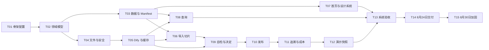

# 产品智策轻量交付版 Implementation Plan

> **For agentic workers:** REQUIRED SUB-SKILL: Use superpowers:subagent-driven-development (recommended) or superpowers:executing-plans to implement this plan task-by-task. Steps use checkbox (`- [ ]`) syntax for tracking.

**Goal:** 在 2026 年 8 月 24 日交付可运行的“产品智策”轻量平台，并在 8 月 30 日冻结可供 9 月现场实时演示的稳定版本。

**Architecture:** 采用本地优先的 Python＋Streamlit 模块化单体。Markdown／Obsidian Vault 保存可读知识资产，SQLite 保存运行状态和索引，Baseline Manifest 是当前生效版本唯一权威；Dify 只承担 Ingest、Query、Lint 三类分析，人工决定和版本发布由本地领域服务控制。

**Tech Stack:** Python 3.11–3.12、Streamlit 1.60、Pydantic 2、SQLite、Dify Workflow API、httpx、PyYAML、python-docx、pypdf、pytest、Streamlit AppTest。

## Global Constraints

- 产品范围以 `产品智策_8月24日轻量交付版方案_v1.0.md` 为准。
- UI 和交互以 `产品智策_轻量交付版_产品与界面设计文档_v1.0.md` 为准。
- 数据、接口和安全以 `产品智策_轻量交付版_技术开发文档_v1.0.md` 为准。
- 8 月 24 日交付六个页面：`home`、`ingest`、`query`、`lint`、`release`、`trace`。
- Dify 只负责 Ingest、Query、Lint，不保存正式决定和当前基线。
- `data/local_state/current_baseline.json` 是当前生效基线唯一权威。
- Streamlit 页面不得直接写 SQL、文件或调用 Dify。
- 原始资料只写入 `data/source_archive/`，导入后不得原地修改。
- 只有 L1 和获得授权且完成脱敏的 L2 内容可外调；L3、L4 默认禁止外调。
- 模拟材料必须显著标记，且不得进入正式基线。
- 保留市场证据缺口和一条确定性成本联动，不实现损益、会计和敏感性分析。
- AI 不得直接批准决定或发布版本。
- 实时和缓存结果使用相同 Schema；缓存只接管 AI 分析，不接管人工决定和发布写入。
- 领域层和 application 层行覆盖率不低于 85%。
- Query 黄金测试准确率不低于 90%，重大结论引用覆盖率 100%。
- Lint 黄金测试识别率不低于 80%，重大问题双方引用覆盖率 100%。
- 1440×1024 必须无横向滚动，每页只保留一个主操作。
- 所有实现任务使用测试驱动：失败测试 → 最小实现 → 测试通过 → 小步提交。

---

## 一、交付基线

### 1.1 两个时间节点

| 节点 | 日期 | 必须达到的状态 |
|---|---|---|
| 开发基线冻结 | 2026-07-31 | Schema、页面结构、Dify 契约和演示材料清单不再随意变化 |
| 垂直切片 | 2026-08-07 | 当前基线 → 导入风险意见 → 生成候选／冲突 |
| 决策闭环 | 2026-08-14 | 导入 → Query → Lint → 人工决定 → ChangeRequest |
| 全流程闭环 | 2026-08-18 | 决定 → 批准 → 发布 → 新基线 → 历史追溯 |
| 冻结候选 | 2026-08-21 | 实时／缓存双通道、黄金测试和演示重置完成 |
| 轻量版交付 | 2026-08-24 | 代码、配置、数据、测试、操作说明和演示材料可交付 |
| 正式演示冻结 | 2026-08-30 | 连续三次全流程无阻断，现场设备完成离线兜底验证 |

### 1.2 建议人员配置

| 角色 | 投入 | 主要职责 |
|---|---:|---|
| A：平台／全栈工程师 | 1.0 FTE | Streamlit、领域层、SQLite、Manifest、发布事务 |
| B：AI／后端工程师 | 1.0 FTE | 文件处理、安全、Dify Workflow、校验、缓存 |
| C：产品／设计／QA | 0.5 FTE | 页面验收、材料、黄金测试、演示脚本和回归 |

若只有两名工程师，A 负责 T01、T02、T03、T07、T10、T11，B 负责 T04、T05、T06、T08、T09；T12—T15 两人共同完成。

### 1.3 总人天估算

| 任务 | 估算 | 主责 | 前置 |
|---|---:|---|---|
| T01 工程骨架、配置和导航 | 2.0 人天 | A | 无 |
| T02 领域模型、状态机和策略 | 2.5 人天 | A | T01 |
| T03 SQLite、Repository 和 Manifest | 3.5 人天 | A | T02 |
| T04 文件归档、提取、脱敏和安全 | 3.0 人天 | B | T01、T02 |
| T05 Dify Gateway、结构校验、缓存和日志 | 3.5 人天 | B | T02、T04 |
| T06 资料导入垂直切片 | 3.0 人天 | A＋B | T03、T04、T05 |
| T07 首页和统一设计系统 | 2.5 人天 | A＋C | T01、T03 |
| T08 当前产品查询 | 2.5 人天 | B＋A | T03、T05 |
| T09 一键自检、决定和变更单 | 4.0 人天 | A＋B | T03、T05、T06 |
| T10 原子发布和恢复 | 3.5 人天 | A | T03、T09 |
| T11 追溯、市场缺口和轻量成本 | 2.5 人天 | A＋B | T03、T09、T10 |
| T12 演示数据、快照和重置 | 2.0 人天 | B＋C | T06—T11 |
| T13 黄金测试、E2E、安全和 UI 验收 | 4.0 人天 | 全员 | T07—T12 |
| T14 8 月 24 日交付封装 | 1.5 人天 | 全员 | T13 |
| T15 8 月 25—30 日实时演示加固 | 3.0 人天 | 全员 | T14 |
| **总计** | **42.5 人天** |  |  |

---

## 二、文件责任地图

### 2.1 顶层

| 文件或目录 | 责任 |
|---|---|
| `pyproject.toml` | Python、依赖、pytest、coverage 和 lint 配置 |
| `streamlit_app.py` | 应用入口，只构建容器、主题和导航 |
| `.env.example` | 非敏感环境变量模板 |
| `.streamlit/config.toml` | 白底蓝色主题和上传限制 |
| `config/app.yaml` | 应用、超时、缓存和发布策略 |
| `config/schema.yaml` | Schema 版本、枚举、关系和编号规则 |
| `config/lint_rules.yaml` | 确定性 Lint 规则 |

### 2.2 业务代码

| 目录 | 责任 |
|---|---|
| `src/domain/` | 纯领域模型、枚举、策略和确定性服务 |
| `src/application/` | 用例、输入输出 DTO 和依赖容器 |
| `src/infrastructure/db/` | SQLite migration 和 Repository 实现 |
| `src/infrastructure/files/` | Archive、Extractor、Redactor、Manifest 和 Markdown |
| `src/infrastructure/gateways/` | Dify HTTP 客户端和三个 Workflow Gateway |
| `src/infrastructure/cache/` | AI 结果精确缓存 |
| `src/infrastructure/recovery/` | Manifest／SQLite 对账和发布保护 |
| `src/infrastructure/observability/` | EventLog 和 ModelCallLog |
| `src/ui/pages/` | 六个页面，仅调用 application 层 |
| `src/ui/components/` | 页头、状态、引用、决定、Diff、追溯和反馈 |
| `src/ui/theme/` | Token 和受控 CSS |

### 2.3 测试

| 目录 | 责任 |
|---|---|
| `tests/unit/` | 领域、策略、校验、缓存和版本逻辑 |
| `tests/integration/` | SQLite、文件、Manifest、Dify Fake 和发布事务 |
| `tests/e2e/` | 六页完整流程和降级路径 |
| `tests/security/` | 外调、路径、文件名、日志和 Prompt Injection |
| `tests/fixtures/` | 明确标记的沙盘材料、黄金问答和预期基线 |

---

## 三、依赖关系



### 3.1 需求覆盖矩阵

| 基线要求 | 实现任务 | 核心测试／证据 |
|---|---|---|
| 六个固定工作区 | T01、T07—T11 | Navigation 测试＋1440×1024 页面验收 |
| 当前基线唯一权威 | T03、T07、T10 | Manifest 原子测试＋启动对账 |
| 四类资料导入 | T04、T06 | PDF／DOCX／TXT／MD 参数化测试 |
| Ingest 结构化编译 | T05、T06 | Gateway Schema＋导入垂直切片 |
| 当前规则查询和引用 | T08 | 10 题黄金集＋范围隔离 |
| Lint 和重大问题双方依据 | T09 | 8—10 条黄金集＋引用降级测试 |
| 四种人工会议操作 | T09 | Decision 策略＋幂等测试 |
| 变更单和人工批准 | T09、T10 | 未批准发布阻断 |
| 原子发布、旧版和恢复 | T10 | 文件失败、镜像失败和历史查询 |
| 完整追溯 | T11 | 六节点主链集成测试 |
| 市场证据缺口 | T11 | 无来源判断降级测试 |
| 轻量成本联动 | T11 | Decimal 公式和免责声明测试 |
| 实时／缓存双通道 | T05、T06、T08、T12 | 超时 E2E＋精确 Cache Key |
| 安全和数据分级 | T02、T04、T13 | L3/L4 无 ModelCallLog |
| 演示初始化和重置 | T03、T12 | Snapshot Hash＋重置后校验 |
| 8 月 24 日可交付 | T13、T14 | 全量测试＋干净环境启动 |
| 8 月 30 日实时演示冻结 | T15 | 性能采样＋连续三次主流程 |

---

### Task 1: 工程骨架、配置加载和六页导航（T01）

**Estimate:** 2.0 人天  
**Owner:** A  
**Window:** 2026-07-29—2026-07-31

**Files:**

- Create: `pyproject.toml`
- Create: `.env.example`
- Create: `.streamlit/config.toml`
- Create: `config/app.yaml`
- Create: `config/schema.yaml`
- Create: `streamlit_app.py`
- Create: `src/application/container.py`
- Create: `src/ui/navigation.py`
- Create: `src/ui/theme/loader.py`
- Create: `src/ui/theme/tokens.css`
- Create: `src/ui/pages/home.py`
- Create: `src/ui/pages/ingest.py`
- Create: `src/ui/pages/query.py`
- Create: `src/ui/pages/lint.py`
- Create: `src/ui/pages/release.py`
- Create: `src/ui/pages/trace.py`
- Test: `tests/unit/test_config.py`
- Test: `tests/unit/test_navigation.py`

**Interfaces:**

- Consumes: `.env`、`st.secrets`、`config/app.yaml`、`config/schema.yaml`
- Produces: `AppSettings`、`AppContainer`、`build_container()`、`build_navigation(container)`

- [ ] **Step 1: 创建项目依赖配置**

```toml
[project]
name = "product-intelligence"
version = "0.1.0"
requires-python = ">=3.11,<3.13"
dependencies = [
  "streamlit>=1.60,<1.61",
  "pydantic>=2.10,<3",
  "httpx>=0.28,<1",
  "tenacity>=9,<10",
  "pypdf>=6,<7",
  "python-docx>=1.2,<2",
  "PyYAML>=6,<7",
  "filelock>=3.16,<4",
]

[dependency-groups]
dev = [
  "pytest>=9,<10",
  "pytest-cov>=6,<7",
  "ruff>=0.12,<1",
]
```

Run: `uv lock && uv sync --group dev`  
Expected: 生成 `uv.lock`，开发依赖安装完成。

- [ ] **Step 2: 编写配置失败测试**

```python
def test_load_settings_rejects_invalid_schema_version(tmp_path):
    app_yaml = tmp_path / "app.yaml"
    schema_yaml = tmp_path / "schema.yaml"
    app_yaml.write_text("app:\n  name: 产品智策\n", encoding="utf-8")
    schema_yaml.write_text("schema_version: ''\n", encoding="utf-8")

    with pytest.raises(ConfigurationError, match="schema_version"):
        load_settings(app_yaml, schema_yaml)
```

- [ ] **Step 3: 运行失败测试**

Run: `uv run pytest tests/unit/test_config.py::test_load_settings_rejects_invalid_schema_version -v`  
Expected: FAIL，原因是 `load_settings` 尚未定义。

- [ ] **Step 4: 实现严格配置模型**

```python
class AppSettings(BaseModel):
    name: str
    project_id: str
    max_upload_mb: int = Field(ge=1, le=20)
    accepted_extensions: tuple[str, ...]
    demo_mode: bool
    schema_version: str = Field(min_length=1)


def load_settings(app_path: Path, schema_path: Path) -> AppSettings:
    app_data = yaml.safe_load(app_path.read_text(encoding="utf-8"))["app"]
    schema_data = yaml.safe_load(schema_path.read_text(encoding="utf-8"))
    return AppSettings(**app_data, schema_version=schema_data["schema_version"])
```

- [ ] **Step 5: 编写导航测试**

```python
def test_navigation_defines_six_routes():
    routes = get_page_definitions()
    assert [item.url_path for item in routes] == [
        "home", "ingest", "query", "lint", "release", "trace"
    ]
```

- [ ] **Step 6: 实现页面定义**

```python
@dataclass(frozen=True)
class PageDefinition:
    title: str
    url_path: str
    render: Callable[[], None]


def get_page_definitions() -> list[PageDefinition]:
    return [
        PageDefinition("项目首页", "home", home.render),
        PageDefinition("资料导入", "ingest", ingest.render),
        PageDefinition("当前查询", "query", query.render),
        PageDefinition("一键自检", "lint", lint.render),
        PageDefinition("变更发布", "release", release.render),
        PageDefinition("追溯与价值", "trace", trace.render),
    ]
```

- [ ] **Step 7: 加入白底蓝色 Token**

```css
:root {
  --pi-blue-600: #1769E0;
  --pi-blue-050: #EEF5FF;
  --pi-text-900: #243B53;
  --pi-text-600: #52677D;
  --pi-border: #D9E2EC;
  --pi-surface: #FFFFFF;
  --pi-surface-muted: #F7FAFC;
  --pi-success: #16865C;
  --pi-warning: #B7791F;
  --pi-danger: #C43D3D;
  --pi-radius: 8px;
}
```

- [ ] **Step 8: 运行骨架测试和启动烟测**

Run: `uv run pytest tests/unit/test_config.py tests/unit/test_navigation.py -v`  
Expected: PASS。

Run: `uv run streamlit run streamlit_app.py --server.headless true`  
Expected: 进程启动，无配置异常；六个导航项顺序正确。

- [ ] **Step 9: 提交**

```bash
git add pyproject.toml .env.example .streamlit config streamlit_app.py src tests/unit
git commit -m "feat: scaffold lightweight product intelligence app"
```

**Acceptance evidence:** 六个空页面可导航；主题为白底、蓝色主操作；错误 Schema 使应用进入明确错误状态。

---

### Task 2: 领域模型、状态机和治理策略（T02）

**Estimate:** 2.5 人天  
**Owner:** A  
**Window:** 2026-07-30—2026-08-03

**Files:**

- Create: `src/domain/enums.py`
- Create: `src/domain/models.py`
- Create: `src/domain/errors.py`
- Create: `src/domain/policies/authority_policy.py`
- Create: `src/domain/policies/security_policy.py`
- Create: `src/domain/policies/state_transition.py`
- Create: `src/domain/policies/release_policy.py`
- Test: `tests/unit/domain/test_models.py`
- Test: `tests/unit/domain/test_state_transition.py`
- Test: `tests/unit/domain/test_security_policy.py`
- Test: `tests/unit/domain/test_release_policy.py`

**Interfaces:**

- Consumes: `config/schema.yaml`
- Produces: `Project`、`SourceRecord`、`KnowledgeCard`、`IssueCard`、`Decision`、`ChangeRequest`、`Baseline` 和全部枚举

- [ ] **Step 1: 编写状态转换失败测试**

```python
@pytest.mark.parametrize(
    ("current", "target"),
    [
        (ChangeStatus.DRAFT, ChangeStatus.PUBLISHED),
        (ChangeStatus.REJECTED, ChangeStatus.APPROVED),
        (ChangeStatus.PUBLISHED, ChangeStatus.DRAFT),
    ],
)
def test_invalid_change_transition_is_rejected(current, target):
    with pytest.raises(DomainError, match="INVALID_CHANGE_TRANSITION"):
        ensure_change_transition(current, target)
```

- [ ] **Step 2: 运行失败测试**

Run: `uv run pytest tests/unit/domain/test_state_transition.py -v`  
Expected: FAIL，状态枚举和策略尚未定义。

- [ ] **Step 3: 实现唯一枚举和状态图**

```python
CHANGE_TRANSITIONS = {
    ChangeStatus.DRAFT: {
        ChangeStatus.PENDING_APPROVAL,
        ChangeStatus.DEFERRED,
        ChangeStatus.NEEDS_INFO,
    },
    ChangeStatus.PENDING_APPROVAL: {
        ChangeStatus.APPROVED,
        ChangeStatus.REJECTED,
        ChangeStatus.DEFERRED,
        ChangeStatus.NEEDS_INFO,
    },
    ChangeStatus.APPROVED: {ChangeStatus.PUBLISHED},
    ChangeStatus.NEEDS_INFO: {ChangeStatus.DRAFT},
    ChangeStatus.DEFERRED: {ChangeStatus.DRAFT},
}


def ensure_change_transition(current: ChangeStatus, target: ChangeStatus) -> None:
    if target not in CHANGE_TRANSITIONS.get(current, set()):
        raise DomainError("INVALID_CHANGE_TRANSITION")
```

- [ ] **Step 4: 编写外调安全测试**

```python
def test_l3_source_cannot_call_external_model(project, source):
    source.security_level = SecurityLevel.L3_CONFIDENTIAL
    source.is_redacted = True
    source.allow_external_model = True
    project.allow_external_model = True

    assert can_call_external_model(project, source) is False
```

- [ ] **Step 5: 实现外调策略**

```python
def can_call_external_model(project: Project, source: SourceRecord) -> bool:
    return all(
        (
            project.allow_external_model,
            source.allow_external_model,
            source.is_redacted,
            source.security_level in {
                SecurityLevel.L1_PUBLIC_SIMULATED,
                SecurityLevel.L2_INTERNAL,
            },
            not source.is_sandbox
            or source.security_level == SecurityLevel.L1_PUBLIC_SIMULATED,
        )
    )
```

- [ ] **Step 6: 编写发布策略测试**

```python
def test_release_requires_approved_change_and_impact_review(change, manifest):
    change.status = ChangeStatus.PENDING_APPROVAL
    command = PublishBaselineInput(
        project_id="LLD",
        change_request_id=change.id,
        approved_by="产品经理",
        impact_reviewed=False,
        release_note="完成目标客群规则调整并保留追溯记录。",
    )

    with pytest.raises(DomainError, match="CHANGE_NOT_APPROVED"):
        ReleasePolicy().validate(command, manifest, change)
```

- [ ] **Step 7: 运行领域测试**

Run: `uv run pytest tests/unit/domain -v`  
Expected: PASS，且状态字符串只在 `src/domain/enums.py` 定义。

- [ ] **Step 8: 提交**

```bash
git add src/domain tests/unit/domain config/schema.yaml
git commit -m "feat: define domain models and governance policies"
```

**Acceptance evidence:** 非法状态转换、L3/L4 外调、未批准发布和模拟数据进入正式基线均被领域层阻断。

---

### Task 3: SQLite、Repository、Vault 和 Baseline Manifest（T03）

**Estimate:** 3.5 人天  
**Owner:** A  
**Window:** 2026-08-03—2026-08-06

**Files:**

- Create: `src/application/ports/repositories.py`
- Create: `src/infrastructure/db/connection.py`
- Create: `src/infrastructure/db/migrations.py`
- Create: `src/infrastructure/db/repositories.py`
- Create: `src/infrastructure/files/manifest_store.py`
- Create: `src/infrastructure/files/markdown_store.py`
- Create: `scripts/bootstrap_demo.py`
- Test: `tests/integration/db/test_migrations.py`
- Test: `tests/integration/db/test_repositories.py`
- Test: `tests/integration/files/test_manifest_store.py`

**Interfaces:**

- Consumes: T02 的领域模型
- Produces: `ProjectRepository`、`SourceRepository`、`KnowledgeRepository`、`IssueRepository`、`DecisionRepository`、`ChangeRepository`、`BaselineRepository`、`ManifestStore`

- [ ] **Step 1: 编写 migration 失败测试**

```python
def test_migrate_creates_required_tables(tmp_path):
    db_path = tmp_path / "product_intelligence.db"
    migrate(db_path)

    with sqlite3.connect(db_path) as conn:
        names = {
            row[0]
            for row in conn.execute(
                "SELECT name FROM sqlite_master WHERE type='table'"
            )
        }
    assert {
        "projects", "sources", "baselines", "knowledge_cards", "relations",
        "issues", "decisions", "change_requests", "model_call_logs",
        "cache_entries", "event_logs",
    } <= names
```

- [ ] **Step 2: 运行 migration 测试并确认失败**

Run: `uv run pytest tests/integration/db/test_migrations.py -v`  
Expected: FAIL，`migrate` 尚未定义。

- [ ] **Step 3: 实现幂等 migration**

```python
def migrate(db_path: Path) -> None:
    db_path.parent.mkdir(parents=True, exist_ok=True)
    with sqlite3.connect(db_path) as connection:
        connection.execute("PRAGMA foreign_keys = ON")
        connection.executescript(INITIAL_SCHEMA_SQL)
        connection.execute(
            "INSERT OR IGNORE INTO schema_migrations(version) VALUES (?)",
            ("1.0",),
        )
```

- [ ] **Step 4: 编写 Repository 往返测试**

```python
def test_source_repository_round_trip(repository, source_record):
    repository.add(source_record)
    loaded = repository.get(source_record.id)
    assert loaded == source_record
    assert repository.find_by_sha256(
        source_record.project_id, source_record.sha256
    ) == source_record
```

- [ ] **Step 5: 编写 Manifest 原子替换测试**

```python
def test_atomic_replace_keeps_old_manifest_when_replace_fails(
    manifest_store, current_manifest, candidate_manifest, monkeypatch
):
    manifest_store.atomic_replace(current_manifest)
    monkeypatch.setattr(os, "replace", Mock(side_effect=OSError("disk error")))

    with pytest.raises(OSError):
        manifest_store.atomic_replace(candidate_manifest)

    assert manifest_store.read_and_validate() == current_manifest
```

- [ ] **Step 6: 实现 Manifest Store**

```python
def atomic_replace(self, manifest: BaselineManifest) -> None:
    payload = manifest.model_dump_json(indent=2)
    temp_path = self.path.with_suffix(".json.tmp")
    temp_path.write_text(payload, encoding="utf-8")
    fsync_file(temp_path)
    os.replace(temp_path, self.path)
    fsync_directory(self.path.parent)
```

- [ ] **Step 7: 实现演示基线初始化**

Run: `uv run python scripts/bootstrap_demo.py`  
Expected:

```text
data/local_state/product_intelligence.db
data/local_state/current_baseline.json
data/obsidian_vault/02_Current_Baseline/LLD-724_1/full.md
data/obsidian_vault/02_Current_Baseline/LLD-724_1/cards.json
```

- [ ] **Step 8: 运行数据层测试**

Run: `uv run pytest tests/integration/db tests/integration/files/test_manifest_store.py -v`  
Expected: PASS。

- [ ] **Step 9: 提交**

```bash
git add src/application/ports src/infrastructure/db src/infrastructure/files scripts tests/integration
git commit -m "feat: add persistence and baseline manifest authority"
```

**Acceptance evidence:** 初始化后 Manifest、Markdown 哈希和 SQLite 当前基线镜像一致；重复执行 migration 不报错。

---

### Task 4: 文件归档、提取、脱敏和安全防护（T04）

**Estimate:** 3.0 人天  
**Owner:** B  
**Window:** 2026-08-03—2026-08-06

**Files:**

- Create: `src/infrastructure/files/archive.py`
- Create: `src/infrastructure/files/extractor.py`
- Create: `src/infrastructure/files/redactor.py`
- Create: `src/domain/services/file_safety.py`
- Test: `tests/integration/files/test_archive.py`
- Test: `tests/integration/files/test_extractor.py`
- Test: `tests/unit/domain/test_redactor.py`
- Test: `tests/security/test_upload_security.py`

**Interfaces:**

- Consumes: `ImportSourceInput`、`SecurityLevel`
- Produces: `ArchiveResult`、`ExtractedDocument`、`ExtractedChunk`、`RedactionResult`

- [ ] **Step 1: 编写路径穿越和伪扩展名测试**

```python
@pytest.mark.parametrize(
    "filename",
    ["../../secret.md", "..\\..\\secret.md", "report.pdf.exe", "/tmp/report.md"],
)
def test_unsafe_filename_is_rejected(filename):
    with pytest.raises(DomainError, match="UNSAFE_FILENAME"):
        sanitize_filename(filename)
```

- [ ] **Step 2: 实现文件名和大小校验**

```python
ALLOWED_EXTENSIONS = {".pdf", ".docx", ".txt", ".md"}


def validate_upload(filename: str, content: bytes, max_bytes: int) -> str:
    safe_name = sanitize_filename(filename)
    suffix = Path(safe_name).suffix.lower()
    if suffix not in ALLOWED_EXTENSIONS:
        raise DomainError("UNSUPPORTED_FILE_TYPE")
    if not content or len(content) > max_bytes:
        raise DomainError("INVALID_FILE_SIZE")
    return safe_name
```

- [ ] **Step 3: 编写归档不可变测试**

```python
def test_duplicate_archive_uses_sha256_and_does_not_overwrite(archive, payload):
    first = archive.save("风险意见.md", payload)
    second = archive.save("风险意见.md", payload)
    assert first.sha256 == second.sha256
    assert first.path == second.path
    assert first.path.read_bytes() == payload
```

- [ ] **Step 4: 编写四类提取测试**

```python
@pytest.mark.parametrize("fixture_name", [
    "sample.pdf", "sample.docx", "sample.txt", "sample.md"
])
def test_extract_supported_document(fixture_dir, fixture_name):
    result = extract_document(fixture_dir / fixture_name)
    assert result.text.strip()
    assert result.chunks
    assert all(chunk.locator for chunk in result.chunks)
```

- [ ] **Step 5: 实现确定性脱敏器**

```python
REDACTION_PATTERNS = {
    "phone": re.compile(r"(?<!\d)1[3-9]\d{9}(?!\d)"),
    "id_card": re.compile(r"(?<!\d)\d{17}[0-9Xx](?!\d)"),
    "bank_card": re.compile(r"(?<!\d)\d{16,19}(?!\d)"),
    "email": re.compile(r"[\w.+-]+@[\w.-]+\.[A-Za-z]{2,}"),
}


def redact_text(text: str) -> RedactionResult:
    redacted = text
    findings = []
    for finding_type, pattern in REDACTION_PATTERNS.items():
        redacted, count = pattern.subn(f"[已脱敏:{finding_type}]", redacted)
        if count:
            findings.append({"type": finding_type, "count": str(count)})
    has_sensitive_residue = any(
        pattern.search(redacted)
        for pattern in REDACTION_PATTERNS.values()
    )
    return RedactionResult(
        redacted_text=redacted,
        findings=findings,
        original_chars=len(text),
        redacted_chars=len(redacted),
        safe_for_external_model=not has_sensitive_residue,
    )
```

- [ ] **Step 6: 运行文件与安全测试**

Run: `uv run pytest tests/integration/files tests/security/test_upload_security.py tests/unit/domain/test_redactor.py -v`  
Expected: PASS。

- [ ] **Step 7: 提交**

```bash
git add src/infrastructure/files src/domain/services/file_safety.py tests/integration/files tests/security tests/unit/domain
git commit -m "feat: secure source archive extraction and redaction"
```

**Acceptance evidence:** 四种格式可提取；相同 SHA-256 不重复入库；路径穿越、双扩展名和超大文件被阻断；L3/L4 不进入外调分支。

---

### Task 5: Dify Gateway、结构校验、精确缓存和调用日志（T05）

**Estimate:** 3.5 人天  
**Owner:** B  
**Window:** 2026-08-05—2026-08-09

**Files:**

- Create: `src/application/ports/workflow_gateway.py`
- Create: `src/infrastructure/gateways/dify_client.py`
- Create: `src/infrastructure/gateways/ingest_gateway.py`
- Create: `src/infrastructure/gateways/query_gateway.py`
- Create: `src/infrastructure/gateways/lint_gateway.py`
- Create: `src/infrastructure/cache/ai_cache.py`
- Create: `src/infrastructure/observability/model_call_logger.py`
- Create: `src/infrastructure/observability/event_logger.py`
- Create: `src/domain/services/citation_validator.py`
- Test: `tests/integration/gateways/test_dify_client.py`
- Test: `tests/integration/gateways/test_workflow_schemas.py`
- Test: `tests/unit/test_ai_cache.py`
- Test: `tests/unit/domain/test_citation_validator.py`

**Interfaces:**

- Consumes: 脱敏后的最小必要片段、三个 Dify API Key
- Produces: `WorkflowGateway.run()`、`IngestGateway`、`QueryGateway`、`LintGateway`、`AiCache.get/put()`、`CitationValidator`

- [ ] **Step 1: 编写 HTTP 重试边界测试**

```python
def make_client(transport: httpx.BaseTransport) -> DifyClient:
    return DifyClient(
        base_url="https://dify.test/v1",
        api_key="test-key",
        http=httpx.Client(transport=transport),
    )


def test_dify_retries_503_once_then_returns():
    responses = iter([
        httpx.Response(503),
        httpx.Response(
            200,
            json={"workflow_run_id": "WF-1", "data": {"outputs": {"result": "{}"}}},
        ),
    ])
    requests = []

    def handler(request):
        requests.append(request)
        return next(responses)

    client = make_client(httpx.MockTransport(handler))
    result = client.run(inputs={"schema_version": "1.0"}, user="LLD", timeout_seconds=30)
    assert result["workflow_run_id"] == "WF-1"
    assert len(requests) == 2


def test_dify_does_not_retry_401():
    requests = []

    def handler(request):
        requests.append(request)
        return httpx.Response(401)

    client = make_client(httpx.MockTransport(handler))
    with pytest.raises(GatewayError, match="DIFY_AUTH_FAILED"):
        client.run(inputs={}, user="LLD", timeout_seconds=30)
    assert len(requests) == 1
```

- [ ] **Step 2: 实现统一 Dify Client**

```python
class DifyClient:
    def run(self, *, inputs: dict[str, Any], user: str, timeout_seconds: int) -> dict[str, Any]:
        request = {"inputs": inputs, "response_mode": "blocking", "user": user}
        for attempt in range(2):
            response = self.http.post(
                f"{self.base_url}/workflows/run",
                headers={"Authorization": f"Bearer {self.api_key}"},
                json=request,
                timeout=timeout_seconds,
            )
            if response.status_code in {429, 502, 503, 504} and attempt == 0:
                continue
            if response.status_code in {400, 401, 403}:
                raise GatewayError.from_status(response.status_code)
            response.raise_for_status()
            return response.json()
        raise GatewayError("DIFY_TEMPORARILY_UNAVAILABLE")
```

- [ ] **Step 3: 编写非法 JSON 和虚假引用测试**

```python
def test_query_gateway_rejects_unknown_citation(fake_client):
    fake_client.result = {
        "answer": "当前规则",
        "citations": [{"citation_id": "NOT-IN-INPUT"}],
        "evidence_sufficiency": "sufficient",
    }
    with pytest.raises(OutputValidationError, match="UNKNOWN_CITATION"):
        gateway.run(query_input)
```

- [ ] **Step 4: 实现精确 Cache Key**

```python
def build_cache_key(
    task_type: str,
    source_sha256: str,
    baseline_version: str,
    prompt_version: str,
    model_label: str,
    schema_version: str,
    question: str = "",
) -> str:
    canonical = "\n".join(
        (
            task_type,
            source_sha256,
            baseline_version,
            prompt_version,
            model_label,
            schema_version,
            " ".join(question.split()),
        )
    )
    return hashlib.sha256(canonical.encode("utf-8")).hexdigest()
```

- [ ] **Step 5: 编写缓存严格匹配测试**

```python
def test_cache_does_not_cross_baseline(cache, cached_result):
    cache.put(key_for(version="LLD-724_1"), cached_result)
    assert cache.get(key_for(version="LLD-724_2")) is None
```

- [ ] **Step 6: 实现结构化调用日志**

```python
logger.record(
    ModelCallLog(
        id=call_id,
        task_type=task_type,
        workflow_run_id=workflow_run_id,
        source_ids=source_ids,
        authorized=True,
        redacted=True,
        result_mode=CallResultMode.REALTIME,
        status="completed",
        duration_ms=duration_ms,
        correlation_id=correlation_id,
    )
)
```

日志对象不得包含 API Key、完整 Prompt 或未脱敏全文。

- [ ] **Step 7: 运行 Gateway、缓存和引用测试**

Run: `uv run pytest tests/integration/gateways tests/unit/test_ai_cache.py tests/unit/domain/test_citation_validator.py -v`  
Expected: PASS。

- [ ] **Step 8: 提交**

```bash
git add src/application/ports src/infrastructure/gateways src/infrastructure/cache src/infrastructure/observability src/domain/services/citation_validator.py tests
git commit -m "feat: add validated Dify workflows and exact cache fallback"
```

**Acceptance evidence:** 503 只重试一次，401 不重试；未知引用和非法枚举被拒绝；不同材料、版本或 Prompt 不复用缓存。

---

### Task 6: 资料导入垂直切片（T06）

**Estimate:** 3.0 人天  
**Owner:** A＋B  
**Window:** 2026-08-06—2026-08-10

**Files:**

- Create: `src/application/dto/ingest.py`
- Create: `src/application/use_cases/import_source.py`
- Modify: `src/ui/pages/ingest.py`
- Create: `src/ui/components/file_upload.py`
- Create: `src/ui/components/feedback.py`
- Test: `tests/integration/use_cases/test_import_source.py`
- Test: `tests/e2e/test_ingest_flow.py`

**Interfaces:**

- Consumes: `ImportSourceInput`、Archive、Extractor、Redactor、SecurityPolicy、IngestGateway
- Produces: `IngestReport`，并写入 SourceRecord、KnowledgeCard、Relation、IssueCard 和 EventLog

- [ ] **Step 1: 编写导入成功失败测试**

```python
def test_import_source_creates_conflict_without_changing_effective_baseline(
    use_case, risk_opinion_bytes, manifest_store, repositories
):
    before = manifest_store.read_and_validate()
    report = use_case.execute(
        ImportSourceInput(
            project_id="LLD",
            uploaded_name="风险意见.md",
            uploaded_bytes=risk_opinion_bytes,
            source_type="risk_opinion",
            authority_level=AuthorityLevel.PROFESSIONAL_OPINION,
            source_department="风险",
            provider=None,
            document_date=date(2026, 7, 29),
            document_version="v1.0",
            applicable_baseline_version="LLD-724_1",
            security_level=SecurityLevel.L2_INTERNAL,
            is_redacted_confirmed=True,
            allow_external_model=True,
            is_sandbox=False,
            preferred_mode="realtime",
        )
    )
    after = manifest_store.read_and_validate()
    assert report.conflict_count == 1
    assert after == before
    assert repositories.knowledge.list_effective("LLD", "LLD-724_1")
```

- [ ] **Step 2: 实现 ImportSource 编排**

```python
def execute(self, command: ImportSourceInput) -> IngestReport:
    upload = self.file_safety.validate(command.uploaded_name, command.uploaded_bytes)
    digest = hashlib.sha256(command.uploaded_bytes).hexdigest()
    existing = self.sources.find_by_sha256(command.project_id, digest)
    if existing and existing.ingest_status == "completed":
        return IngestReport.from_duplicate(existing)
    if existing:
        source = existing
        archived_path = Path(existing.archive_path)
    else:
        archived = self.archive.save(upload.safe_name, command.uploaded_bytes)
        source = self.source_factory.create(command, archived)
        self.sources.add(source)
        archived_path = archived.path
    extracted = self.extractor.extract(archived_path)
    redaction = self.redactor.redact(extracted)
    source = self.source_factory.apply_redaction(source, redaction)
    self.sources.update(source)
    try:
        result = self.ingest_runner.run(
            source,
            extracted,
            redaction,
            preferred_mode=command.preferred_mode,
        )
    except GatewayTimeout:
        self.sources.update_ingest_status(source.id, "realtime_failed")
        raise
    validated = self.output_validator.validate_ingest(result, source)
    with self.unit_of_work.transaction():
        self.knowledge.upsert_cards(validated.cards)
        self.relations.add_all(validated.relations)
        self.issues.add_all(validated.issues)
        self.sources.update_ingest_status(source.id, "completed")
        self.events.add(validated.event)
    return IngestReport.from_validated(source, validated)
```

- [ ] **Step 3: 实现三步导入页面**

页面固定顺序：

```text
1 上传文件
2 确认资料属性和安全边界
3 编译并查看结果
```

按钮状态：

```python
can_submit = (
    uploaded_file is not None
    and source_type
    and authority_level
    and source_department
    and document_date
    and document_version
    and applicable_baseline_version
)
st.button("开始编译", type="primary", disabled=not can_submit, key="ingest_submit")
```

- [ ] **Step 4: 添加实时超时后的缓存选择**

```python
try:
    report = container.import_source.execute(command)
except GatewayTimeout:
    st.warning("实时分析超时，可使用同材料、同版本的冻结缓存继续。")
    if st.button("使用缓存结果", key="ingest_use_cache"):
        report = container.import_source.execute(
            command.model_copy(update={"preferred_mode": "cache"})
        )
```

- [ ] **Step 5: 运行垂直切片**

Run: `uv run pytest tests/integration/use_cases/test_import_source.py tests/e2e/test_ingest_flow.py -v`  
Expected: PASS。

手工证据：

```text
初始基线 LLD-724_1
→ 导入风险意见
→ 显示 1 个冲突和引用
→ 当前基线仍为 LLD-724_1
```

- [ ] **Step 6: 提交**

```bash
git add src/application/dto src/application/use_cases/import_source.py src/ui/pages/ingest.py src/ui/components tests
git commit -m "feat: deliver secure source ingest vertical slice"
```

**Acceptance evidence:** 2026-08-07 前真实跑通一次垂直切片；重复文件不重复入库；候选／冲突不进入当前答案。

---

### Task 7: 首页和统一设计系统（T07）

**Estimate:** 2.5 人天  
**Owner:** A＋C  
**Window:** 2026-08-06—2026-08-11

**Files:**

- Create: `src/application/dto/dashboard.py`
- Create: `src/application/use_cases/get_dashboard.py`
- Modify: `src/ui/pages/home.py`
- Create: `src/ui/components/page_header.py`
- Create: `src/ui/components/project_context.py`
- Create: `src/ui/components/baseline_hero.py`
- Create: `src/ui/components/status_badge.py`
- Create: `src/ui/components/grouped_list.py`
- Modify: `src/ui/theme/tokens.css`
- Test: `tests/integration/use_cases/test_get_dashboard.py`
- Test: `tests/e2e/test_home_page.py`

**Interfaces:**

- Consumes: Manifest、ProjectRepository、IssueRepository、ChangeRepository、EventRepository
- Produces: `DashboardView`

- [ ] **Step 1: 编写 Dashboard 聚合测试**

```python
def test_dashboard_uses_manifest_version_and_limits_recent_events(use_case, fixtures):
    view = use_case.execute(GetDashboardInput(project_id="LLD"))
    assert view.current_baseline.version == fixtures.manifest.current_version
    assert len(view.recent_events) <= 5
    assert view.integrity_ok is True
```

- [ ] **Step 2: 实现 Dashboard 用例**

```python
def execute(self, command: GetDashboardInput) -> DashboardView:
    manifest = self.manifest.read_and_validate()
    integrity = self.reconciliation.validate_manifest_mirror(read_only=True)
    return DashboardView(
        project=self.projects.get(command.project_id),
        current_baseline=self.baselines.get(manifest.current_baseline_id),
        open_issue_count=self.issues.count_open(command.project_id),
        candidate_change_count=self.changes.count_pending(command.project_id),
        source_count=self.sources.count(command.project_id),
        recent_events=self.events.latest(command.project_id, limit=5),
        integrity_ok=integrity.ok,
    )
```

- [ ] **Step 3: 实现首页视觉优先级**

首页必须依次显示：

```text
项目名称与阶段
当前生效基线（页面最强信息）
导入新资料（唯一主按钮）
查询当前产品／启动一键自检（次按钮）
开放问题／候选变更／已入库资料（分组列表）
最近活动（最多五条）
```

- [ ] **Step 4: 增加完整性异常状态**

```python
if not view.integrity_ok:
    feedback.error(
        title="当前基线镜像需要修复",
        body="查询仍按 Manifest 只读运行，变更发布已暂时禁用。",
        code="BASELINE_INTEGRITY_FAILED",
    )
```

- [ ] **Step 5: 运行首页和视觉烟测**

Run: `uv run pytest tests/integration/use_cases/test_get_dashboard.py tests/e2e/test_home_page.py -v`  
Expected: PASS。

Viewport: `1440×1024`  
Expected: 无横向滚动；三个概况不拆成三张 KPI 卡；主按钮只有“导入新资料”。

- [ ] **Step 6: 提交**

```bash
git add src/application src/ui tests/integration/use_cases/test_get_dashboard.py tests/e2e/test_home_page.py
git commit -m "feat: build baseline-first project dashboard"
```

**Acceptance evidence:** 首页当前版本最醒目；开放问题、候选变更和资料数量可跳到对应筛选页面。

---

### Task 8: 当前产品查询和引用回答（T08）

**Estimate:** 2.5 人天  
**Owner:** B＋A  
**Window:** 2026-08-10—2026-08-12

**Files:**

- Create: `src/application/dto/query.py`
- Create: `src/application/use_cases/run_query.py`
- Modify: `src/ui/pages/query.py`
- Create: `src/ui/components/citation_block.py`
- Test: `tests/unit/application/test_run_query.py`
- Test: `tests/e2e/test_query_flow.py`
- Create: `tests/fixtures/gold_query.json`

**Interfaces:**

- Consumes: `RunQueryInput`、Manifest、KnowledgeRepository、QueryGateway、CitationValidator
- Produces: `QueryResponse`

- [ ] **Step 1: 编写范围隔离测试**

```python
def test_effective_query_never_uses_candidate_cards(use_case, fake_query_gateway):
    response = use_case.execute(
        RunQueryInput(
            project_id="LLD",
            question="当前目标客群是什么？",
            scope="effective",
            historical_version=None,
        )
    )
    sent_ids = {
        item["id"]
        for item in fake_query_gateway.last_inputs["effective_cards"]
    }
    assert sent_ids == set(response.effective_rules)
    assert "RULE-CANDIDATE-001" not in sent_ids
```

- [ ] **Step 2: 编写历史范围校验测试**

```python
def test_historical_scope_requires_version(use_case):
    with pytest.raises(DomainError, match="HISTORICAL_VERSION_REQUIRED"):
        use_case.execute(
            RunQueryInput(
                project_id="LLD",
                question="历史规则是什么？",
                scope="historical",
                historical_version=None,
            )
        )
```

- [ ] **Step 3: 实现 Query 用例**

```python
def execute(self, command: RunQueryInput) -> QueryResponse:
    version = self.scope_policy.resolve_version(command)
    cards = self.knowledge.list_effective(command.project_id, version)
    notices = self.notice_builder.build(command) if command.scope == "effective_with_notices" else []
    raw = self.gateway.run(self.query_builder.build(command, version, cards, notices))
    response = self.validator.validate_query(raw, allowed_cards=cards)
    return self.citation_validator.ensure_supported(response)
```

- [ ] **Step 4: 实现页面回答层级**

```text
当前回答
适用版本和范围
关键结论引用
候选／冲突提示（仅 notice）
证据充分度
实时／缓存状态
```

证据不足时固定展示：

```text
现有材料不足以支持确定结论。请补充资料或查看相关引用。
```

- [ ] **Step 5: 建立 10 题黄金集**

`tests/fixtures/gold_query.json` 每题必须包含：

```json
{
  "id": "Q-001",
  "question": "当前目标客群是什么？",
  "scope": "effective",
  "expected_version": "LLD-724_1",
  "required_card_ids": ["RULE-LLD-001"],
  "forbidden_card_ids": ["RULE-CANDIDATE-001"],
  "required_citation_ids": ["CIT-SRC-001-01"]
}
```

- [ ] **Step 6: 运行查询测试**

Run: `uv run pytest tests/unit/application/test_run_query.py tests/e2e/test_query_flow.py -v`  
Expected: PASS。

Run: `uv run pytest tests/golden/test_query_golden.py -v`  
Expected: 至少 9/10 通过；范围隔离和重大引用 10/10 通过。

- [ ] **Step 7: 提交**

```bash
git add src/application src/ui/pages/query.py src/ui/components/citation_block.py tests
git commit -m "feat: add citation-grounded current product query"
```

**Acceptance evidence:** 当前、带提示和历史三种范围可用；候选内容不混入当前答案；每个关键结论可回到来源。

---

### Task 9: 一键自检、会议决定和 ChangeRequest（T09）

**Estimate:** 4.0 人天  
**Owner:** A＋B  
**Window:** 2026-08-11—2026-08-16

**Files:**

- Create: `config/lint_rules.yaml`
- Create: `src/domain/services/deterministic_lint.py`
- Create: `src/application/dto/lint.py`
- Create: `src/application/dto/decision.py`
- Create: `src/application/use_cases/run_lint.py`
- Create: `src/application/use_cases/record_decision.py`
- Create: `src/application/use_cases/create_change_request.py`
- Modify: `src/ui/pages/lint.py`
- Create: `src/ui/components/issue_list.py`
- Create: `src/ui/components/decision_bar.py`
- Test: `tests/unit/domain/test_deterministic_lint.py`
- Test: `tests/integration/use_cases/test_run_lint.py`
- Test: `tests/integration/use_cases/test_record_decision.py`
- Create: `tests/fixtures/gold_lint.json`

**Interfaces:**

- Consumes: 当前基线、比较资料、LintGateway、IssueRepository
- Produces: `LintReport`、`Decision`、状态为 `pending_approval` 的 `ChangeRequest`

- [ ] **Step 1: 编写确定性规则测试**

```python
def test_gov_001_blocks_non_effective_card_in_current_baseline():
    finding = run_rule(
        "GOV-001",
        card=knowledge_card(status=KnowledgeStatus.CANDIDATE),
        baseline=current_baseline(),
    )
    assert finding.severity == IssueSeverity.BLOCKING
    assert finding.rule_id == "GOV-001"
```

- [ ] **Step 2: 实现确定性规则先行**

```python
def execute(self, command: RunLintInput) -> LintReport:
    deterministic = self.local_lint.run(command)
    comparison = self.comparison_builder.build_minimum(command)
    semantic = self.gateway.run(
        baseline_rules=comparison.baseline_rules,
        comparison_items=comparison.items,
        deterministic_findings=deterministic,
    )
    merged = self.issue_merger.merge(deterministic, semantic)
    validated = self.validator.validate_lint(merged)
    deduplicated = self.deduplicator.apply(validated)
    self.issues.upsert_all(deduplicated)
    return LintReport(issues=deduplicated)
```

- [ ] **Step 3: 编写重大问题双引用测试**

```python
def test_major_issue_without_two_sides_is_downgraded(lint_validator):
    issue = issue_payload(severity="blocking", evidence=[baseline_evidence()])
    validated = lint_validator.validate_issue(issue)
    assert validated.severity == IssueSeverity.PENDING_INFO
    assert validated.validation_note == "缺少对方依据"
```

- [ ] **Step 4: 编写决定约束测试**

```python
def test_accept_change_requires_owner_and_verification_condition(use_case):
    command = RecordDecisionInput(
        issue_id="ISSUE-001",
        action=DecisionAction.ACCEPT_CHANGE,
        conclusion="采纳风险意见",
        confirmed_by="产品经理",
        responsible_party=None,
        due_at=None,
        verification_condition=None,
        idempotency_key="DECISION-CLICK-001",
    )
    with pytest.raises(DomainError, match="DECISION_FIELDS_REQUIRED"):
        use_case.execute(command)
```

- [ ] **Step 5: 实现幂等决定和变更草稿**

```python
def execute(self, command: RecordDecisionInput) -> DecisionResult:
    existing = self.decisions.find_by_idempotency_key(command.idempotency_key)
    if existing:
        return DecisionResult.from_existing(existing)
    self.policy.validate(command)
    with self.unit_of_work.transaction():
        decision = self.decisions.add(self.factory.create(command))
        self.issues.update_status(command.issue_id, self.policy.issue_status(command.action))
        change = None
        if command.action == DecisionAction.ACCEPT_CHANGE:
            change = self.change_factory.from_decision(decision)
            change.status = ChangeStatus.PENDING_APPROVAL
            self.changes.add(change)
    return DecisionResult(decision=decision, change_request=change)
```

- [ ] **Step 6: 实现四种会议操作**

```text
接受迭代 → 必填责任方、验证条件 → 生成待审批 ChangeRequest
维持当前 → 必填维持依据 → Issue 关闭
暂缓处理 → 必填到期时间 → Issue deferred
标记误报 → 必填误报原因 → Issue false_positive
```

- [ ] **Step 7: 建立 8—10 条 Lint 黄金集**

每条包含规则、两侧引用、期望级别和是否允许误报。至少覆盖：

```text
客群边界冲突
风险意见未同步
会议决定未形成变更
技术方案版本落后
市场判断缺证据
成本参数变化未重算
候选内容误入当前基线
正常措辞差异不应判冲突
```

- [ ] **Step 8: 运行自检与决定测试**

Run: `uv run pytest tests/unit/domain/test_deterministic_lint.py tests/integration/use_cases/test_run_lint.py tests/integration/use_cases/test_record_decision.py -v`  
Expected: PASS。

Run: `uv run pytest tests/golden/test_lint_golden.py -v`  
Expected: 识别率不低于 80%；重大问题双方引用 100%。

- [ ] **Step 9: 提交**

```bash
git add config/lint_rules.yaml src/domain/services src/application src/ui/pages/lint.py src/ui/components tests
git commit -m "feat: add governed lint decision and change workflow"
```

**Acceptance evidence:** 四种决定均可记录；AI 建议不自动成为决定；接受迭代生成待审批变更；重复点击不重复写入。

---

### Task 10: 变更检查、人工批准、原子发布和恢复（T10）

**Estimate:** 3.5 人天  
**Owner:** A  
**Window:** 2026-08-14—2026-08-18

**Files:**

- Create: `src/application/dto/release.py`
- Create: `src/application/use_cases/review_change_request.py`
- Create: `src/application/use_cases/publish_baseline.py`
- Create: `src/infrastructure/recovery/reconciliation_service.py`
- Create: `src/infrastructure/recovery/release_guard.py`
- Modify: `src/infrastructure/files/manifest_store.py`
- Modify: `src/infrastructure/files/markdown_store.py`
- Modify: `src/ui/pages/release.py`
- Create: `src/ui/components/change_diff.py`
- Test: `tests/integration/use_cases/test_publish_baseline.py`
- Test: `tests/integration/use_cases/test_review_change_request.py`
- Test: `tests/integration/recovery/test_reconciliation.py`
- Test: `tests/e2e/test_release_flow.py`

**Interfaces:**

- Consumes: `ReviewChangeRequestInput`、待审批／已批准 ChangeRequest、当前 Manifest、Markdown Store、Repository
- Produces: 可审计复核结果、新版本目录、新 Manifest、SQLite 镜像、发布事件

- [ ] **Step 1: 编写四种复核和幂等测试**

```python
@pytest.mark.parametrize(
    ("action", "expected_status"),
    [
        (ChangeReviewAction.APPROVE, ChangeStatus.APPROVED),
        (ChangeReviewAction.REJECT, ChangeStatus.REJECTED),
        (ChangeReviewAction.DEFER, ChangeStatus.DEFERRED),
        (ChangeReviewAction.REQUEST_INFO, ChangeStatus.NEEDS_INFO),
    ],
)
def test_review_change_maps_action_to_status(use_case, pending_change, action, expected_status):
    command = ReviewChangeRequestInput(
        change_request_id=pending_change.id,
        action=action,
        reviewed_by="产品经理",
        comment="已检查修改前后、依据、影响对象和目标版本。",
        idempotency_key=f"REVIEW-{action}",
    )
    first = use_case.execute(command)
    second = use_case.execute(command)
    assert first.status == expected_status
    assert second.id == first.id
```

- [ ] **Step 2: 实现变更复核用例**

```python
REVIEW_TARGET_STATUS = {
    ChangeReviewAction.APPROVE: ChangeStatus.APPROVED,
    ChangeReviewAction.REJECT: ChangeStatus.REJECTED,
    ChangeReviewAction.DEFER: ChangeStatus.DEFERRED,
    ChangeReviewAction.REQUEST_INFO: ChangeStatus.NEEDS_INFO,
}


def execute(self, command: ReviewChangeRequestInput) -> ChangeRequest:
    existing = self.changes.find_by_review_idempotency_key(command.idempotency_key)
    if existing:
        return existing
    change = self.changes.get(command.change_request_id)
    if change.status != ChangeStatus.PENDING_APPROVAL:
        raise DomainError("CHANGE_NOT_REVIEWABLE")
    if not 10 <= len(command.comment.strip()) <= 200:
        raise DomainError("INVALID_REVIEW_COMMENT")
    with self.unit_of_work.transaction():
        reviewed = self.changes.record_review(
            change_id=change.id,
            action=command.action,
            reviewed_by=command.reviewed_by,
            comment=command.comment.strip(),
            idempotency_key=command.idempotency_key,
            reviewed_at=self.clock.now(),
            target_status=REVIEW_TARGET_STATUS[command.action],
        )
        self.events.add_change_reviewed(reviewed)
    return reviewed
```

- [ ] **Step 3: 编写未批准发布测试**

```python
def test_publish_rejects_unapproved_change(use_case, pending_change):
    with pytest.raises(DomainError, match="CHANGE_NOT_APPROVED"):
        use_case.execute(
            PublishBaselineInput(
                project_id="LLD",
                change_request_id=pending_change.id,
                approved_by="产品经理",
                impact_reviewed=True,
                release_note="完成规则调整并保留版本差异与追溯依据。",
            )
        )
```

- [ ] **Step 4: 编写文件失败保持旧版测试**

```python
def test_write_failure_keeps_old_manifest(use_case, approved_change, manifest_store, monkeypatch):
    before = manifest_store.read_and_validate()
    monkeypatch.setattr(
        use_case.markdown_store,
        "commit_release_dir",
        Mock(side_effect=OSError("disk full")),
    )
    with pytest.raises(OSError):
        use_case.execute(publish_command(approved_change.id))
    assert manifest_store.read_and_validate() == before
```

- [ ] **Step 5: 实现发布锁和原子流程**

实现顺序不可调整：

```text
取得项目发布锁
→ 校验当前 Manifest 和文件哈希
→ 校验已批准变更、影响复核、正式／沙盘边界
→ 临时目录生成 full.md、cards.json、diff.md、release.json
→ 校验候选 Manifest
→ 提交目标版本目录
→ 原子替换 Manifest
→ SQLite 事务更新镜像
→ 写发布事件
```

- [ ] **Step 6: 编写 SQLite 镜像失败恢复测试**

```python
def test_sqlite_failure_rebuilds_mirror_from_effective_manifest(
    use_case, approved_change, reconciliation, monkeypatch
):
    monkeypatch.setattr(
        use_case.baseline_repo,
        "add",
        Mock(side_effect=sqlite3.OperationalError("locked")),
    )
    reconciliation.rebuild_current_from_manifest = Mock(
        return_value=RepairResult(success=True)
    )
    result = use_case.execute(publish_command(approved_change.id))
    assert result.status == BaselineStatus.EFFECTIVE
    reconciliation.rebuild_current_from_manifest.assert_called_once()
```

- [ ] **Step 7: 实现启动对账**

```python
repair = reconciliation_service.validate_manifest_mirror()
if not repair.ok:
    repaired = reconciliation_service.rebuild_current_from_manifest()
    if not repaired.success:
        release_guard.block("manifest_sqlite_mismatch")
```

修复失败时：首页和查询可按 Manifest 只读；发布按钮禁用。

- [ ] **Step 8: 实现变更 Diff 页面**

页面必须显示：

```text
目标卡片
修改前
修改后
变更依据
影响对象
正式应批准角色
当前演示确认人
目标版本
发布说明
人工批准状态
```

“批准并发布”必须先调用 `ReviewChangeRequest(action=approve)`；复核成功后再调用 `PublishBaseline`。发布失败时保留 `approved` 状态，用户重新校验后可重试发布。

- [ ] **Step 9: 运行复核、发布和恢复测试**

Run: `uv run pytest tests/integration/use_cases/test_review_change_request.py tests/integration/use_cases/test_publish_baseline.py tests/integration/recovery/test_reconciliation.py tests/e2e/test_release_flow.py -v`  
Expected: PASS。

- [ ] **Step 10: 提交**

```bash
git add src/application src/infrastructure/recovery src/infrastructure/files src/ui/pages/release.py src/ui/components/change_diff.py tests
git commit -m "feat: add atomic governed baseline release"
```

**Acceptance evidence:** 发布成功后新版本生效、父版本可见、旧版可查；任何发布前失败保持旧 Manifest；镜像不一致时发布受控禁用。

---

### Task 11: 追溯、市场证据缺口和轻量成本联动（T11）

**Estimate:** 2.5 人天  
**Owner:** A＋B  
**Window:** 2026-08-17—2026-08-19

**Files:**

- Create: `src/application/use_cases/build_trace.py`
- Create: `src/domain/services/market_evidence.py`
- Create: `src/domain/services/cost_impact.py`
- Modify: `src/ui/pages/trace.py`
- Create: `src/ui/components/trace_chain.py`
- Test: `tests/unit/domain/test_market_evidence.py`
- Test: `tests/unit/domain/test_cost_impact.py`
- Test: `tests/integration/use_cases/test_build_trace.py`

**Interfaces:**

- Consumes: Relation、SourceRecord、KnowledgeCard、IssueCard、Decision、ChangeRequest、Baseline
- Produces: `TraceView`、`MarketEvidenceGap`、`CostImpactResult`

- [ ] **Step 1: 编写完整追溯测试**

```python
def test_trace_contains_source_issue_decision_change_and_release(use_case):
    trace = use_case.execute(BuildTraceInput(entity_id="RULE-LLD-001"))
    assert [node.kind for node in trace.main_chain] == [
        "source", "knowledge", "issue", "decision", "change", "baseline"
    ]
    assert all(edge.relation_type for edge in trace.edges)
```

- [ ] **Step 2: 实现追溯链**

```python
class TraceView(BaseModel):
    main_chain: list[TraceNode]
    edges: list[TraceEdge]
    missing_links: list[str]


def execute(self, command: BuildTraceInput) -> TraceView:
    graph = self.relations.load_connected(command.entity_id, max_depth=6)
    return self.trace_builder.build(
        graph,
        preferred_order=["source", "knowledge", "issue", "decision", "change", "baseline"],
    )
```

- [ ] **Step 3: 编写市场证据分类测试**

```python
def test_market_claim_without_source_becomes_validation_gap():
    result = classify_market_claim(
        claim="客户普遍接受该奖励机制",
        source_refs=[],
        validation_plan=None,
    )
    assert result.classification == "unvalidated_assumption"
    assert result.evidence_sufficiency == "insufficient"
```

- [ ] **Step 4: 编写成本 Decimal 测试**

```python
def test_cost_impact_uses_decimal_and_fixed_disclaimer():
    result = calculate_cost_impact(
        CostImpactInput(
            parameter_name="单笔有效推荐奖励",
            old_value=Decimal("50.00"),
            new_value=Decimal("60.00"),
            projected_valid_referrals=100,
            source_refs=["RULE-REWARD-001"],
        )
    )
    assert result.old_cost == Decimal("5000.00")
    assert result.new_cost == Decimal("6000.00")
    assert result.delta == Decimal("1000.00")
    assert result.disclaimer == "仅供业务影响提示，正式口径需财务确认。"
```

- [ ] **Step 5: 实现确定性成本函数**

```python
MONEY = Decimal("0.01")


def calculate_cost_impact(command: CostImpactInput) -> CostImpactResult:
    if not command.source_refs:
        raise DomainError("COST_SOURCE_REQUIRED")
    old_cost = (command.old_value * command.projected_valid_referrals).quantize(MONEY)
    new_cost = (command.new_value * command.projected_valid_referrals).quantize(MONEY)
    return CostImpactResult(
        formula="单笔有效推荐奖励 × 预计有效推荐笔数",
        old_cost=old_cost,
        new_cost=new_cost,
        delta=(new_cost - old_cost).quantize(MONEY),
        source_refs=command.source_refs,
        disclaimer="仅供业务影响提示，正式口径需财务确认。",
    )
```

- [ ] **Step 6: 实现追溯页面**

一屏主链固定显示：

```text
原始资料 → 结构化知识 → 问题 → 人工决定 → 变更单 → 生效基线
```

下方依次显示市场证据缺口、轻量成本联动、实测价值和模型调用审计。未实测指标不显示。

- [ ] **Step 7: 运行追溯和代表性能力测试**

Run: `uv run pytest tests/unit/domain/test_market_evidence.py tests/unit/domain/test_cost_impact.py tests/integration/use_cases/test_build_trace.py -v`  
Expected: PASS。

- [ ] **Step 8: 提交**

```bash
git add src/application/use_cases/build_trace.py src/domain/services src/ui/pages/trace.py src/ui/components/trace_chain.py tests
git commit -m "feat: add traceability evidence gaps and cost impact"
```

**Acceptance evidence:** 主故事链可回到原文；无证据市场判断不会被描述为事实；成本联动有来源、公式和免责声明，不输出损益结论。

---

### Task 12: 演示数据、冻结缓存、快照和一键重置（T12）

**Estimate:** 2.0 人天  
**Owner:** B＋C  
**Window:** 2026-08-18—2026-08-20

**Files:**

- Create: `tests/fixtures/sources/current_product.md`
- Create: `tests/fixtures/sources/risk_opinion.md`
- Create: `tests/fixtures/sources/meeting_minutes.md`
- Create: `tests/fixtures/sources/technical_review.md`
- Create: `scripts/export_snapshot.py`
- Create: `scripts/reset_demo.py`
- Create: `scripts/validate_data.py`
- Create: `data/demo_snapshots/initial/manifest.json`
- Create: `data/demo_snapshots/frozen/manifest.json`
- Test: `tests/integration/scripts/test_reset_demo.py`
- Test: `tests/integration/scripts/test_validate_data.py`

**Interfaces:**

- Consumes: 已验证数据库、Vault、Manifest 和缓存
- Produces: 可校验的 initial/frozen 快照和恢复工具

- [ ] **Step 1: 编写重置测试**

```python
def test_reset_restores_manifest_database_and_cache(snapshot, demo_dir):
    corrupt_demo_state(demo_dir)
    reset_demo(snapshot.path, demo_dir)
    report = validate_data(demo_dir)
    assert report.ok is True
    assert report.baseline_version == "LLD-724_1"
```

- [ ] **Step 2: 实现快照清单**

```python
class SnapshotManifest(BaseModel):
    app_version: str
    schema_version: str
    baseline_version: str
    database_sha256: str
    manifest_sha256: str
    vault_sha256: str
    cache_index_sha256: str
    created_at: datetime
```

- [ ] **Step 3: 实现安全重置**

重置只能覆盖显式目标：

```text
data/local_state/product_intelligence.db
data/local_state/current_baseline.json
data/local_state/cache/
data/obsidian_vault/
```

不得删除 `data/source_archive/` 中正式原始资料。恢复后必须自动运行 `validate_data.py`。

- [ ] **Step 4: 冻结三类同材料缓存**

缓存至少包含：

```text
风险意见 Ingest 成功结果
当前规则 Query 成功结果
全范围 Lint 成功结果
```

每条缓存必须记录 source SHA-256、baseline version、prompt version、model label 和 schema version。

- [ ] **Step 5: 运行快照测试**

Run: `uv run pytest tests/integration/scripts -v`  
Expected: PASS。

Run: `uv run python scripts/reset_demo.py && uv run python scripts/validate_data.py`  
Expected: `VALIDATION_OK baseline=LLD-724_1`。

- [ ] **Step 6: 提交**

```bash
git add tests/fixtures scripts data/demo_snapshots
git commit -m "feat: add deterministic demo snapshots and reset"
```

**Acceptance evidence:** 任意演示后可恢复初始状态；无网络时可用完全匹配缓存走完整流程；正式原始资料不被重置删除。

---

### Task 13: 黄金测试、E2E、安全测试和设计验收（T13）

**Estimate:** 4.0 人天  
**Owner:** 全员  
**Window:** 2026-08-19—2026-08-23

**Files:**

- Create: `tests/golden/test_query_golden.py`
- Create: `tests/golden/test_lint_golden.py`
- Create: `tests/e2e/test_full_success.py`
- Create: `tests/e2e/test_realtime_timeout_fallback.py`
- Create: `tests/e2e/test_release_failure.py`
- Create: `tests/e2e/test_security_block.py`
- Create: `tests/e2e/harness.py`
- Create: `tests/e2e/conftest.py`
- Create: `tests/security/test_prompt_injection.py`
- Create: `tests/security/test_log_redaction.py`
- Create: `docs/qa/ui-acceptance-1440x1024.md`
- Create: `docs/qa/test-report-2026-08-24.md`

**Interfaces:**

- Consumes: 完整应用和冻结 fixture
- Produces: `DemoHarness` 和可审计的功能、质量、安全、UI 验收证据

- [ ] **Step 1: 建立 E2E Harness**

```python
class DemoHarness:
    def __init__(self, container: AppContainer, fixture_dir: Path):
        self.container = container
        self.fixture_dir = fixture_dir

    def import_source(
        self,
        fixture_name: str,
        preferred_mode: Literal["realtime", "cache"] = "realtime",
    ) -> IngestReport:
        command = ingest_command_from_fixture(self.fixture_dir / fixture_name)
        return self.container.import_source.execute(
            command.model_copy(update={"preferred_mode": preferred_mode})
        )

    def query(self, question: str) -> QueryResponse:
        return self.container.run_query.execute(
            RunQueryInput(
                project_id="LLD",
                question=question,
                scope="effective",
                historical_version=None,
            )
        )

    def run_lint(self) -> LintReport:
        return self.container.run_lint.execute(
            RunLintInput(
                project_id="LLD",
                scope="all_current_sources",
                source_id=None,
            )
        )

    def record_accept_change(self, issue_id: str) -> DecisionResult:
        return self.container.record_decision.execute(
            RecordDecisionInput(
                issue_id=issue_id,
                action=DecisionAction.ACCEPT_CHANGE,
                conclusion="采纳专业意见并形成产品规则调整。",
                confirmed_by="产品经理",
                responsible_party="产品",
                due_at=None,
                verification_condition="发布前完成规则、风险和技术实现一致性复核。",
                idempotency_key=f"E2E-{issue_id}-ACCEPT",
            )
        )

    def approve_change(self, change_id: str) -> ChangeRequest:
        return self.container.review_change_request.execute(
            ReviewChangeRequestInput(
                change_request_id=change_id,
                action=ChangeReviewAction.APPROVE,
                reviewed_by="产品经理",
                comment="已检查修改前后、依据、影响对象和目标版本。",
                idempotency_key=f"E2E-{change_id}-APPROVE",
            )
        )

    def publish(self, change_id: str) -> Baseline:
        return self.container.publish_baseline.execute(
            PublishBaselineInput(
                project_id="LLD",
                change_request_id=change_id,
                approved_by="产品经理",
                impact_reviewed=True,
                release_note="完成目标客群边界调整并保留来源与决策记录。",
            )
        )
```

`tests/e2e/conftest.py` 每次测试前从 initial snapshot 创建独立临时数据目录并构建 `AppContainer`，测试后丢弃该临时目录。

- [ ] **Step 2: 建立完整成功 E2E**

```python
def test_complete_governed_product_change(harness, repositories, manifest_store):
    ingest = harness.import_source("risk_opinion.md")
    assert ingest.conflict_count >= 1
    query = harness.query("当前目标客群是什么？")
    assert query.baseline_version == "LLD-724_1"
    assert query.citations
    lint = harness.run_lint()
    issue = next(item for item in lint.issues if item.status == IssueStatus.OPEN)
    decision = harness.record_accept_change(issue.id)
    change = decision.change_request
    assert change.status == ChangeStatus.PENDING_APPROVAL
    approved = harness.approve_change(change.id)
    assert approved.status == ChangeStatus.APPROVED
    released = harness.publish(change.id)
    assert released.version == "LLD-724_2"
    assert manifest_store.read_and_validate().current_version == "LLD-724_2"
    assert repositories.baselines.find_by_version("LLD", "LLD-724_1") is not None
```

- [ ] **Step 3: 建立实时超时 E2E**

```python
def test_timeout_can_use_exact_cache_and_continue(harness, dify_timeout):
    with pytest.raises(GatewayTimeout):
        harness.import_source("risk_opinion.md", preferred_mode="realtime")
    cached = harness.import_source("risk_opinion.md", preferred_mode="cache")
    assert cached.result_mode == CallResultMode.CACHE
    assert cached.source_id
```

- [ ] **Step 4: 建立发布失败 E2E**

```python
def test_release_failure_keeps_old_version(
    harness,
    approved_change,
    manifest_store,
    inject_release_write_failure,
):
    before = manifest_store.read_and_validate()
    with pytest.raises(DomainError, match="RELEASE_WRITE_FAILED"):
        harness.publish(approved_change.id)
    assert manifest_store.read_and_validate() == before
```

- [ ] **Step 5: 建立安全阻断 E2E**

```python
def test_l3_source_never_starts_model_call(
    container,
    l3_ingest_command,
    source_repository,
    model_call_repository,
):
    result = container.import_source.execute(l3_ingest_command)
    assert result.result_mode == CallResultMode.LOCAL_ONLY
    digest = hashlib.sha256(l3_ingest_command.uploaded_bytes).hexdigest()
    source = source_repository.find_by_sha256("LLD", digest)
    assert model_call_repository.count_started_for_source(source.id) == 0
```

- [ ] **Step 6: 执行全量自动测试**

Run:

```bash
uv run pytest \
  --cov=src/domain \
  --cov=src/application \
  --cov-report=term-missing \
  --cov-fail-under=85
```

Expected: 0 failed；领域和 application 合并覆盖率不低于 85%。

- [ ] **Step 7: 执行黄金测试**

Run: `uv run pytest tests/golden -v`  
Expected:

```text
Query accuracy >= 90%
Query scope isolation = 100%
Critical citation coverage = 100%
Lint recall >= 80%
Major issue two-side citation coverage = 100%
```

- [ ] **Step 8: 按设计文档逐页验收**

使用 1440×1024 截图核对：

```text
六个导航顺序
当前版本视觉优先级
每页唯一主操作
状态不仅依赖颜色
无卡片嵌套
无横向滚动
实时／缓存标识
重大问题双引用
发布前后 Diff
追溯主链一屏可读
```

- [ ] **Step 9: 连续执行三次全流程**

Run:

```bash
for run_index in 1 2 3
do
  uv run python scripts/reset_demo.py
  uv run pytest tests/e2e/test_full_success.py -v || exit 1
done
```

Expected: 三次均无阻断，且每次开始前重置成功。

- [ ] **Step 10: 提交**

```bash
git add tests docs/qa
git commit -m "test: verify governed demo workflow and release safety"
```

**Acceptance evidence:** 测试报告列出执行时间、版本、通过数、失败数、准确率、识别率和已知限制；不得只写“测试通过”。

---

### Task 14: 8 月 24 日轻量交付封装（T14）

**Estimate:** 1.5 人天  
**Owner:** 全员  
**Window:** 2026-08-22—2026-08-24

**Files:**

- Create: `README.md`
- Create: `docs/runbook/local-development.md`
- Create: `docs/runbook/demo-operation.md`
- Create: `docs/runbook/recovery.md`
- Create: `docs/runbook/dify-import.md`
- Create: `docs/delivery/2026-08-24-checklist.md`
- Modify: `uv.lock`

**Interfaces:**

- Consumes: 已通过 T13 的冻结候选
- Produces: 可移交的代码、配置、数据、Dify 配置、测试证据和操作说明

- [ ] **Step 1: 锁定依赖**

Run: `uv lock --check`  
Expected: 锁文件与 `pyproject.toml` 一致。

- [ ] **Step 2: 验证全新环境启动命令**

Run:

```bash
uv sync --frozen
cp .env.example .env
uv run python scripts/bootstrap_demo.py
uv run python scripts/validate_data.py
uv run streamlit run streamlit_app.py --server.headless true
```

Expected: 无手工修改代码即可启动。

- [ ] **Step 3: 完成交付清单**

`docs/delivery/2026-08-24-checklist.md` 必须逐项记录：

```text
源代码版本
依赖锁文件
配置模板
三个 Dify Workflow 导入说明
SQLite 初始化
知识 Vault
黄金测试数据
冻结缓存
测试报告
演示重置
操作手册
已知限制
材料安全复核人和时间
```

- [ ] **Step 4: 执行交付前最终验证**

Run:

```bash
uv run python scripts/reset_demo.py
uv run python scripts/validate_data.py
uv run pytest
```

Expected: `VALIDATION_OK` 且 0 failed。

- [ ] **Step 5: 建立交付标签提交**

```bash
git add README.md docs uv.lock
git commit -m "docs: package August 24 lightweight delivery"
git tag -a v0.1.0-lightweight -m "August 24 lightweight delivery"
```

**Acceptance evidence:** 新工程师只按 README 和 runbook 可在一台干净设备启动、重置并跑通完整流程。

---

### Task 15: 8 月 25—30 日正式实时演示加固（T15）

**Estimate:** 3.0 人天  
**Owner:** 全员  
**Window:** 2026-08-25—2026-08-30

**Files:**

- Modify: `config/app.yaml`
- Modify: `src/infrastructure/gateways/dify_client.py`
- Modify: `src/infrastructure/cache/ai_cache.py`
- Create: `src/ui/components/fallback_state.py`
- Create: `tests/unit/ui/test_fallback_state.py`
- Create: `docs/demo/2026-09-live-demo-script.md`
- Create: `docs/demo/preflight-checklist.md`
- Create: `docs/qa/test-report-2026-08-30.md`

**Interfaces:**

- Consumes: v0.1.0-lightweight
- Produces: 8 月 30 日冻结的实时演示版本，不增加一期业务能力

- [ ] **Step 1: 固定性能采样**

对以下操作各运行 10 次：

```text
首页读取
Ingest 实时
Query 实时
Lint 实时
缓存读取
发布
重置
```

记录 P50、P95、失败率和超时原因。首页目标 3 秒内，Query 目标 20 秒内，Ingest/Lint 目标 45 秒内；超过目标时优先缩小输入片段和固定演示数据，不扩架构。

- [ ] **Step 2: 验证实时失败自动提示**

```python
def test_timeout_state_disables_mismatched_cache():
    state = build_fallback_state(
        task_type="query",
        realtime_error_code="DIFY_TIMEOUT",
        exact_cache_available=False,
    )
    assert state.title == "实时分析超时"
    assert state.cache_button_enabled is False
    assert state.detail == "未找到同材料、同版本的可用缓存"
```

实现：

```python
@dataclass(frozen=True)
class CacheFallbackView:
    title: str
    detail: str
    cache_button_enabled: bool


def build_fallback_state(
    *,
    task_type: str,
    realtime_error_code: str,
    exact_cache_available: bool,
) -> CacheFallbackView:
    if realtime_error_code != "DIFY_TIMEOUT":
        raise ValueError(f"unsupported fallback error: {realtime_error_code}")
    detail = (
        "可使用同材料、同版本的冻结缓存继续。"
        if exact_cache_available
        else "未找到同材料、同版本的可用缓存"
    )
    return CacheFallbackView(
        title="实时分析超时",
        detail=detail,
        cache_button_enabled=exact_cache_available,
    )
```

- [ ] **Step 3: 完成 5—8 分钟演示脚本**

脚本固定主线：

```text
00:00 当前基线和项目问题
00:45 导入风险意见
02:00 查询当前规则并展示引用
03:00 一键自检发现冲突
04:15 人工接受迭代
05:00 检查 Diff 并发布
06:15 查看新版本和完整追溯
07:00 展示市场缺口、轻量成本和价值证据
```

- [ ] **Step 4: 现场设备预检**

`docs/demo/preflight-checklist.md` 必须包含：

```text
电源和网络
浏览器版本与 100% 缩放
1440×1024 分辨率
Dify 三个 Key 可用
系统时间正确
初始快照校验通过
缓存完整
备用演示视频可播放
日志目录可写
连续三次主流程无阻断
```

- [ ] **Step 5: 冻结缓存和依赖**

8 月 30 日之后：

```text
不自动刷新缓存
不升级依赖
不修改 Schema
不新增页面
不新增 Lint 类型
只修复演示阻断、数据错误和安全问题
```

- [ ] **Step 6: 最终验证和版本提交**

Run:

```bash
uv sync --frozen
uv run python scripts/reset_demo.py
uv run python scripts/validate_data.py
uv run pytest
for run_index in 1 2 3
do
  uv run python scripts/reset_demo.py
  uv run pytest tests/e2e/test_full_success.py -v || exit 1
done
```

Expected: 数据校验通过、全量测试 0 failed、完整流程连续三次无阻断。

```bash
git add config src docs tests data/demo_snapshots
git commit -m "release: freeze September live demo build"
git tag -a v0.2.0-live-demo -m "August 30 live demo freeze"
```

**Acceptance evidence:** 现场可优先使用实时 Dify；实时异常时只使用完全匹配缓存；切换后仍能真实执行人工决定和本地发布。

---

## 四、每日管理规则

### 4.1 每日站会只回答四件事

1. 昨天完成了哪个可验证结果；
2. 今天要关闭哪个验收条件；
3. 是否影响 8 月 24 日主线；
4. 是否需要删除或降级某项展示能力。

### 4.2 阻断分级

| 等级 | 定义 | 处理 |
|---|---|---|
| P0 | 当前基线错误、发布不安全、敏感内容外调 | 立即停止其他开发 |
| P1 | 导入、查询、自检、决定、发布主线不可用 | 当日优先修复 |
| P2 | 缓存、追溯、代表性能力或关键 UI 不可用 | 冻结前必须修复 |
| P3 | 非主线视觉和易用性问题 | 进入 8 月 25—30 日加固 |

### 4.3 变更控制

8 月 7 日后新增需求必须同时满足：

```text
不改变 Schema
不增加新的一级页面
不引入新的基础设施
不降低安全边界
不影响主流程测试
两人以内半天完成
```

不满足时进入二期清单。

---

## 五、Definition of Done

单个任务只有同时满足以下条件才可关闭：

- 失败测试已先出现并记录；
- 最小实现通过目标测试；
- 相关回归测试通过；
- 输入输出类型与技术文档一致；
- 错误码和日志可定位；
- 不包含 API Key、未脱敏全文或模拟事实；
- UI 通过对应页面验收；
- 文档和配置同步；
- 提交只包含该任务范围；
- 有可复核的截图、测试输出或数据校验结果。

项目只有同时满足以下条件才可标记为 8 月 24 日交付：

- 六个页面可用；
- 四类材料可导入；
- Query 当前规则有有效引用；
- Lint 重大问题有双方依据；
- 四种会议操作可记录；
- 接受迭代可生成 ChangeRequest；
- 未批准不能发布；
- 发布生成新 Manifest；
- 旧版可查；
- 主故事追溯完整；
- 市场证据缺口和轻量成本联动可运行；
- 实时和缓存可切换；
- Manifest、Markdown 和 SQLite 镜像一致；
- L3/L4 无外调；
- 领域和 application 覆盖率不低于 85%；
- 黄金测试达到目标；
- 1440×1024 设计验收通过；
- 完整流程连续三次无阻断。
