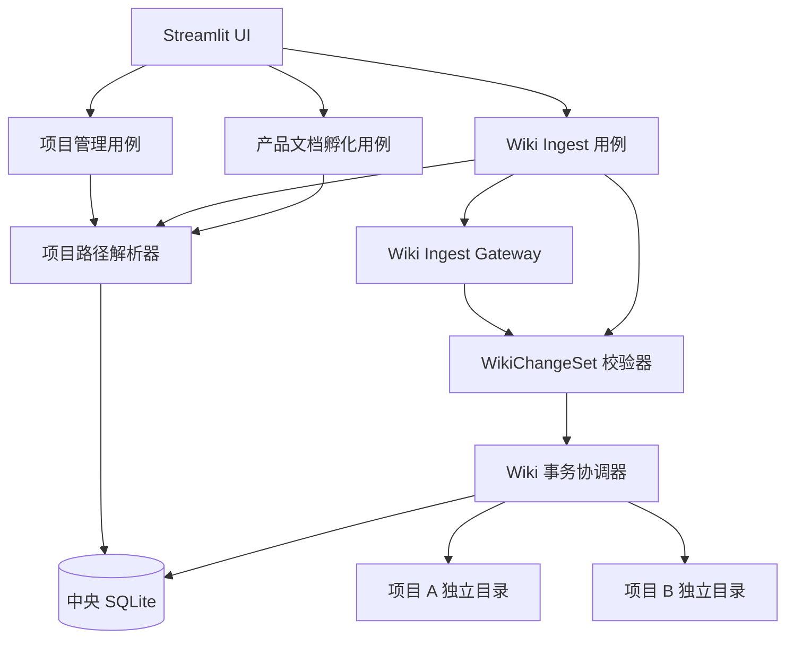

# 产品文档孵化器 2.2 技术架构设计

## 版本信息

| 项目 | 内容 |
| --- | --- |
| 文档版本 | v1.0 |
| 编制日期 | 2026 年 8 月 17 日 |
| 对应产品方案 | `产品文档孵化器_2.2迭代产品方案_v1.0.md`（文档内版本 v1.1） |
| 前置代码版本 | `feat/lightweight-t01`，产品文档孵化器 2.1 已合并 |
| 目标用户 | Owner（产品经理） |
| 技术路线 | 路线 A：中央数据库保留，项目内容目录独立 |
| 投入约束 | 预计 10.5 人日，封顶 12 人日 |

> 本文档定义 2.2 的技术架构、模块边界、接口契约、数据流、事务恢复、安全边界和测试门禁。本文档不是逐任务实施排期；只有本设计通过 Owner 评审后，才编写详细实施计划。

---

## 一、已确认的架构决策

以下决策已经由 Owner 明确确认，后续实施计划不得擅自变更：

1. 保留中央 SQLite，不为每个项目拆分独立数据库；
2. 每次创建项目时，Owner 可以独立选择存放父目录；
3. 系统在所选父目录下创建 `{项目ID}/`，不得直接接管已有目录；
4. 2.2 支持同一台电脑内的项目整体移动和重新定位；
5. 2.2 不支持复制项目文件夹到另一台电脑后直接恢复全部运行状态；
6. 采用完整 Wiki-LLM 语义：归档、Ingest、文档孵化和发布是四个不同动作；
7. L1/L2 在材料和项目均授权后可以通过外部模型形成 Wiki 变更建议；
8. L3/L4 采用“本地 Markdown/Obsidian 编辑 + 页面校验确认”，外部模型调用次数必须为零；
9. Ingest 最终通过统一 `WikiChangeSet` 提交来源页、主题页、index、log 和状态；
10. Wiki 提交采用“项目锁 + 暂存区 + 恢复日志”；
11. 旧版比赛演示 `ImportSource` 不删除、不重写，2.2 新建独立的 Wiki Ingest 用例；
12. 不新增一级导航页面，Ingest 入口保留在“原始材料”页面；
13. 当前产品发布、Markdown 导出、候选 Diff 和 Owner 审核流程继续复用 2.1。

## 二、现状架构评估

### 2.1 已有分层

项目当前采用四层结构：

```text
Streamlit UI
→ Application Use Cases / Ports
→ Domain Models / Policies
→ SQLite、文件系统、Dify Gateway 等 Infrastructure Adapters
```

该分层可以继续使用，2.2 不引入新的 Web 框架、后台任务框架、消息队列或向量数据库。

### 2.2 当前项目定位机制

当前实现存在以下绑定：

- `IncubatorSettings.library_root` 同时承担中央设置目录、数据库目录和默认项目父目录；
- 中央数据库位于 `{library_root}/.incubator/product_incubator.db`；
- `ProjectPaths.for_project(library_root, project_id)` 固定推导 `{library_root}/{project_id}`；
- `ManageProjects`、`ProjectScaffolder`、`AppContainer` 和项目页面均依赖上述推导；
- 项目根目录不能独立登记，因此不能分布在不同父目录。

2.2 必须拆开“中央控制根”和“项目内容根”两个概念，但为了控制改动，不强制重命名已有 `library_root` 字段：

- 代码中的 `library_root` 在 2.2 内解释为**中央控制根兼默认项目父目录**；
- 每个项目的实际内容根由 `projects.project_root_path` 单独登记；
- 所有项目业务服务必须通过统一路径解析器获得实际项目根，禁止继续自行拼接 `library_root / project_id`。

### 2.3 当前材料与 Ingest 机制

2.1 已经把材料归档从候选产品方案生成中拆出：

- `ArchiveRawSource` 负责不可变 Raw 归档和材料治理元数据；
- `SourceIndexStore` 在项目内镜像来源元数据；
- `IncubateDocument` 当前仍直接读取、抽取 Raw 内容生成候选产品方案；
- 旧 `ImportSource` 同时处理上传、抽取、知识卡和比赛演示状态，与 2.2 的 Wiki Ingest 定义不一致。

因此 2.2 的正确改造方式是新增 Wiki Ingest 管线，并让产品文档孵化改为读取已维护的 Wiki，而不是把旧 `ImportSource` 改名后继续使用。

## 三、目标与非目标

### 3.1 技术目标

1. 支持一个中央项目清单管理分布在本机不同目录的项目；
2. 新项目自动生成完整 2.2 Wiki-LLM 脚手架；
3. 已归档材料进入明确的 Ingest 状态机；
4. L1/L2 和 L3/L4 最终产生同一种可校验 `WikiChangeSet`；
5. 来源页、主题页、index、log、source-index 和 SQLite 具备可恢复的一致性；
6. 产品文档孵化默认只读取 `ingested` Wiki 成果；
7. 继续满足项目隔离、Raw 不可变、敏感数据不外发和发布不被 Ingest 修改；
8. 保留 2.0/2.1 现有项目和既有比赛演示链路。

### 3.2 明确非目标

2.2 不实现：

- 跨电脑直接迁移；
- 项目内独立 SQLite；
- 应用内复制、移动或删除完整项目；
- 完整在线 Wiki 编辑器；
- 文件夹监听和无人值守 Ingest；
- 批量、多文件并发或后台 Ingest；
- Wiki 页面重命名、删除和复杂反向链接维护；
- 向量数据库、RAG 服务、qmd 或 MCP 搜索服务；
- 自动判定冲突结论；
- AI 自动发布当前产品方案；
- Wiki 整包导出。

## 四、总体架构



### 4.1 依赖方向

- UI 只调用应用端口，不直接修改 Wiki 文件或 SQLite；
- 应用用例只依赖领域对象和端口；
- 路径解析、文件事务、数据库和外部模型均为基础设施适配器；
- Gateway 只能返回结构化建议，不能持有 Wiki 写权限；
- 只有 Wiki 事务协调器可以提交 Wiki 变更集；
- 产品文档孵化通过 Wiki 上下文读取器获取内容，不自行遍历 Raw。

### 4.2 控制面与内容面

中央控制面保存：

- Owner 设置；
- 项目列表和当前项目；
- 项目绝对根路径和路径状态；
- 材料、草稿、发布、模型调用和 Ingest 运行状态；
- 跨项目结构建议所需的最小元数据。

项目内容面保存：

- Raw 原始材料；
- Wiki 来源页、主题页、索引和日志；
- Schema 和 Agent 规则；
- 候选、当前版本、历史版本和 Markdown 导出；
- 项目内 source-index、事务暂存与恢复记录。

中央数据库记录路径不代表获得任意文件访问权。每次读取和写入仍必须经过项目身份与边界校验。

## 五、项目路径架构

### 5.1 项目路径数据

`Project`/`projects` 增加：

```python
project_root_path: str
root_status: Literal["available", "unavailable"]
root_last_verified_at: datetime | None
```

`ProjectSummary` 增加根路径和状态，用于项目卡片展示。

`CreateProjectInput` 增加：

```python
parent_root: Path
```

新增：

```python
class RelocateProjectInput(ProjectDto):
    project_id: str
    project_root: Path
```

### 5.2 ProjectPathResolver

新增统一端口和适配器：

```python
class ProjectPathResolving(Protocol):
    def resolve(self, project_id: str) -> ProjectPaths: ...
    def validate_parent(self, parent_root: Path, project_id: str) -> Path: ...
    def validate_relocation(self, project_id: str, project_root: Path) -> ProjectPaths: ...
```

解析规则：

1. 从中央项目仓储获取 `project_root_path`，不得根据 ID 自行猜测；
2. 规范化为绝对路径并拒绝项目根符号链接；
3. 要求 `.incubator/project.json` 存在；
4. 文件中的 `project_id` 必须与中央记录一致；
5. 所有派生路径必须位于解析后的项目根内部；
6. 路径不可用时更新 `root_status=unavailable`，但不得自动新建目录；
7. 校验成功时更新 `root_status=available` 和 `root_last_verified_at`。

`ProjectPaths` 保留 `library_root` 作为中央控制根，同时增加显式项目根构造入口：

```python
ProjectPaths.for_registered_root(
    library_root=control_root,
    project_id=project_id,
    project_root=registered_root,
)
```

旧 `for_project()` 暂时保留给历史测试和兼容路径，但 2.2 新业务代码不得调用。

### 5.3 创建项目

```text
Owner 输入项目资料和父目录
→ 校验父目录存在、为目录且可写，并解析为规范化绝对路径
→ 计算 {父目录}/{项目ID}
→ 拒绝已存在的目标
→ 在同一父目录创建临时脚手架
→ 校验完整性
→ 无覆盖原子改名为正式目录
→ 中央 SQLite 登记项目和绝对根路径
→ 创建成功
```

如果目录提交成功但数据库登记失败，必须在同一父目录内把刚创建的目录原子改名为 `.{项目ID}.quarantine-{uuid}`。不得跨磁盘移动，不得直接删除，不得触碰创建前已经存在的任何目录。

项目创建锁按规范化父目录加项目 ID 生成哈希，锁文件保存在中央控制根 `.incubator/locks/`，避免两个请求同时创建同一目标。父目录允许祖先路径包含系统链接，但最终项目目标不得是符号链接。

### 5.4 重新定位

重新定位只更新中央登记，不复制或改写项目内容：

1. Owner 选择移动后的项目根目录；
2. 校验目录存在、可读且不是符号链接；
3. 读取 `.incubator/project.json`；
4. 比对 `project_id` 和 Schema；
5. 校验必需目录和文件；
6. 更新 `project_root_path`、`root_status` 和校验时间；
7. 重新装配当前项目服务。

项目 ID 不一致、Schema 不可识别或必需系统文件缺失时，拒绝重新定位。

### 5.5 AppContainer 改造

`_build_project_context()` 改为：

```text
中央项目仓储
→ ProjectPathResolver.resolve(project_id)
→ ProjectContext(project_id, paths, central_db_path)
→ 按实际项目根装配文件服务
```

中央 `db_path` 始终来自控制根，不得改为项目根内数据库。

## 六、2.2 项目脚手架

### 6.1 必需结构

```text
{项目ID}/
├── README.md
├── AGENTS.md
├── raw/
├── wiki/
│   ├── index.md
│   ├── log.md
│   ├── sources/
│   ├── topics/
│   ├── drafts/
│   │   └── local-ingest/
│   ├── current/
│   └── versions/
├── schema/
│   ├── AGENTS.md
│   ├── ingest-contract.md
│   ├── source-page-template.md
│   ├── topic-page-template.md
│   ├── product-document-template.md
│   └── field-conventions.md
├── exports/
└── .incubator/
    ├── project.json
    ├── source-index.json
    ├── transactions/
    └── locks/
```

### 6.2 资产模板

`assets/incubator_schema/` 增加：

- 根 README 模板；
- 根 AGENTS 模板；
- `ingest-contract.md`；
- 来源页模板；
- 主题页模板。

`ProjectScaffolder` 只负责从可信应用资产生成目录和静态入口，不包含模型调用。

### 6.3 project.json

Schema 版本升级为 `2.2`，至少包含：

```json
{
  "schema_version": "2.2",
  "product_name": "产品文档孵化器",
  "project_id": "PROJECT-A",
  "name": "项目 A",
  "wiki_initialized": true,
  "wiki_schema_version": "2.2",
  "root_readme_path": "README.md",
  "root_agent_rules_path": "AGENTS.md",
  "ingest_contract_path": "schema/ingest-contract.md"
}
```

项目绝对路径不写入 Wiki 页面。中央数据库是当前路径入口，项目 ID 是重新定位的稳定身份。

## 七、Wiki Ingest 领域模型

### 7.1 状态

```python
class WikiIngestStatus(StrEnum):
    PENDING = "pending_ingest"
    PROCESSING = "ingesting"
    INGESTED = "ingested"
    FAILED = "ingest_failed"
    REINGEST_RECOMMENDED = "reingest_recommended"
    LOCAL_REVIEW_REQUIRED = "local_review_required"
```

2.1 历史 `archived` 保持可读；2.2 新项目归档成功后直接使用 `pending_ingest`。

### 7.2 WikiChangeSet

```python
class WikiPageChange(DomainModel):
    relative_path: str
    operation: Literal["create", "replace"]
    before_sha256: str | None
    markdown: str
    after_sha256: str


class WikiChangeSet(DomainModel):
    transaction_id: str
    project_id: str
    source_id: str
    idempotency_key: str
    schema_version: str
    generation_mode: Literal["external_ai", "local_manual"]
    page_changes: list[WikiPageChange]
    source_page_path: str
    topic_page_paths: list[str]
    conflict_count: int
    evidence_gap_count: int
    result_digest: str
```

约束：

- 一次变更集只对应一份来源；
- 必须恰好包含一份来源页；
- 必须包含更新后的 `wiki/index.md` 和 `wiki/log.md`；
- 主题页可以为零份或多份；
- 只允许写入 `wiki/sources/`、`wiki/topics/`、`wiki/index.md`、`wiki/log.md` 和 `.incubator/source-index.json`；
- 禁止写入 Raw、Schema、current、versions、产品候选和发布 Manifest；
- create 的目标必须不存在，replace 的目标必须与 `before_sha256` 一致；
- 所有路径必须是项目内规范化相对路径。

### 7.3 幂等键

```text
SHA-256(project_id + source_id + raw_sha256 + ingest_schema_version)
```

同一幂等键已有成功运行时，返回已提交结果，不再次调用模型，不新增日志和重复段落。

Schema 升级后幂等键改变，来源进入 `reingest_recommended`，但旧 Wiki 结果继续可用，直到 Owner 明确重新 Ingest。

## 八、L1/L2 标准 Ingest

### 8.1 应用用例

新增 `IngestArchivedSource`：

```python
class IngestArchivedSourceInput(BaseModel):
    project_id: str
    source_id: str
    requested_by: str


class WikiIngestResultView(BaseModel):
    source_id: str
    status: WikiIngestStatus
    source_page_path: str
    topic_page_paths: list[str]
    conflict_count: int
    evidence_gap_count: int
    duplicate: bool
```

### 8.2 执行步骤

1. 解析当前项目根并获取项目 Ingest 锁；
2. 读取中央来源记录，校验属于当前项目；
3. 校验 Raw 路径位于项目 `raw/` 内；
4. 重新计算 SHA-256 并与归档记录一致；
5. 校验项目外部调用开关、材料安全等级、脱敏和材料授权；
6. 读取并校验 `schema/ingest-contract.md`；
7. 读取当前 index 和相关主题，并通过 `WikiOutboundContextBuilder` 生成允许外发的安全投影；
8. 抽取并脱敏允许外发的材料内容；
9. 调用独立 Wiki Ingest Gateway；
10. 将结构化输出转换为完整 `WikiChangeSet`；
11. 执行引用、路径、链接、冲突、Schema 和项目边界校验；
12. 通过 Wiki 事务协调器提交；
13. 返回来源页、主题页、冲突和证据缺口摘要。

### 8.3 Gateway 边界

新增 Wiki Ingest 输入输出 Schema，不复用旧知识卡输出：

```python
class WikiIngestWorkflowInput(BaseModel):
    schema_version: Literal["2.2"]
    task_id: str
    project_id: str
    source: WikiSourceInput
    source_chunks: list[WikiSourceChunk]
    safe_index_projection: str
    safe_related_topics: list[SafeWikiTopicInput]
    ingest_contract: str


class WikiIngestWorkflowOutput(BaseModel):
    schema_version: Literal["2.2"]
    task_id: str
    source_page_markdown: str
    topic_changes: list[WikiTopicChangeOutput]
    index_entries: list[WikiIndexEntryOutput]
    conflicts: list[WikiConflictOutput]
    evidence_gaps: list[str]
```

Gateway 不直接返回任意目标路径。应用根据稳定 ID 和安全文件名生成路径，避免模型输出目录逃逸。

模型只生成来源页正文、主题页正文或结构化主题变更；`wiki/index.md`、`wiki/log.md` 和 source-index 的最终文本由本地确定性代码生成。

外部 Gateway 不得直接接收完整 `wiki/index.md` 或完整主题页。安全投影遵循：

1. 只包含引用来源均为 L1/L2、已脱敏且允许外部调用的陈述；
2. 任何包含 L3/L4 或未授权来源的主题页正文整体不外发；
3. 对被排除但与本次来源主题相同的页面，只在本地结果中增加“敏感主题需 Owner 对照”，不得外发主题标题或正文；
4. index 只生成本次调用所需的安全来源/主题摘要，不传原文件；
5. 安全投影的字符数、来源 ID 和授权证明写入模型调用日志，但不记录正文。

这样可能无法由外部模型判断 L1/L2 新来源与 L3/L4 旧知识之间的语义冲突；该类冲突必须进入本地 Owner 对照，不能以提升自动化程度为由放宽安全边界。

## 九、L3/L4 本地 Ingest

### 9.1 本地草稿位置

```text
wiki/drafts/local-ingest/{source_id}/
├── README.md
├── source.md
└── topics/
    └── {topic-slug}.md
```

此目录是待确认草稿，不是已生效 Wiki。它可以被 Obsidian 浏览和编辑，但不会被产品文档孵化读取。

### 9.2 创建本地草稿

新增 `PrepareLocalWikiIngest`：

1. 校验来源属于当前项目且为 L3/L4；
2. 校验 Raw 完整性；
3. 从可信模板生成 `source.md` 和操作 README；
4. 可复制 Owner 选择的现有主题页到草稿 topics 目录供修改；
5. 不把 Raw 正文自动写入日志或外部服务；
6. 将材料状态设为 `local_review_required`。

### 9.3 校验确认

新增 `ConfirmLocalWikiIngest`：

1. 读取本地草稿；
2. 校验来源 ID、必需章节、Frontmatter、链接和引用；
3. 校验主题页只能对应当前项目已有页或合法新页；
4. 转换为 `generation_mode=local_manual` 的 `WikiChangeSet`；
5. 通过与 L1/L2 相同的事务协调器提交；
6. 成功后删除 `wiki/drafts/local-ingest/{source_id}/` 草稿；事务 `result.json` 保留路径、哈希和计数摘要，不重复保存敏感正文；失败时保留草稿供 Owner 修正；
7. 将材料状态设为 `ingested`。

所有 L3/L4 流程不得构造 Gateway，也不得产生模型调用日志。自动化测试必须以 Gateway 调用次数为零作为硬门禁。

## 十、Wiki 事务与恢复

### 10.1 事务目录

```text
.incubator/transactions/{transaction_id}/
├── journal.json
├── staged/
├── backup/
└── result.json
```

### 10.2 journal 状态

```text
building
→ prepared
→ files_committed
→ database_committed
→ committed

任一步失败 → rolling_back → rolled_back
无法确定 → recovery_required
```

`journal.json` 至少记录：

- transaction ID；
- project ID 和 source ID；
- 幂等键；
- Schema 版本；
- 每个目标的相对路径、before/after SHA-256；
- 当前阶段；
- 创建和更新时间；
-安全错误码，不记录敏感正文。

### 10.3 提交协议

1. 获取 `.incubator/locks/wiki-ingest.lock`；
2. 检查是否存在未恢复事务；
3. 在 `staged/` 生成全部目标文件；
4. 验证所有目标路径、哈希、Markdown、引用和链接；
5. 把当前目标文件复制到 `backup/`；
6. 写入 `prepared` 日志并刷新到磁盘；
7. 使用同目录临时文件和 `os.replace` 逐个替换目标；
8. 写入 `files_committed`；
9. 在单个 SQLite 事务中更新来源记录和 `wiki_ingest_runs`；
10. 写入 `database_committed`；
11. 复核磁盘 after SHA-256；
12. 写入 `committed` 并清理大体积暂存、保留结果摘要。

SQLite 与多个 Markdown 文件无法形成真正的单指令原子提交，因此 2.2 的“原子”定义是：正常失败立即回滚；进程崩溃后可以根据日志确定性恢复；恢复完成前禁止继续写入。

### 10.4 恢复矩阵

| journal 状态 | 数据库成功记录 | 恢复动作 |
| --- | --- | --- |
| `building` / `prepared` | 无 | 删除暂存，恢复备份（如有），标记 rolled_back |
| `files_committed` | 无 | 使用 backup 恢复全部目标，标记 rolled_back |
| `files_committed` | 有 | 校验 after 哈希，补写 database_committed/committed |
| `database_committed` | 有 | 校验 after 哈希并完成收尾 |
| `database_committed` | 无 | 判定异常，进入 recovery_required，不自动猜测 |
| `committed` | 有 | 无动作，可清理残留暂存 |

如果 backup 缺失、目标哈希既不匹配 before 也不匹配 after，必须进入 `recovery_required`，不得覆盖 Owner 在外部编辑器中的未知修改。

### 10.5 并发

- 同一项目同一时间只允许一个 Wiki Ingest；
- 不同项目使用各自锁，可以并行；
- Owner 在 Obsidian 修改正式 Wiki 与系统提交发生冲突时，before SHA-256 校验失败，本次提交终止；
- 应用启动或进入项目时，如发现 `ingesting` 运行没有活动锁、没有可恢复提交且已超过配置的中断判定时间，则将其标记为 `ingest_failed/WIKI_INGEST_INTERRUPTED`；
- 2.2 不实现自动三方合并。

## 十一、数据库迁移

### 11.1 projects

```sql
ALTER TABLE projects ADD COLUMN project_root_path TEXT;
ALTER TABLE projects ADD COLUMN root_status TEXT NOT NULL DEFAULT 'available';
ALTER TABLE projects ADD COLUMN root_last_verified_at TEXT;
```

迁移程序使用中央控制根对既有项目回填：

```text
project_root_path = canonical(control_root / project_id)
```

存在且 `.incubator/project.json` 身份匹配时标记 `available`，否则标记 `unavailable`。迁移不创建、移动或改写已有项目目录。

新项目登记完成后 `project_root_path` 必须非空。数据库层可以暂时允许历史 NULL，仓储层和 2.2 用例必须拒绝新项目 NULL。

### 11.2 source_records

```sql
ALTER TABLE source_records ADD COLUMN ingest_schema_version TEXT;
ALTER TABLE source_records ADD COLUMN ingested_at TEXT;
ALTER TABLE source_records ADD COLUMN source_page_path TEXT;
ALTER TABLE source_records ADD COLUMN topic_page_paths_json TEXT NOT NULL DEFAULT '[]';
ALTER TABLE source_records ADD COLUMN ingest_result_digest TEXT;
ALTER TABLE source_records ADD COLUMN ingest_error_code TEXT;
ALTER TABLE source_records ADD COLUMN generation_mode TEXT;
```

历史记录不自动改为 `ingested`。2.1 的 `archived`、旧比赛链路的 `completed` 等状态继续按原用例解释，2.2 Wiki Ingest 只把 2.2 新归档或 Owner 明确发起的材料转换到新状态机。

### 11.3 wiki_ingest_runs

```sql
CREATE TABLE IF NOT EXISTS wiki_ingest_runs (
    id TEXT PRIMARY KEY,
    project_id TEXT NOT NULL REFERENCES projects(id),
    source_id TEXT NOT NULL REFERENCES source_records(id),
    transaction_id TEXT NOT NULL UNIQUE,
    idempotency_key TEXT NOT NULL UNIQUE,
    schema_version TEXT NOT NULL,
    generation_mode TEXT NOT NULL,
    status TEXT NOT NULL,
    source_page_path TEXT,
    topic_page_paths_json TEXT NOT NULL DEFAULT '[]',
    result_digest TEXT,
    error_code TEXT,
    started_at TEXT NOT NULL,
    finished_at TEXT
);
```

不新增 Wiki 正文表，避免数据库和 Markdown 同时成为正文真相来源。

## 十二、source-index 和 Wiki 文件规则

### 12.1 source-index 2.2

每份来源增加：

- `ingest_schema_version`；
- `ingested_at`；
- `source_page_path`；
- `topic_page_paths`；
- `ingest_result_digest`；
- `ingest_error_code`；
- `generation_mode`。

source-index 是便于 Finder、Obsidian 和本地检查的项目内镜像，不取代中央 SQLite。

### 12.2 来源页

每份成功 Ingest 的来源只对应一个稳定来源页：

```text
wiki/sources/{source_id}-{safe-material-name}.md
```

Frontmatter 至少包含：

- source ID；
- material series ID；
- material version；
- Raw 相对路径和 SHA-256；
- 材料类型、权威和安全等级；
- Ingest Schema 版本；
- generation mode；
- Ingest 时间。

### 12.3 主题页

主题页必须保留：

- 当前综合结论；
- 支持来源；
- 冲突来源；
- 待确认项；
- 最近更新时间。

新来源不得静默删除旧来源支持的结论。冲突必须并列呈现并保留双方 source ID。

### 12.4 index 和 log

`wiki/index.md` 由本地确定性代码维护来源入口、主题入口、未解决冲突和最近 Ingest。

`wiki/log.md` 每次成功事务只新增一条固定格式记录。失败不得写成功日志；同一幂等键不得重复写日志。

## 十三、产品文档孵化改造

### 13.1 WikiContextReader

新增：

```python
class WikiContextReading(Protocol):
    def list_ingested_sources(self, project_id: str) -> list[WikiSourceView]: ...
    def read_context(self, project_id: str, source_ids: list[str]) -> WikiIncubationContext: ...
```

职责：

- 只返回 `ingested` 来源；
- 校验来源页和主题页位于当前项目；
- 验证来源页记录的 Raw SHA-256 仍与中央记录一致；
- 返回来源页、相关主题页、冲突和证据缺口；
- L3/L4 只读取已经本地确认的 Wiki 页面，不读取 Raw 正文外发。

### 13.2 IncubateDocument

保留候选 ID、草稿存储、Diff、Owner 审核和发布逻辑，只替换上下文来源：

```text
当前：选材料 → 直接读取 Raw → 抽取 → 生成候选
2.2：选已 Ingest 来源 → 读取 Wiki 来源页/主题页 → 生成候选
```

候选记录继续保存 source IDs，同时增加或在调用摘要中保存实际使用的 Wiki 页面路径。

L3/L4 Wiki 内容不能进入外部文档生成。Owner 可继续使用 2.1 的本地候选能力；2.2 不新增本地大模型。

## 十四、界面改造

### 14.1 项目中心

新增：

- “项目存放父目录”；
- 最终项目根目录实时预览；
- 恢复默认目录；
- 路径不存在、不可写、目标已存在和路径非法提示；
- 项目卡片显示实际绝对路径和 `available/unavailable`；
- `unavailable` 项目显示“重新定位”，不显示“进入项目”；
- 创建成功显示 README 和 Wiki 索引位置。

Streamlit 轻量版使用绝对路径文本输入，不开发复杂系统文件夹选择器。

### 14.2 原始材料

归档成功文案改为：

```text
材料已归档，尚未 Ingest
```

材料卡显示：

- Ingest 状态；
- 开始 Ingest；
- 查看 Wiki 结果；
- 失败后重试；
- L3/L4 创建本地 Ingest 草稿；
- 校验并确认本地 Ingest；
- 本次新增/更新主题、冲突和证据缺口数量。

页面通过应用服务读取数据，不直接解析和修改 source-index。

### 14.3 文档孵化

- 材料列表只展示已 Ingest 来源；
- 显示来源页和相关主题数量；
- 候选上下文显示实际 Wiki 页面；
- 未解决冲突醒目提示；
- 不再提示“归档即可直接参与外部生成”。

### 14.4 导航

保持五个一级入口：

- 项目中心；
- 原始材料；
- 文档孵化；
- 当前产品；
- 检查与建议。

不新增独立 Ingest 一级页面。

## 十五、错误码与失败行为

建议新增稳定错误码：

| 错误码 | 含义 | 用户行为 |
| --- | --- | --- |
| `PROJECT_ROOT_UNAVAILABLE` | 登记的项目目录不存在 | 重新定位 |
| `PROJECT_ROOT_ID_MISMATCH` | 新目录项目 ID 不匹配 | 选择正确目录 |
| `PROJECT_ROOT_NOT_WRITABLE` | 父目录不可写 | 更换目录或权限 |
| `PROJECT_ROOT_ALREADY_EXISTS` | 目标项目目录已存在 | 更换 ID 或父目录 |
| `WIKI_SCHEMA_MISSING` | Ingest Schema 缺失 | 修复脚手架后重试 |
| `WIKI_SOURCE_INTEGRITY_FAILED` | Raw SHA-256 不一致 | 恢复正确 Raw，不得继续 |
| `WIKI_EXTERNAL_CALL_DENIED` | 安全策略不允许外部调用 | 使用本地路线 |
| `WIKI_CHANGESET_INVALID` | 变更集结构或引用非法 | 修复输出或本地草稿 |
| `WIKI_CONCURRENT_MODIFICATION` | Owner 已修改目标页 | 重新读取后重试 |
| `WIKI_TRANSACTION_FAILED` | 正常提交失败并已回滚 | 查看安全摘要后重试 |
| `WIKI_RECOVERY_REQUIRED` | 无法自动判断一致性 | 先执行恢复检查 |
| `WIKI_INGEST_ALREADY_RUNNING` | 当前项目已有 Ingest | 等待当前任务完成 |

错误日志只允许记录项目 ID、来源 ID、事务 ID、错误码、阶段和时间，不记录 Raw 正文、完整 Wiki 正文或密钥。

## 十六、安全设计

### 16.1 路径安全

- project ID 继续使用固定正则；
- Owner 选择的父目录必须规范化并进行可写检查；
- 项目根、Raw、Wiki、Schema、事务目录均拒绝符号链接逃逸；
- 模型输出不得控制文件路径；
- 所有相对路径拒绝绝对路径、`..`、NUL 和路径分隔符注入；
- 不因为项目路径登记在数据库中就跳过 `.incubator/project.json` 身份校验。

### 16.2 内容安全

- Raw 永久只读；
- L1/L2 只有项目和材料均授权、已脱敏时才调用外部模型；
- L3/L4 外部 Gateway 调用次数必须为零；
- 外部 Wiki Ingest 只发送本次单一来源的受控内容和必要相关主题；
- 不发送其他项目正文；
- 不将 API Key 或 `.env` 写入 Wiki；
- Ingest 不能修改 current、versions 或发布 Manifest。

### 16.3 项目隔离

应用用例同时校验：

1. command.project_id；
2. 中央实体 project_id；
3. `.incubator/project.json` project_id；
4. SourceRecord.project_id；
5. 所有目标路径属于解析后的项目根。

任一不一致立即失败。

## 十七、模块与文件影响

### 17.1 建议新增

| 文件 | 单一职责 |
| --- | --- |
| `src/domain/wiki.py` | Wiki 状态、页面变更、变更集和结果模型 |
| `src/application/dto/wiki_ingest.py` | 外部、本地和恢复命令 DTO |
| `src/application/ports/wiki_ingest.py` | 路径、Gateway、Wiki 事务和上下文端口 |
| `src/application/use_cases/ingest_archived_source.py` | L1/L2 标准 Wiki Ingest |
| `src/application/use_cases/prepare_local_wiki_ingest.py` | 生成 L3/L4 本地草稿 |
| `src/application/use_cases/confirm_local_wiki_ingest.py` | 校验并确认本地草稿 |
| `src/application/use_cases/recover_wiki_transaction.py` | 项目打开时恢复未完成事务 |
| `src/infrastructure/files/project_path_resolver.py` | 中央登记到安全 ProjectPaths 的统一解析 |
| `src/infrastructure/files/wiki_store.py` | Wiki 页面读取和确定性 index/log 生成 |
| `src/infrastructure/files/wiki_change_set_store.py` | 暂存、提交、备份和回滚 |
| `src/infrastructure/files/wiki_validator.py` | Markdown、链接、引用和路径校验 |
| `src/infrastructure/files/wiki_outbound_context.py` | 按来源授权生成可外发 Wiki 安全投影 |
| `src/infrastructure/gateways/wiki_ingest_gateway.py` | 2.2 Wiki Ingest 外部模型适配 |
| `tests/unit/domain/test_wiki.py` | 状态、幂等和变更集规则 |
| `tests/unit/infrastructure/test_project_path_resolver.py` | 路径与身份校验 |
| `tests/integration/use_cases/test_wiki_ingest.py` | L1/L2 主流程 |
| `tests/integration/use_cases/test_local_wiki_ingest.py` | L3/L4 本地流程 |
| `tests/integration/files/test_wiki_transaction.py` | 事务、回滚和恢复 |
| `tests/security/test_wiki_project_isolation.py` | 跨项目与路径攻击 |
| `tests/security/test_wiki_outbound_projection.py` | L3/L4 与未授权主题不进入外发上下文 |
| `tests/e2e/test_wiki_incubation_flow.py` | 归档到孵化完整流程 |

### 17.2 建议修改

| 文件 | 修改内容 |
| --- | --- |
| `src/domain/models.py`、`incubator.py`、`enums.py` | 项目路径字段、摘要和新状态 |
| `src/application/dto/projects.py` | 父目录和重新定位 DTO |
| `src/application/ports/incubator.py` | 创建、重新定位和路径状态接口 |
| `src/application/use_cases/manage_projects.py` | 独立父目录、登记、重新定位和项目摘要 |
| `src/application/use_cases/archive_raw_source.py` | 2.2 新项目归档状态改为 pending_ingest |
| `src/application/use_cases/incubate_document.py` | 使用 WikiContextReader |
| `src/infrastructure/db/migrations.py` | 2.2 增量迁移 |
| `src/infrastructure/db/repositories.py` | 项目路径、Ingest 字段和运行仓储 |
| `src/infrastructure/files/project_library.py` | 显式登记根路径的 ProjectPaths |
| `src/infrastructure/files/project_scaffolder.py` | 2.2 完整脚手架 |
| `src/infrastructure/files/source_index_store.py` | 2.2 字段与事务快照支持 |
| `src/infrastructure/files/project_audit_log.py` | Wiki Ingest 成功日志必须进入变更集；其他既有业务日志保持兼容 |
| `src/infrastructure/gateways/schemas.py` | Wiki Ingest 输入输出 Schema |
| `src/application/project_context.py` | 中央 DB 与独立项目根并存 |
| `src/application/container.py` | 路径解析、Wiki 服务和恢复装配 |
| `src/ui/pages/projects.py` | 父目录、实际路径和重新定位 |
| `src/ui/pages/materials.py` | Ingest 状态与外部/本地操作 |
| `src/ui/pages/incubate.py` | 已 Ingest Wiki 来源和冲突提示 |
| `tests/integration/use_cases/test_manage_projects.py` | 多父目录和重新定位 |
| `tests/integration/db/test_migrations.py` | 2.2 迁移与回填 |
| `tests/e2e/test_projects_page.py`、`test_materials_page.py`、`test_incubate_page.py` | 页面流程 |

### 17.3 原则上保持不动

- `ImportSource` 旧比赛演示语义；
- 当前产品发布用例；
- 当前产品单 Markdown 导出；
- 候选 Diff 和 Owner 审核；
- 2.1 材料分类、材料系列和版本链；
- 现有 Query/Lint 演示链路。

如果测试表明必须修改这些模块，只允许做兼容适配，不得扩大 2.2 产品范围。

## 十八、测试与验收门禁

### 18.1 单元测试

必须覆盖：

- 路径规范化、符号链接、目录逃逸和项目 ID；
- Wiki 状态合法流转；
- 幂等键稳定性；
- WikiChangeSet 允许/禁止目标；
- 来源页、主题页和 Obsidian 链接格式；
- 冲突和引用必填规则；
- 确定性 index/log 生成。

### 18.2 集成测试

必须覆盖：

- 新数据库和 2.1 数据库迁移；
- 既有项目路径回填且不改写目录；
- 两个项目在不同父目录创建和切换；
- 目录移动后重新定位；
- 完整 L1/L2 Wiki Ingest；
- 完整 L3/L4 本地确认；
- 每个事务阶段注入失败并验证恢复；
- 同一幂等键重复执行；
- Owner 外部编辑造成 before SHA 冲突；
- 产品文档孵化只读取已 Ingest Wiki。

### 18.3 安全测试

必须覆盖：

- A 项目无法读取、链接或修改 B 项目；
- 模型输出绝对路径、`..` 和符号链接攻击被拒绝；
- L3/L4 Gateway 调用数为零；
- Raw 在 Ingest 前后字节和 SHA-256 不变；
- Ingest 不修改 current、versions 和 Manifest；
- 错误日志不包含敏感正文。

### 18.4 端到端测试

至少包含四条：

1. 创建独立目录项目 → 归档 L1/L2 → Ingest → Wiki → 孵化候选；
2. 创建独立目录项目 → 归档 L3/L4 → Obsidian 草稿 → 校验确认 → 本地后续流程；
3. 两个项目位于不同目录 → 分别操作 → 无交叉读写；
4. 项目整体移动 → 路径不可用 → 重新定位 → 继续归档和 Ingest。

### 18.5 回归门禁

进入 2.2 验收前必须同时满足：

- 2.2 新增测试全部通过；
- 现有全量测试通过；
- Ruff 检查通过；
- Ruff format 检查通过；
- compileall 通过；
- 产品方案 AC-01～AC-29 有明确自动化或人工证据；
- 未提交测试产物和敏感日志；
- 仅有预期工作区改动。

## 十九、兼容与上线策略

### 19.1 新项目

2.2 上线后新建项目必须完整使用 2.2 脚手架。缺少 README、AGENTS、sources 或 Ingest Schema 时创建整体失败。

### 19.2 既有项目

- 只回填中央路径字段；
- 不自动补 README、AGENTS 或来源页；
- 不批量 Ingest 历史材料；
- 不自动修改现有 Wiki；
- 仍能按 2.0/2.1 流程打开和使用；
- 路径失效时可以使用重新定位。

### 19.3 功能启用

Wiki Ingest 能力以项目 `schema_version=2.2` 和 `wiki_initialized=true` 为准。旧项目不显示误导性的“开始 Wiki Ingest”按钮。

### 19.4 回退

如果 2.2 应用版本回退：

- 新增数据库列和表保留，不做破坏性降级；
- 2.1 代码忽略新增列；
- 2.2 新项目文件仍是普通 Markdown，可用 Obsidian 浏览；
- 不执行自动删除或回写旧 Schema。

## 二十、工作包与投入约束

| 工作包 | 架构范围 | 预计人日 |
| --- | --- | ---: |
| A | 路径字段、解析器、创建/重新定位和项目页面 | 1.5 |
| B | 2.2 脚手架、README/AGENTS/Schema 模板 | 1.0 |
| C | Wiki 领域模型、数据库状态和来源索引 | 1.5 |
| D | WikiChangeSet、事务提交、回滚和恢复 | 2.0 |
| E | L1/L2 Wiki Ingest Gateway 与用例 | 1.5 |
| F | L3/L4 本地草稿和确认 | 1.0 |
| G | Wiki 驱动的文档孵化与页面调整 | 0.75 |
| H | 安全、端到端、回归和验收证据 | 1.25 |
| 合计 |  | 10.5 |

保留 1.5 人日风险缓冲，整体不得超过 12 人日。

若实施估算超过 12 人日，允许优先延后：

- 项目卡片的待 Ingest/已 Ingest统计；
- `reingest_recommended` 的主动提醒；
- L3/L4 本地草稿自动复制已有主题页，改由 Owner 手动新建主题草稿。

不得裁减：

- 独立项目根目录和重新定位；
- 禁止覆盖和项目身份校验；
- 根 README/AGENTS 和标准 Ingest Schema；
- 来源页、index、log；
- 项目锁、事务恢复和 Raw 完整性；
- L3/L4 零外部调用；
- 项目隔离；
- Ingest 不修改当前产品和发布 Manifest。

## 二十一、详细实施计划的输入边界

后续详细实施计划必须：

1. 按工作包拆成可以独立验证的小任务；
2. 每个任务先写失败测试，再实现最小代码；
3. 每个节点给出具体文件、命令和验收证据；
4. 先完成项目路径与脚手架，再完成 Wiki 事务，再接入外部/本地 Ingest；
5. 产品文档孵化改造必须在 Wiki Ingest 稳定后进行；
6. 每一批完成后运行相关测试，最终运行全量门禁；
7. 不在计划中夹带跨电脑迁移、在线 Wiki 编辑器或数据库拆分。

本技术架构的最终判断标准是：项目内容可以安全分布在本机不同目录；每份材料先被可靠地编译进项目内可浏览、可追溯的 Wiki；产品文档再从这套 Wiki 孵化，而中央数据库继续承担统一控制和状态登记。
