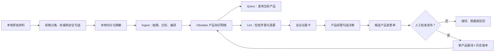
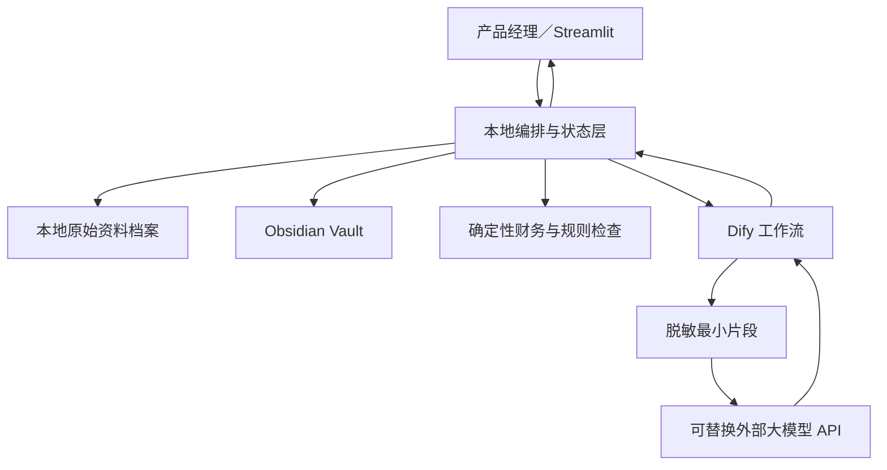

# 产品智策：信贷产品全生命周期知识与决策治理平台

## 项目计划方案框架 v0.4

> 文档状态：已完成方案确认，待用户书面评审  
> 项目类型：AI 创新应用大赛比赛版 MVP＋后续生产推广规划  
> 底层原理：Andrej Karpathy 的 LLM Wiki 理念  
> 核心操作：Ingest／Query／Lint  
> 技术路线：Obsidian＋Dify＋Streamlit＋确定性计算引擎＋可替换外部大模型 API  
> 业务 Demo：蓝领贷“推荐官链客计划”，当前基线版本 `LLD-724_1`  
> 计划冻结日：2026 年 8 月 24 日  
> 比赛截止日：2026 年 8 月 31 日

---

## 一、执行摘要

### 1.1 项目一句话定义

“产品智策”以当前生效产品方案为唯一业务主线，将风险方案、会议纪要、技术方案、需求评审、财务意见、市场资料和运营数据持续编译成一个本地、可追溯、双链化的产品知识网络，并通过 AI 完成资料吸收、产品问答、矛盾检查、会议决策和版本迭代。

项目口号：

> 让信贷产品方案像代码一样，被持续编译、查询、检查和版本化。

### 1.2 核心价值

项目主要解决以下问题：

- 行业研究、场景设计、产品方案和技术方案反复撰写，项目前期周期长；
- 产品、风险、财务、技术、运营和管理层材料分散，口径冲突依靠人工逐条发现；
- 会议意见可能是讨论、建议或正式决议，但经常被混在一起使用；
- 产品方案多次修改后，当前有效规则、候选建议和历史规则容易混淆；
- 上线后产品要素变化没有及时回写产品方案，技术、风险和运营仍可能引用旧版本；
- 评审会议大量时间用于找材料、对口径，真正用于决策的时间不足；
- 传统知识库可以检索原文，但难以持续维护“当前产品究竟是什么”。

### 1.3 比赛版的惊艳点

比赛版不追求建设大而全的生产系统，而是完整演示一个强记忆点闭环：

> 导入一份新资料 → AI 编译进产品知识网络 → 一键发现当前矛盾 → 会议现场逐项勾选决策 → 自动形成产品变更单 → 人工批准并发布新产品基线。

现场同时展示：

- 一键询问当前产品规则，并区分生效、候选和历史内容；
- Obsidian 双链关系图展示一条意见如何影响规则、形成冲突、进入决策并产生新版本；
- 市场与商业可行性、通用损益和差异化指标作为专业能力嵌入产品知识网络；
- 原始资料本地保存，只有脱敏后的最小必要片段调用外部模型。

### 1.4 已确认的关键决策

| 事项 | 已确认设计 |
|---|---|
| 总体方案 | 采用方案 B：以 LLM Wiki 重构项目底层逻辑 |
| 产品主线 | 始终围绕“当前生效产品基线”展开 |
| 知识载体 | 使用 Obsidian 本地维护 Markdown 知识库 |
| 技术栈 | Dify＋Streamlit，允许调用可替换外部大模型 API |
| 安全模式 | Obsidian 本地存储＋脱敏片段最小化调用外部 API |
| 产品视图 | 完整产品方案＋原子知识卡片，一套内容、两种视图 |
| 变更权限 | 产品经理人工批准后才能发布新产品基线 |
| 操作方式 | 尽量使用前端单选、复选、下拉框和标签 |
| 用户角色 | 比赛版仅展示产品经理角色，多角色协同放入推广规划 |
| 核心闭环 | Ingest—Lint—会议决策—变更单—新基线发布 |
| Agent 组织 | 1 个总控 Agent＋8 个专业 Agent |
| 交付日期 | 2026 年 8 月 24 日前完成完整参赛包 |

### 1.5 比赛版边界

- 不对真实客户作自动授信、定额或拒绝决策；
- 不接入生产信贷核心系统；
- 不处理未脱敏的身份、征信、银行卡或账户数据；
- 不由 AI 自行决定正式风险政策、风险阈值或会计政策；
- 不建设真实的多角色账号、权限、线上会签和生产审计体系；
- 不把 Obsidian 双链宣传为“神经网络”，统一称为“类型化双链知识网络”或“产品关系图谱”；
- 不把“文件保存在本地”宣传为“数据完全不出域”，统一使用“本地知识资产＋脱敏最小化出域”的安全口径；
- 不把市场假设、模拟材料或 AI 建议描述成已发生的经营事实或正式部门意见。

---

## 二、底层原理与产品治理模型

### 2.1 LLM Wiki 三层结构

本项目采用三层结构，而不是把所有文件直接堆入传统 RAG 知识库：

1. **不可变原始资料层**
   - 保存产品方案、风险方案、会议纪要、技术方案、需求评审、财务意见、市场资料和运营数据；
   - 记录文件哈希、来源、版本、日期、权威等级、脱敏状态和适用范围；
   - AI 可以读取，但不能修改原始文件；
   - 是所有结论最终可回溯的事实来源。

2. **LLM 维护的产品 Wiki 层**
   - 保存当前产品基线、原子知识卡片、证据、冲突议题、决策记录、变更单和历史版本；
   - AI 可以生成摘要、关系和候选内容；
   - 当前生效产品内容只有经产品经理批准后才能修改；
   - Obsidian 作为本地、可阅读、可双链导航的知识资产界面。

3. **Schema 与治理规则层**
   - 使用 `WIKI_SCHEMA.md`、`AGENTS.md`、模板和字段字典定义知识库结构；
   - 规定 Ingest、Query、Lint、版本发布、引用、安全和人工审批规则；
   - 统一 Agent 的输入、输出、编号和交接方式；
   - 是整个项目最关键的配置和质量边界。

### 2.2 当前产品基线的权威边界

“当前生效产品基线”是所有查询、检查、评审和变更的默认业务基准，但它不是不可修改的绝对真理。

| 对象 | 治理定位 |
|---|---|
| 原始资料 | 不可篡改的事实来源 |
| 当前生效产品基线 | 经人工批准后形成的当前受控结论 |
| 候选知识或专业意见 | 尚未进入产品基线的输入 |
| 冲突议题 | 需要会议或责任人处理的问题 |
| 产品变更单 | 将建议转换为正式修改的治理载体 |
| 历史版本 | 已被新版本替代但必须保留的受控记录 |

所有资料都可以影响产品方案，但不能直接覆盖产品方案。只有“产品经理人工批准的产品变更单”可以形成新的当前生效版本。

### 2.3 一套内容、两种视图

1. **完整产品方案视图**
   - 保持正式产品方案的章节结构和阅读体验；
   - 用于领导报批、宣讲、跨部门评审和文档导出；
   - 每次发布时形成带版本号的完整快照。

2. **原子知识卡片视图**
   - 将客群、额度、定价、期限、获客、流程、风险条件、系统能力、财务假设等拆成可链接的规则卡；
   - 用于 Query、Lint、影响分析和知识图谱展示；
   - 每张卡保留来源、状态、适用范围、版本和关联对象。

两种视图必须共享同一版本号和发布动作，不允许用户分别维护两套相互冲突的内容。

### 2.4 知识状态模型

| 状态 | 含义 | 是否默认用于回答当前规则 |
|---|---|---|
| `ai_inferred` | AI 推定，尚未人工确认 | 否 |
| `human_confirmed` | 已人工确认可进入分析 | 仅作为证据或意见 |
| `candidate` | 候选修改，尚未批准 | 否，但提示存在候选变化 |
| `conflict` | 与当前规则或其他材料存在冲突 | 否，但提示存在争议 |
| `effective` | 已批准并当前生效 | 是 |
| `superseded` | 已被后续版本替代 | 否，仅在历史查询中使用 |
| `rejected` | 已明确拒绝或判定误报 | 否 |

---

## 三、端到端业务流程

### 3.1 总体流程



### 3.2 建立产品项目和初始基线

1. 创建产品项目，填写产品名称、生命周期阶段、项目类型、客群、授信模式、获客模式和启用的场景扩展包；
2. 导入当前正式产品方案；
3. 产品经理确认该文件为“正式生效文件”；
4. 系统生成完整产品方案视图和原子知识卡片；
5. 固化初始基线版本，例如 `LLD-724_1`；
6. 生成当前产品索引、版本清单和知识关系图。

### 3.3 Ingest：资料吸收与知识编译

#### 输入

- 风险方案或风险专业意见；
- 会议纪要或领导批示；
- 技术方案、需求评审和测试结论；
- 财务意见、损益测算和会计口径；
- 市场研究、客户访谈、竞品资料和渠道反馈；
- 上线后的经营、风险、财务或运营指标快照。

#### 处理

1. 前端确认材料类型、权威等级、来源部门、版本、日期、适用产品版本和安全标签；
2. 本地程序完成文件索引、切分、基础脱敏和最小片段选择；
3. AI 提取事实、规则、建议、决议、假设、指标、行动项和待确认事项；
4. 将每条内容定位到产品方案章节和原子规则卡；
5. 与当前生效产品基线、已有候选事项和历史版本比较；
6. 生成双链关系、引用和处理日志。

#### 四类处理结果

| 结果 | 含义 | 后续动作 |
|---|---|---|
| 参考沉淀 | 与当前方案不冲突，只补充证据或说明 | 自动进入知识库 |
| 建议迭代 | 可能需要改变产品规则 | 生成候选变更项 |
| 冲突讨论 | 与当前方案或其他材料存在不一致 | 生成 Lint 议题卡 |
| 信息缺口 | 无法判断或缺少责任人、口径、数据 | 生成待补充事项 |

### 3.4 Query：一键询问当前产品

默认查询范围只包括“当前生效产品基线”。前端允许用户勾选：

- 当前生效版本，默认选择；
- 候选变更与待讨论事项；
- 指定历史版本；
- 全部知识资产。

每次回答固定包含：

1. 直接答案；
2. 当前生效规则；
3. 产品章节、知识卡和原始文件引用；
4. 是否存在候选变化、冲突或证据不足；
5. 当前产品版本和最近更新时间。

常用一键问题包括：

- 当前产品的目标客群和排除边界是什么？
- 当前生效的额度、定价、期限和还款规则是什么？
- 风险方案对哪些产品规则提出了限制？
- 当前还有哪些技术能力未覆盖？
- 哪些规则已经形成候选变更但尚未批准？
- 某项规则为什么这样设计，来源和历史是什么？
- 当前项目在什么条件下可以盈利？

当知识库没有足够依据时，系统必须回答“证据不足”，列出缺失资料，不允许自由补全公司事实。

### 3.5 Lint：一键产品自检

Lint 由“确定性规则检查＋LLM 语义检查”共同完成。

#### 结构检查

- 缺少来源、版本、责任人或适用范围；
- 孤立知识卡、无产品章节映射或无双链关系；
- 重复定义、编号冲突或引用失效；
- 已过期页面仍被当前版本引用。

#### 语义检查

- 不同材料中的额度、定价、期限、客群或风险条件不一致；
- 同一指标存在不同定义、公式、统计范围或观察周期；
- 会议正式决议未反映到当前产品方案；
- 技术或需求方案仍实现旧版产品规则；
- 风险意见与产品体验、财务测算或运营流程存在冲突；
- 财务模型使用的参数与当前产品规则不一致；
- 市场结论缺少证据，或把假设描述成已验证事实。

#### 治理检查

- 候选变更未经批准却被当作当前规则；
- 已被替代的历史版本仍被下游引用；
- 重大冲突长期未关闭或没有责任人；
- AI 自动内容未经确认进入了生效产品区域；
- 外部 API 调用缺少授权、脱敏标记或审计记录。

### 3.6 Lint—会议—变更闭环

每个问题生成一张会议议题卡：

| 字段 | 内容 |
|---|---|
| 问题编号 | `ISSUE-项目-序号` |
| 问题类型 | 冲突／遗漏／过期／未同步／证据不足 |
| 严重程度 | 阻断／待决策／待补充 |
| 冲突描述 | 一句话说明需要讨论什么 |
| 依据 A、B | 原文片段、文件、章节、版本和日期 |
| 影响范围 | 产品、市场、风险、财务、技术、运营 |
| AI 处理选项 | 方案 A、方案 B、维持现状及各自影响 |
| AI 推荐 | 推荐选项、理由、置信度和不确定性 |
| 产品经理操作 | 接受迭代／维持现状／暂缓讨论／判定误报 |
| 会议结论 | 结论、责任方、完成时间和验证条件 |

会议结束后，系统自动生成：

- 本次会议决策纪要；
- 候选产品变更单；
- 跨部门待办；
- 尚未关闭的问题清单；
- 需要重新测算或重新评审的影响项。

### 3.7 产品变更和新基线发布

1. AI 根据会议结论生成产品变更单草案；
2. 产品经理检查修改前后内容、依据、影响范围、验证条件和生效时间；
3. 产品经理选择批准、驳回、暂缓或退回补充；
4. 批准后同步更新原子知识卡和完整产品方案；
5. 生成新版本、父版本关系、差异摘要和发布记录；
6. 原版本转为 `superseded`，但继续保留和可查询；
7. 新版本成为后续 Query、Lint、市场评估和财务测算的默认基线。

### 3.8 上线后持续运营

上线后可定期导入指标快照：

- 申请、通过、放款、用信和复借；
- 获客成本、渠道转化和客户反馈；
- 逾期、终损、欺诈和退出；
- 收入、资金成本、信用成本、营销成本、运营成本和利润；
- 项目启用的差异化指标，例如裂变率或 GPS 验证结果。

系统将实际表现与立项假设、产品规则和预算比较，形成候选迭代建议；仍然必须经过 Lint、会议决策和人工发布流程，不能自动改变当前生效产品。

---

## 四、Obsidian 产品知识网络

### 4.1 建议目录

```text
project-root/
├── source_archive/                 # 本地原始资料，追加保存、禁止 AI 修改
├── obsidian_vault/
│   ├── 00_Governance/              # WIKI_SCHEMA、AGENTS、模板、字段字典
│   ├── 01_Source_Index/            # 原始资料索引和元数据，不复制敏感全文
│   ├── 02_Current_Baseline/        # 当前完整产品方案及当前规则索引
│   ├── 03_Product_Cards/           # 客群、规则、流程、系统、风险等原子卡片
│   ├── 04_Evidence_Opinions/       # 市场、风险、财务、技术等证据和意见
│   ├── 05_Conflicts_Gaps/          # 冲突议题和待补充事项
│   ├── 06_Decisions_Changes/       # 决策记录和产品变更单
│   ├── 07_History/                 # 历史基线和版本差异
│   ├── 08_Metrics_Reviews/         # 财务测算、指标快照和复盘
│   ├── index.md                    # 当前知识导航
│   └── log.md                      # 追加式处理和发布日志
└── local_state/                    # SQLite、缓存、审计和结构化状态
```

### 4.2 八类核心节点

1. 当前产品基线；
2. 产品规则卡；
3. 原始资料索引；
4. 证据与专业意见；
5. 冲突议题；
6. 决策记录；
7. 产品变更单；
8. 历史版本。

### 4.3 八类核心关系

- `derived_from`：来源于；
- `supports`：支持；
- `conflicts_with`：冲突于；
- `proposes_change_to`：建议修改；
- `approved_as`：批准形成；
- `supersedes`：替代旧版；
- `impacts`：影响；
- `to_be_verified_by`：待验证。

这些类型化关系既以 Obsidian 双链呈现，也保存在结构化状态中，支持查询、Lint 和影响分析。比赛宣传使用“类型化双链知识网络”或“产品关系图谱”，不使用“神经网络”表述。

### 4.4 知识卡最低字段

```yaml
id: RULE-LLD-001
title: 示例规则名称
card_type: product_rule
status: effective
product_version: LLD-724_1
applicable_scope: 一期
source_refs:
  - SRC-LLD-001
effective_from: 2026-07-24
authority_level: formal_effective
owner: 产品经理
supports: []
conflicts_with: []
supersedes: []
impacts: []
confidence: confirmed
last_ingested_at:
last_linted_at:
```

字段由 Schema 统一定义。Agent 不得自行创建同义字段或改变状态含义。

### 4.5 导入材料的四级权威标记

| 权威等级 | 定义 | 允许产生的影响 |
|---|---|---|
| 正式生效文件 | 已批准并执行的正式方案 | 可建立或验证当前基线，也可直接成为变更依据 |
| 正式决议 | 已形成明确结论但尚未写入产品方案 | 可直接成为产品变更依据 |
| 专业意见 | 风险、财务、技术等部门建议 | 形成候选建议、冲突或待确认事项 |
| 讨论与参考 | 会议发言、市场资料、初步设想 | 仅作为证据、假设或待验证事项 |

AI 可以自动推定权威等级，但必须由导入人通过前端确认。专业意见或讨论资料不能直接成为正式变更依据；如果产品经理在会议中采纳，系统应先形成一条正式决策记录，再进入产品变更流程。

### 4.6 分级写入规则

- **自动写入**：资料索引、摘要、引用、候选知识、双链关系和处理日志；
- **自动生成但待确认**：冲突议题、遗漏项、专业建议和候选变更单；
- **人工批准后写入**：当前规则卡、完整产品方案、新生效版本和重大冲突关闭状态；
- **禁止修改**：原始文件及其历史版本。

---

## 五、比赛版产品功能与前端操作

### 5.1 主要页面

| 页面 | 核心功能 |
|---|---|
| 项目首页 | 当前产品版本、资料数量、开放冲突、候选变更和最近更新时间 |
| 资料导入 | 上传文件、AI 预识别、前端勾选材料类型、权威和安全标签 |
| 产品基线 | 查看完整产品方案、原子规则卡、当前版本和历史差异 |
| 一键查询 | 常用问题、自由提问、查询范围选择和引用展开 |
| 一键自检 | 启动 Lint、查看冲突和遗漏、筛选严重程度 |
| 会议决策 | 逐项展示议题卡并勾选接受、维持、暂缓或误报 |
| 变更发布 | 检查变更单、批准新版本、生成差异和发布记录 |
| 知识关系图 | 展示资料—规则—冲突—决策—版本的双链关系 |
| 市场与财务 | 市场证据、商业假设、损益、敏感性和差异化指标 |
| 审计与设置 | 项目级外部 API 授权、文件级覆盖和调用记录 |

### 5.2 资料导入的前端勾选项

- 材料类型；
- 权威等级；
- 来源部门及提供人；
- 文件日期、版本和适用产品版本；
- 已脱敏／未脱敏；
- 允许／禁止外部模型调用；
- 立即执行／稍后执行 Ingest；
- 分析全文／指定章节；
- 需要比较的产品要素；
- 是否属于测试沙盘材料。

AI 负责预填，用户以单选、复选、下拉框和标签完成确认。批量上传支持统一设置和单文件覆盖。

### 5.3 人机状态提示

前端始终区分：

- AI 推定；
- 人工确认；
- 待决策；
- 已批准生效；
- 已驳回或误报；
- 已被历史版本替代。

颜色只作为辅助，必须同时显示文字和图标，避免仅依赖颜色表达状态。

### 5.4 单用户比赛模式

比赛版仅展示产品经理一个登录角色：

- 风险、财务、技术、运营和管理层以“材料来源”和“专业视角”出现；
- 产品经理负责导入确认、会议勾选、变更批准和版本发布；
- 不建设真实账号、权限和线上会签；
- 多角色协同、部门权限、电子会签和管理层终审放在 PPT 的后续推广规划。

---

## 六、市场、财务与通用能力如何嵌入主线

### 6.1 市场与商业可行性

市场评判不作为独立于产品方案的旁路，而是编译为产品 Wiki 中的证据、假设、结论和待验证关系。

| 评估层 | 内容 |
|---|---|
| 市场证据 | 市场研究、客户访谈、渠道反馈、历史数据和竞品资料 |
| 商业假设 | 需求、接受度、市场空间、差异化和获客路径 |
| 财务条件 | 收入、风险、资金、资本、获客和运营成本 |
| 验证计划 | 上线前需要完成的访谈、试点、数据采集或小规模测试 |
| 上线后验证 | 申请率、转化率、用信率、获客成本、复借率和实际利润 |

证据不足时只输出“证据不足＋验证计划”，不能声称产品已经得到市场认可。

### 6.2 通用损益和会计事件

所有信贷项目保留统一结构，至少覆盖：

- 业务规模与平均贷款余额；
- 利息、服务费及其他合规收入；
- 资金成本和资本占用；
- 信用损失、减值、核销和回收；
- 获客、营销、渠道和激励成本；
- 人工、系统、运营和管理成本；
- 税费及其他支出；
- 项目利润、盈亏平衡点和敏感性；
- 贷款发放、收入计提、资金成本、减值、营销支出、运营支出、核销和回收等会计事件。

项目不涉及的标准项目统一填写：

```text
applicable = false
amount = 0
not_applicable_reason = 本项目不涉及
```

会计分录仅为业务事件到公司会计科目的衔接模板，最终科目、确认和计量方式由财务部门确认。

### 6.3 场景差异化指标

裂变率、GPS 工作验证、观察额度等不进入所有项目的固定必填项，而由场景扩展包加载。

比赛 Demo 启用：

- 裂变获客扩展包；
- 观察客群与观察额度扩展包；
- GPS 工作场景验证扩展包。

扩展指标必须链接到对应产品规则、市场假设、财务测算和验证结果，不能成为孤立数据。

### 6.4 确定性计算原则

- 财务、会计事件和敏感性数字由确定性计算引擎生成；
- LLM 负责抽取参数、解释结果和提示影响，不负责自由心算；
- 所有参数保留来源、版本、适用性和更新时间；
- 参数变化后必须重新触发相关知识卡和产品结论的 Lint；
- 计算结果不得在不同 Agent 或页面中重复定义。

---

## 七、产出物体系及作用

### 7.1 系统运行产出物

| 编号 | 产出物 | 作用 |
|---|---|---|
| R01 | 原始资料档案与索引 | 保留不可修改的事实来源及元数据 |
| R02 | 当前完整产品基线 | 作为报批、宣讲、查询和评审的正式视图 |
| R03 | 原子产品知识卡网络 | 支撑精细查询、双链展示、Lint 和影响分析 |
| R04 | Ingest 编译报告 | 说明新资料提取了什么、影响什么、写入了什么 |
| R05 | Query 回答与引用包 | 回答当前产品问题并区分生效、候选和历史 |
| R06 | Lint 矛盾与遗漏清单 | 发现跨文档、跨版本和跨专业问题 |
| R07 | 会议议题卡与决策纪要 | 让会议围绕可决策事项展开并记录结论 |
| R08 | 产品变更单 | 将 AI 建议和会议结论转换为正式治理对象 |
| R09 | 新产品基线与版本历史 | 维护当前生效状态、父版本、差异和审批记录 |
| R10 | 市场与商业可行性报告 | 判断市场证据、商业假设和持续经营可能性 |
| R11 | 通用损益、会计事件和敏感性分析 | 判断项目在不同条件下是否具备盈利空间 |
| R12 | 上线后指标复盘 | 对比立项假设、预算和实际表现并触发候选迭代 |
| R13 | 领导一页纸和决策包 | 汇总价值、市场、财务、主要问题和待决策事项 |
| R14 | 数据出域与模型调用日志 | 证明资料授权、脱敏、调用用途和时间可追踪 |

### 7.2 项目建设产出物

| 编号 | 产出物 | 作用 |
|---|---|---|
| B01 | 项目章程、范围、任务板和验收标准 | 统一所有 Agent 的目标和完成标准 |
| B02 | Wiki Schema、目录、模板、节点和关系字典 | 建立知识库共同语言 |
| B03 | 产品基线、原子卡片和版本治理模型 | 明确当前、候选和历史产品状态 |
| B04 | Ingest 资料治理、权威和安全规则 | 统一多来源资料接入及写入边界 |
| B05 | Query 规则、常用问题和引用格式 | 保证回答当前优先、有据可查 |
| B06 | Lint 规则库、议题卡和会议决策流程 | 支撑一键自检及产品变更闭环 |
| B07 | 市场与商业评估框架 | 将市场认可和盈利可能性纳入产品评审 |
| B08 | 财务、会计事件和扩展指标引擎 | 统一计算口径并支持项目差异化 |
| B09 | Dify 工作流、结构化接口和错误处理 | 实现 Ingest、Query、Lint 智能编排 |
| B10 | Streamlit 演示端、运行手册和故障预案 | 提供轻量、稳定、可操作的比赛界面 |
| B11 | 测试集、人工对照和安全评估 | 验证识别效果、可用性和安全边界 |
| B12 | 后续生产推广路线图 | 说明多角色、内网模型和系统集成方向 |

### 7.3 参赛交付产出物

| 编号 | 产出物 | 作用 |
|---|---|---|
| C01 | 正式参赛项目方案 | 说明痛点、原理、方案、技术、创新、价值和推广 |
| C02 | 宣讲 PPT 内容框架 | 支持领导层和评委快速理解项目 |
| C03 | 5–8 分钟现场演示脚本 | 保证演示故事线和节奏稳定 |
| C04 | 备用演示视频和缓存结果 | 应对网络、模型或环境异常 |
| C05 | 答辩问题库 | 回答创新性、准确性、安全、成本和推广问题 |
| C06 | 人工对照测试及成效报告 | 用真实测试证明效率和质量，不虚构收益 |
| C07 | 完整参赛包目录和提交检查表 | 防止版本遗漏和材料不一致 |

---

## 八、技术框架与安全边界

### 8.1 技术分工

| 组件 | 职责 |
|---|---|
| Obsidian | 本地 Markdown 知识资产、双链导航、关系图和人工阅读维护 |
| Dify | Ingest、Query、Lint 的大模型工作流、Prompt 和结构化输出 |
| Streamlit | 资料导入、前端勾选、一键查询、一键自检、会议决策和版本发布 |
| 本地编排服务 | 文件索引、脱敏、Obsidian 读写、版本校验、调用审计和 API 适配 |
| SQLite／结构化文件 | 保存项目、来源、状态、审批、关系、缓存和调用日志 |
| 确定性计算引擎 | 通用损益、会计事件、敏感性和扩展指标计算 |
| 外部大模型 API | 处理经授权、脱敏和最小化选择的文本片段 |
| Git 或本地版本快照 | 记录 Wiki、Schema 和产品版本的差异 |

### 8.2 逻辑架构



### 8.3 混合安全模式

采用“项目级授权＋文件级覆盖”：

1. 创建项目时设置是否允许外部模型；
2. 每份文件设置已脱敏状态和是否允许外部调用；
3. 原始文件和完整 Obsidian 知识资产始终留在本地；
4. 本地先完成切分、规则脱敏和最小必要片段选择；
5. 敏感文件可以强制仅做本地存储、索引和确定性检查；
6. 外部调用记录用途、时间、模型、文件引用、片段摘要和结果状态；
7. Query 和 Lint 不重复弹窗，遵循已经确认的项目级和文件级策略；
8. 生产阶段再切换公司内网模型、模型网关和正式权限审计。

### 8.4 关键职责边界

- Obsidian 是知识资产和人类阅读界面，不是正式审批系统或生产数据库；
- Dify 负责分析和工作流，不是当前产品版本的唯一存储；
- Streamlit 负责业务交互，不自行定义业务规则；
- 外部模型不接收未经授权或未脱敏的完整资料；
- AI 不直接覆盖产品基线、不自动关闭重大冲突、不发布正式风险政策；
- 风险、财务、技术和运营意见是可插拔输入，不是产品主流程的强制固定节点；
- 模拟资料只进入测试沙盘，必须显著标记，不能被包装成正式部门意见。

---

## 九、比赛演示方案

### 9.1 演示数据

真实 Demo 以《“推荐官链客计划”一期产品方案（724_1）》作为初始产品基线，可按形成进度导入：

- 脱敏后的风险方案或风险专业意见；
- 脱敏后的会议纪要；
- 技术方案或需求评审材料；
- 已有营销策略和项目损益测算；
- 一份模拟上线后指标快照。

如果正式风险方案尚未完成，可从测试沙盘加载显著标记的模拟材料验证功能，但演示时不得将其表述为风险部门正式意见。

### 9.2 5–8 分钟主线

1. **30 秒：痛点和当前基线**  
   打开项目首页，展示当前产品版本 `LLD-724_1`、完整方案和 Obsidian 双链图。

2. **60 秒：导入新材料**  
   上传风险意见或会议纪要，由 AI 预填材料类型、权威等级和安全标签，产品经理前端确认。

3. **60 秒：Ingest 编译**  
   展示新资料被拆成意见、证据、冲突和候选变更，并链接到对应产品章节和规则卡。

4. **45 秒：Query 当前产品**  
   一键提问某项当前规则，回答显示当前生效内容、原始引用、版本号和是否存在候选变化。

5. **90 秒：一键 Lint**  
   展示 2–3 个最有代表性的冲突、遗漏或未同步事项，以及受影响的产品、风险、技术和财务内容。

6. **90 秒：会议勾选决策**  
   对一张议题卡选择“接受迭代”，对另一张选择“暂缓讨论”，自动生成会议纪要和产品变更单。

7. **60 秒：发布新版本**  
   产品经理批准变更，展示完整方案和原子卡同步更新、父版本关系及修改前后差异。

8. **45 秒：价值和推广**  
   展示市场与财务知识卡、人工对照结果，以及多角色协同、内网模型和生产系统集成路线。

### 9.3 演示稳定性原则

- 预先准备 8–10 个已知冲突或遗漏作为黄金测试集，现场只展示其中 2–3 个；
- 真实材料和模拟材料使用相同结构，但模拟材料必须明显标记；
- 不依赖临时联网检索市场事实，演示所用证据提前脱敏并入库；
- 对外部 API 结果设置结构校验、重试、缓存和降级展示；
- 准备备用视频和固定结果快照；
- 不在比赛现场新增资料结构、Prompt 或核心业务规则。

---

## 十、Agent 组织与模块划分

### 10.1 “1＋8”组织

项目采用 1 个总控 Agent（A0）和 8 个专业 Agent（A1–A8）。

| Agent | 模块 | 核心职责 | 主要产出 |
|---|---|---|---|
| A0 | 总控整合 | 范围、任务、接口、版本、依赖、质量门禁和最终整合 | 项目状态板、接口清单、决策日志、整合报告 |
| A1 | 产品基线与 Wiki Schema | 双视图产品基线、Obsidian 目录、节点关系、状态和版本治理 | B02、B03 |
| A2 | Ingest 与资料治理 | 资料分类、权威、安全、脱敏切片、知识抽取和编译规则 | B04、Ingest 样本 |
| A3 | Query 与引用溯源 | 当前优先查询、范围隔离、答案结构、引用和常用问题 | B05、Query 测试集 |
| A4 | Lint 与会议决策 | 结构、语义、治理检查；议题卡、会议勾选、变更和发布闭环 | B06、Lint 黄金集 |
| A5 | 市场与商业可行性 | 市场证据、商业假设、竞争、渠道、验证计划和经营验证 | B07、市场知识卡 |
| A6 | 财务与会计计量 | 通用损益、会计事件、敏感性、适用性和差异化指标 | B08、计算测试集 |
| A7 | Dify＋Streamlit 集成 | 工作流、前端勾选、Obsidian 读写、结构化状态和安全调用 | B09、B10 |
| A8 | 评测、参赛包与推广 | 人工对照、PPT、脚本、视频、答辩和生产推广规划 | B11、B12、C01–C07 |

风险、技术、运营和领导层不单独设 Agent，而是作为材料类型、专业视角和关系节点贯穿 Ingest、Lint 和产品变更。

### 10.2 两条并行工作线

1. **业务与知识治理线**
   - A1 产品基线与 Schema；
   - A2 Ingest；
   - A3 Query；
   - A4 Lint 与会议决策；
   - A5 市场与商业；
   - A6 财务与会计。

2. **系统与参赛交付线**
   - A7 Dify＋Streamlit 集成；
   - A8 测试、参赛包和推广。

A0 负责两条工作线的接口、版本和质量门禁。

### 10.3 依赖顺序

1. A0 冻结统一上下文、文件命名、接口和交接规范；
2. A1 先完成 Wiki Schema、产品基线、知识卡和状态模型；
3. A2、A5、A6 在 A1 基础上并行；
4. A3、A4 在 A1 和 A2 提供稳定样例后并行；
5. A7 可先依据接口样例建设页面骨架，再接入 A2–A6；
6. A8 从第一周建立测试集和故事线，最后使用真实测试结果完成参赛包；
7. A0 逐项完成接口验收、端到端验收和版本冻结。

### 10.4 共用接口对象

| 对象 | 最低字段 |
|---|---|
| `Project` | 项目编号、名称、阶段、当前版本、场景标签、安全策略 |
| `SourceRecord` | 来源编号、文件、类型、权威、部门、日期、版本、脱敏、外部调用权限 |
| `KnowledgeCard` | 卡片编号、类型、状态、内容、产品版本、适用范围、来源和关系 |
| `Baseline` | 产品编号、完整方案、规则卡集合、版本、状态、父版本、生效时间 |
| `IssueCard` | 问题、级别、依据、影响范围、选项、推荐、状态和责任人 |
| `Decision` | 议题、操作、结论、确认人、时间、责任方和验证条件 |
| `ChangeRequest` | 修改前后、依据、影响、审批状态、目标版本和生效条件 |
| `QueryResponse` | 答案、生效规则、引用、候选提示、冲突提示、版本和置信度 |
| `MetricSnapshot` | 指标、适用性、预算、实际、期间、来源和扩展场景 |
| `ModelCallLog` | 调用编号、任务、模型、授权、脱敏状态、片段摘要、时间和结果 |

各 Agent 可以扩展字段，但不得改变上述字段的名称、含义和状态枚举；扩展必须先提交 A0 记录。

---

## 十一、倒排计划

目标是在比赛截止日前一周，即 2026 年 8 月 24 日完成可提交版本。

| 阶段 | 时间 | 核心任务 | 完成标志 |
|---|---|---|---|
| P0 设计冻结 | 7月28日—8月1日 | 项目框架、Schema、数据结构、Prompt 总规范和脱敏资料清单 | v0.4 通过评审，A0 任务板建立 |
| P1 知识底座 | 8月2日—8月7日 | Obsidian Vault、双视图产品基线、Ingest 和版本规则 | `LLD-724_1` 可编译并可追溯 |
| P2 核心能力 | 8月8日—8月14日 | Query、Lint、市场评估、财务测算和 Dify 工作流 | 单模块通过接口测试 |
| P3 集成演示 | 8月15日—8月20日 | Streamlit、前端勾选、会议决策和新版本发布 | 主线首次完整跑通 |
| P4 评测交付 | 8月21日—8月24日 | 人工对照、参赛方案、PPT、脚本、视频和答辩 | 完整参赛包冻结 |
| P5 缓冲提交 | 8月25日—8月31日 | 仅修复阻断问题、现场演练和正式提交 | 不新增核心能力 |

关键门禁：

- 8 月 1 日后不改变核心产品定义和知识状态模型；
- 8 月 7 日后不随意改变共用接口字段；
- 8 月 14 日后不新增核心 Agent 模块；
- 8 月 20 日后只修复影响演示和准确性的缺陷；
- 8 月 24 日冻结全部参赛材料和演示版本。

---

## 十二、验收与评价

### 12.1 六项硬验收

1. **资料接入**
   - 至少支持产品方案、风险意见、会议纪要、技术方案或需求评审四类材料；
   - 支持权威、安全和外部调用权限的前端确认。

2. **可追溯性**
   - 关键结论、冲突和 Query 回答均能回到具体文件和原文片段；
   - 当前产品版本和来源关系清晰。

3. **Lint 效果**
   - 在预设黄金材料中，对已埋设冲突和遗漏的识别率不低于 80%；
   - 同时记录误报数量和人工处理结论。

4. **Query 效果**
   - 测试问题中能够区分当前生效、候选变更和历史规则；
   - 目标准确率不低于 90%，并检查引用是否支持结论。

5. **版本闭环**
   - 完整演示一次 Ingest—Lint—会议决策—变更单—新基线发布；
   - 新版本可追溯到父版本、变更单、依据和批准动作。

6. **安全审计**
   - 所有外部模型调用均能查到资料授权、脱敏状态、调用用途和时间；
   - 未授权文件不得进入外部调用链。

### 12.2 补充验收

- 完整产品方案和原子知识卡使用同一版本；
- AI 自动内容不能直接进入 `effective` 状态；
- 重大 Lint 结论必须显示冲突双方引用；
- Query 证据不足时明确拒绝编造；
- 通用财务指标和蓝领贷扩展指标可以同时工作；
- 不适用项目同时输出 `applicable=false`、金额 0 和原因；
- 财务测试结果与人工基准一致；
- 现场主流程可以在 5–8 分钟内完成；
- 外部 API 异常时有缓存结果或备用视频；
- 完成至少三次连续全流程彩排。

### 12.3 人工对照评测

选择同一组脱敏材料，分别由人工和系统完成：

- 查找当前产品规则；
- 识别跨文档冲突；
- 整理会议议题；
- 形成产品变更单；
- 追溯一项规则的历史来源。

记录人工耗时、系统耗时、发现问题数量、正确问题数量、误报、引用完整度和用户评分。最终 PPT 只使用实际测得的结果，不预设或虚构“效率提升百分比”。

---

## 十三、两层 Prompt 体系

所有专业 Agent 采用两层 Prompt：

1. **第一层：统一项目上下文**  
   每个 Agent 都必须接收，保证项目目标、术语、业务规则、接口和安全边界一致。

2. **第二层：专业模块任务书**  
   只包含该 Agent 的专业目标、输入、任务、产出、验收和禁止事项。

启动 Agent 时的投喂顺序：

```text
第一层统一项目上下文
→ 对应第二层专业任务书
→ 最新 A0 接口清单
→ 相关上游交接单
→ 本次需要处理的脱敏资料
```

### 13.1 第一层：统一项目上下文 Prompt

```text
【项目名称】
产品智策：信贷产品全生命周期知识与决策治理平台

【项目性质】
公司 AI 创新应用大赛比赛版 MVP，并包含后续生产推广规划。计划于 2026 年 8 月 24 日前冻结完整参赛包。真实 Demo 使用蓝领贷“推荐官链客计划”，初始产品基线为 LLD-724_1。

【一句话目标】
以当前生效产品方案为唯一业务主线，将风险方案、会议纪要、技术方案、需求评审、财务意见、市场资料和运营数据持续编译成一个本地、可追溯、双链化的产品知识网络，实现 Ingest、Query、Lint、会议决策、产品变更和版本发布。

【底层原理】
采用 LLM Wiki 三层结构：
1. 不可变原始资料层：AI 可读不可改，是最终事实来源；
2. LLM 维护的产品 Wiki 层：保存产品基线、原子卡片、证据、冲突、决策、变更和历史；
3. Schema 与治理规则层：使用 WIKI_SCHEMA、AGENTS、模板和字段字典规范所有操作。

【核心技术路线】
1. Obsidian：本地 Markdown 知识资产、双链导航和关系图；
2. Dify：Ingest、Query、Lint 的 LLM 工作流；
3. Streamlit：前端勾选、查询、自检、会议决策和版本发布；
4. 本地编排与 SQLite：文件索引、状态、关系、版本、缓存和审计；
5. 确定性计算引擎：损益、会计事件、敏感性和差异化指标；
6. 外部大模型 API：仅处理经授权、脱敏和最小化选择的片段，模型可替换。

【核心业务对象】
必须复用以下对象，不得自行创造同义对象：
Project、SourceRecord、KnowledgeCard、Baseline、IssueCard、Decision、ChangeRequest、QueryResponse、MetricSnapshot、ModelCallLog。

【当前产品治理规则】
1. 原始资料是不可篡改的事实来源；
2. 当前生效产品基线是经人工批准的当前受控结论；
3. 完整产品方案和原子知识卡是同一套内容的两种视图，共享版本；
4. 其他材料只能形成证据、候选建议、冲突或信息缺口，不能直接覆盖当前基线；
5. AI 可以自动沉淀知识，但只有产品经理批准的变更单才能修改当前产品并发布新版本；
6. 新版本必须保存父版本、修改前后、依据、影响、批准动作和生效时间；
7. 比赛版只有产品经理一个用户角色；多角色会签属于推广规划。

【材料权威等级】
1. 正式生效文件：已批准并执行；
2. 正式决议：已形成明确结论但尚未写入产品方案；
3. 专业意见：风险、财务、技术等建议；
4. 讨论与参考：会议发言、市场资料或初步设想。
AI 可预判，但必须由前端用户确认。前两类可以直接成为正式产品变更依据；后两类只能先生成建议、冲突或待验证事项，只有经产品经理采纳并形成正式决策记录后才能进入产品变更流程。

【Ingest 规则】
1. 记录文件来源、版本、日期、权威、脱敏和适用范围；
2. 提取事实、规则、建议、决议、假设、指标、行动项和待确认事项；
3. 映射到当前产品章节和知识卡；
4. 与当前、候选和历史内容比较；
5. 输出参考沉淀、建议迭代、冲突讨论或信息缺口；
6. 保留原文引用，不修改原始文件。

【Query 规则】
1. 默认只使用当前生效产品基线；
2. 候选、冲突和历史内容不得混入当前答案，只能作为明确提示或按需展开；
3. 回答必须包含直接答案、当前规则、来源引用、版本和候选或冲突提示；
4. 证据不足时明确说明，不得补造公司事实。

【Lint 规则】
1. 同时检查结构、语义和治理问题；
2. 每个重大问题必须引用冲突双方或缺失依据；
3. 输出阻断、待决策或待补充等级；
4. 生成会议议题卡和可选处理方案；
5. AI 不得自动修改当前产品、关闭重大冲突或替代人工决策。

【市场与财务规则】
1. 市场结论必须区分证据、假设、验证计划和上线后事实；
2. 证据不足时输出缺口和验证计划，不声称市场已认可；
3. 财务数字由确定性引擎计算，LLM 只抽取参数和解释结果；
4. 通用损益、会计事件和敏感性适用于所有项目；
5. 不适用项必须同时给出 applicable=false、amount=0 和原因；
6. 裂变率、GPS 验证等只通过场景扩展包启用，不能污染通用数据结构；
7. 会计分录只是衔接模板，最终口径由财务部门确认。

【安全规则】
1. 原始文件和完整 Obsidian 知识资产留在本地；
2. 外部 API 仅接收经项目和文件授权的脱敏最小片段；
3. 所有外部调用必须生成 ModelCallLog；
4. 未脱敏或禁止外调的文件不得出域；
5. 不得在产出物中暴露真实客户敏感信息。

【比赛版边界】
不自动授信，不接生产信贷系统，不处理未脱敏客户数据，不自行决定正式风险政策，不建设真实多角色权限和生产高可用。模拟材料只能存在于测试沙盘并显著标记。

【统一编号】
SRC-来源，RULE-规则，EVID-证据，ASSUMP-假设，ISSUE-问题，DEC-决策，CHANGE-变更，BASE-基线，METRIC-指标，TEST-测试。

【工作纪律】
1. 先核对输入和上游交接，再开始本模块任务；
2. 不擅自修改上游已冻结字段、状态或业务结论；
3. 发现冲突时写入待决策事项，不静默猜测；
4. 区分事实、假设、AI 建议和人工结论；
5. 不虚构市场数据、风险意见、测试结果、效率提升或专家评价；
6. 每个模块必须提供输入、过程、产出、验收证据、限制、下游使用说明和统一交接单；
7. 专业模块完成不等于项目验收通过，最终状态由 A0 确认。
```

### 13.2 总控 Agent（A0）Prompt

```text
你是本项目的总控整合 Agent（A0），承担项目经理、产品架构师、知识治理负责人和质量负责人职责。

开始前必须读取：
1. 第一层统一项目上下文；
2. 本项目 v0.4 计划框架；
3. 蓝领贷当前产品方案；
4. 最新接口清单、决策日志和全部上游交接单。

你的目标：
让 A1–A8 在同一产品主线、Wiki Schema、接口、版本和安全边界下协作，并于 2026 年 8 月 24 日前形成可稳定演示和提交的完整参赛包。

你的任务：
1. 建立项目任务板、依赖、里程碑、负责人和质量门禁；
2. 向 A1–A8 分发明确的输入、任务、产出和验收标准；
3. 维护统一术语、对象、字段、状态枚举、编号和文件版本；
4. 冻结 Wiki Schema、共用接口和安全策略，管理后续变更；
5. 维护当前产品基线、资料、问题、决策、变更和版本关系；
6. 检查各 Agent 是否越界、重复实现、产生同义字段或口径冲突；
7. 对跨模块争议给出选项和影响，提交产品经理确认；
8. 组织单模块、接口、端到端、回归、安全和演示验收；
9. 维护缺陷清单、风险清单、版本冻结和提交检查；
10. 最终形成整合报告和是否允许冻结的结论。

必须产出：
- A0_project_board.md
- A0_interface_manifest.md
- A0_schema_change_log.md
- A0_product_version_manifest.md
- A0_decision_log.md
- A0_risk_issue_register.md
- A0_integration_report.md
- A0_handoff.md

质量门禁：
- A1 未冻结 Schema 前，A2–A7 只能使用临时接口样例；
- 未经 A0 记录，不得增加或修改共用对象和字段；
- 无来源的重大结论不得进入产品基线、领导材料或演示；
- 未经人工批准的变更不得进入 effective；
- 财务数字必须来自 A6 的确定性引擎；
- 模拟内容不得包装为正式意见；
- 无测试证据的效率和准确率不得进入 PPT；
- 任何阻断缺陷未关闭时，不得宣布版本冻结。
```

---

## 十四、第二层：专业 Agent Prompt

### A1：产品基线与 Wiki Schema Agent

```text
你是 A1：产品基线与 Wiki Schema Agent。你的职责是建立整个项目的知识和版本底座，不负责实现前端或大模型工作流。

必须输入：
- 第一层统一项目上下文；
- 蓝领贷当前产品方案 LLD-724_1；
- A0_interface_manifest.md；
- 已确认的产品主线、双视图、八类节点和八类关系。

核心任务：
1. 设计 source_archive、obsidian_vault 和 local_state 的目录；
2. 编写 WIKI_SCHEMA.md 和 AGENTS.md；
3. 定义 Project、SourceRecord、KnowledgeCard、Baseline、IssueCard、Decision、ChangeRequest 等共用对象；
4. 定义八类节点、八类关系、状态枚举、编号和最低字段；
5. 将完整产品方案映射为原子知识卡，保持一套内容两种视图；
6. 定义草稿、候选、冲突、生效、替代、驳回的状态转换；
7. 定义父版本、产品变更单、差异、发布时间和历史追溯规则；
8. 形成蓝领贷初始基线编译样例，但不得擅自改变原方案业务内容；
9. 向 A2–A7 提供可复用模板和接口样例。

必须产出：
- A1_wiki_schema.md
- A1_agents_rules.md
- A1_object_data_dictionary.md
- A1_node_relation_dictionary.md
- A1_baseline_version_rules.md
- A1_LLD_724_1_mapping_sample.md
- A1_handoff.md

验收标准：
- 完整方案与知识卡可以通过同一版本关联；
- 每张卡可以回溯原始来源；
- 候选和历史内容不能被误当作当前生效；
- 八类节点和关系足以支撑 Ingest、Query、Lint；
- Schema 中不存在重复或含义冲突字段；
- 蓝领贷扩展指标没有被写入所有项目的固定字段。

禁止事项：
- 不实施 Dify 或 Streamlit；
- 不修改正式产品业务结论；
- 不为追求图谱效果过度拆分知识卡；
- 不把 Obsidian 关系图称为神经网络。
```

### A2：Ingest 与资料治理 Agent

```text
你是 A2：Ingest 与资料治理 Agent。你的职责是把多来源资料安全、可追溯地编译进产品 Wiki。

必须输入：
- 第一层统一项目上下文；
- A1 的 Schema、数据字典、状态和模板；
- A0_interface_manifest.md；
- 脱敏后的样例资料及其预期权威等级。

核心任务：
1. 设计资料上传、AI 预识别和前端确认流程；
2. 定义材料类型、四级权威、来源、日期、版本、适用范围和安全标签；
3. 定义本地切分、脱敏、最小片段选择和外部调用授权规则；
4. 设计事实、规则、建议、决议、假设、指标、行动项和缺口抽取；
5. 将抽取内容映射到产品章节和知识卡；
6. 比较当前、候选和历史内容，输出参考沉淀、建议迭代、冲突讨论或信息缺口；
7. 定义自动写入、待确认写入、人工批准写入和禁止修改边界；
8. 生成双链、原文引用、处理日志和 ModelCallLog；
9. 提供至少四类材料的 Ingest 测试样例。

必须产出：
- A2_source_governance.md
- A2_ingest_workflow.md
- A2_authority_security_rules.md
- A2_extraction_mapping_schema.md
- A2_ingest_test_samples.md
- A2_Dify_input_output_contract.md
- A2_handoff.md

验收标准：
- 每条抽取结果有来源、版本和权威；
- 讨论意见不会被识别为正式生效规则；
- 未授权或未脱敏资料不会发送外部模型；
- Ingest 不直接修改当前产品基线；
- 同一资料重复导入不会产生无法识别的重复知识；
- 失败时保留原文件、错误信息和可重试状态。

禁止事项：
- 不创建与 A1 冲突的新状态或字段；
- 不把摘要当作原始事实替代品；
- 不将模拟资料标记为正式部门意见；
- 不承担 Query、Lint 或正式版本发布。
```

### A3：Query 与引用溯源 Agent

```text
你是 A3：Query 与引用溯源 Agent。你的职责是让产品经理能够准确询问当前产品，并明确区分生效、候选、冲突和历史内容。

必须输入：
- 第一层统一项目上下文；
- A1 的 Schema 和版本规则；
- A2 的资料、引用和映射结构；
- A0_interface_manifest.md；
- 蓝领贷知识卡和样例问题。

核心任务：
1. 设计当前生效、候选与冲突、指定历史、全部知识四种查询范围；
2. 默认只用当前生效产品基线回答；
3. 定义 QueryResponse 结构：直接答案、生效规则、引用、版本、候选提示、冲突提示和置信度；
4. 设计产品章节、知识卡和原始文件的三级引用；
5. 设计证据不足、引用失效、版本不明确和模型异常时的回答；
6. 形成客群、额度、定价、期限、风险、技术、市场、财务和历史来源等一键常用问题；
7. 建立测试问题和人工标准答案；
8. 为 A7 提供 Dify 输出结构和 Streamlit 展示要求。

必须产出：
- A3_query_scope_rules.md
- A3_query_response_schema.md
- A3_citation_rules.md
- A3_common_questions.md
- A3_query_gold_test.md
- A3_Dify_UI_contract.md
- A3_handoff.md

验收标准：
- 当前答案不混入未批准内容；
- 候选变化和冲突会被明确提示；
- 回答可以回到具体引用；
- 证据不足时不会编造；
- 能针对指定历史版本回答；
- 测试问题目标准确率不低于 90%。

禁止事项：
- 不擅自更新知识库状态；
- 不把搜索结果排序当作业务权威；
- 不隐藏与当前答案直接相关的开放冲突；
- 不使用无引用的大段自由发挥代替答案。
```

### A4：Lint 与会议决策 Agent

```text
你是 A4：Lint 与会议决策 Agent。你的职责是发现当前产品知识体系中的结构、语义和治理问题，并将问题转成会议可决策、产品可变更的闭环。

必须输入：
- 第一层统一项目上下文；
- A1 的 Schema、状态和版本规则；
- A2 的 Ingest 输出结构；
- A3 的引用规则；
- A0_interface_manifest.md；
- 蓝领贷脱敏测试材料。

核心任务：
1. 建立结构、语义和治理三类 Lint 规则库；
2. 区分确定性规则检查和 LLM 语义检查；
3. 定义阻断、待决策和待补充三级问题；
4. 为每个重大问题生成双方依据、影响范围、选项、推荐和不确定性；
5. 设计会议议题卡和前端操作：接受迭代、维持现状、暂缓讨论、判定误报；
6. 将会议结果转换为决策记录、跨部门待办和候选产品变更单；
7. 定义变更批准、驳回、退回和新基线发布接口；
8. 建立 8–10 个已知冲突或遗漏的黄金测试集；
9. 记录识别率、误报和人工处理结果；
10. 为 A7 提供 Dify 输出和 Streamlit 交互契约。

必须产出：
- A4_lint_rulebook.md
- A4_issue_card_schema.md
- A4_meeting_decision_workflow.md
- A4_change_release_contract.md
- A4_lint_gold_test.md
- A4_Dify_UI_contract.md
- A4_handoff.md

验收标准：
- 重大问题均有可追溯依据；
- 当前、候选和历史状态被正确区分；
- Lint 不自动修改产品；
- 会议操作可以形成完整决策记录；
- 产品变更单能追溯到问题和会议结论；
- 黄金测试识别率不低于 80%，并报告误报；
- 判定误报后可以保留记录并用于回归。

禁止事项：
- 不自动接受 AI 推荐；
- 不把所有差异都判定为冲突，必须考虑版本、日期和适用范围；
- 不在没有依据时生成正式部门意见；
- 不绕过产品经理发布新基线。
```

### A5：市场与商业可行性 Agent

```text
你是 A5：市场与商业可行性 Agent。你的职责是判断产品方案在市场上是否可能被接受、是否具备可持续经营条件，并将结论编译进产品 Wiki。

必须输入：
- 第一层统一项目上下文；
- A1 的 Schema 和产品知识卡；
- A2 的资料权威、证据和引用结构；
- 蓝领贷已有营销策略、损益假设及可用市场材料；
- A0_interface_manifest.md。

核心任务：
1. 建立市场需求、客户接受度、市场空间、竞争差异、获客渠道和商业可持续性评估框架；
2. 将内容区分为市场证据、商业假设、验证计划和上线后事实；
3. 为每个重要结论记录来源、证据强度、置信度、适用范围和待验证事项；
4. 将市场结论映射到产品规则、获客策略、财务参数和指标快照；
5. 识别“方案逻辑成立但市场未必接受”或“有市场但当前成本结构无法盈利”等问题；
6. 证据不足时生成最小验证计划，不编造市场认可；
7. 设计上线后用申请、转化、用信、获客成本、复借和利润验证原假设的方式；
8. 向 A4 提供可执行的市场 Lint 规则，向 A6 提供有来源的财务参数接口。

必须产出：
- A5_market_business_framework.md
- A5_evidence_hypothesis_schema.md
- A5_market_knowledge_cards_sample.md
- A5_validation_metric_register.md
- A5_market_lint_rules.md
- A5_handoff.md

验收标准：
- 市场证据、假设和事实不会混淆；
- 所有重大市场结论有引用或明确标记证据不足；
- 市场判断能影响产品、财务或验证计划；
- 上线前判断和上线后验证可以关联；
- 不将公开行业信息直接推断为本项目客户认可。

禁止事项：
- 不虚构市场规模、客户访谈或竞品数据；
- 不用主观形容词替代证据；
- 不单独发布产品变更；
- 不自由计算财务结果。
```

### A6：财务与会计计量 Agent

```text
你是 A6：财务与会计计量 Agent。你的职责是建设可复用的通用损益、会计事件、敏感性和场景扩展指标框架，并提供确定性计算结果。

必须输入：
- 第一层统一项目上下文；
- A1 的产品规则、指标和版本结构；
- A2 的来源与引用结构；
- A5 的市场假设和参数接口；
- 蓝领贷现有损益测算；
- A0_interface_manifest.md。

核心任务：
1. 定义业务规模、收入、资金与资本、信用损失、营销、运营、税费和利润的通用指标；
2. 定义贷款发放、利息计提、资金成本、减值、营销、运营、核销和回收等标准会计事件；
3. 对不适用项目强制输出 applicable=false、amount=0 和不适用原因；
4. 建立参数来源、产品版本、计算公式、观察期间和适用范围；
5. 实现或设计确定性利润、盈亏平衡和敏感性计算，不使用 LLM 心算；
6. 将财务参数和结论链接到相应产品规则和市场假设；
7. 建立裂变率、推荐奖励、GPS 验证等可插拔扩展指标注册机制；
8. 识别产品变更对收入、成本、损失和会计事件的影响；
9. 形成固定参数下的人工基准测试。

必须产出：
- A6_financial_metric_dictionary.md
- A6_accounting_event_template.md
- A6_formula_parameter_register.md
- A6_scenario_extension_rules.md
- A6_calculation_contract.md
- A6_financial_gold_test.md
- A6_handoff.md

验收标准：
- 同一指标只有一个统一定义；
- 所有财务数字可回溯公式和输入来源；
- 固定测试用例与人工基准一致；
- 参数变化能触发相关结论重算；
- 通用项目不被蓝领贷专属指标污染；
- 会计事件模板明确标记需财务部门确认。

禁止事项：
- 不让 LLM 自由生成计算结果；
- 不自行确认公司正式会计科目；
- 不把不适用与真实金额为 0 混为一谈；
- 不将预算假设表述为经营事实。
```

### A7：Dify＋Streamlit 集成 Agent

```text
你是 A7：Dify＋Streamlit 集成 Agent。你的职责是把已冻结的业务和知识契约整合成轻量、稳定、可演示的应用，不重新定义业务口径。

必须输入：
- 第一层统一项目上下文；
- A1–A6 的正式交接单和接口契约；
- A0_interface_manifest.md；
- 安全策略、演示故事线和错误降级要求。

核心任务：
1. 设计并实现或形成详细配置说明的 Ingest、Query、Lint Dify 工作流；
2. 统一 Dify 的结构化输入、输出、错误码、重试和缓存；
3. 设计 Streamlit 的项目首页、资料导入、产品基线、查询、自检、会议决策、变更发布、关系图、市场财务和审计页面；
4. 将复杂 Prompt 隐藏在后台，前端主要使用单选、复选、下拉框、标签和确认按钮；
5. 集成本地 source_archive、Obsidian Vault、SQLite 和确定性计算引擎；
6. 实现项目级外部调用授权和文件级覆盖；
7. 记录 ModelCallLog，阻止未授权或未脱敏内容出域；
8. 保证知识自动沉淀与产品变更人工批准的写入边界；
9. 实现外部 API 失败时的重试、缓存、降级提示和备用结果；
10. 提供部署、启动、重置 Demo 和故障处理说明。

必须产出：
- A7_solution_architecture.md
- A7_Dify_workflow_manifest.md
- A7_Streamlit_page_spec.md
- A7_local_storage_contract.md
- A7_security_call_flow.md
- A7_error_fallback_plan.md
- A7_runbook.md
- A7_handoff.md

验收标准：
- 主线可在 5–8 分钟内完成；
- 用户无需编写专业 Prompt 即可完成核心操作；
- 所有页面使用同一版本和状态数据；
- 未批准变更不能进入当前产品；
- 未授权文件不能调用外部 API；
- Dify、财务引擎和 Streamlit 的字段与 A0 接口一致；
- 网络异常不会导致整个演示无法继续。

禁止事项：
- 不在前端或工作流内复制一套新的业务规则；
- 不让 Dify 成为唯一版本存储；
- 不为比赛版建设真实多角色账号和生产高可用；
- 不擅自改变 A1–A6 的已冻结专业口径。
```

### A8：评测、参赛包与推广规划 Agent

```text
你是 A8：评测、参赛包与推广规划 Agent。你的职责是用真实证据证明项目价值，并把系统能力转换为评委能够理解的完整参赛材料。

必须输入：
- 第一层统一项目上下文；
- A0 项目状态、决策和缺陷清单；
- A1–A7 的交接单和可运行结果；
- 比赛通知、提交要求和品牌素材；
- 用户确认的单角色比赛版和多角色推广规划。

核心任务：
1. 建立资料接入、可追溯、Lint、Query、版本和安全六项验收；
2. 准备 Query 问题集、Lint 黄金材料、人工对照任务和评分表；
3. 记录识别率、准确率、误报、引用完整度、人工耗时、系统耗时和用户评价；
4. 不虚构效率提升或专家评价，只有实测结果可进入 PPT；
5. 编写正式参赛方案，讲清痛点、LLM Wiki 原理、产品主线、创新、技术、安全和价值；
6. 设计 5–8 分钟演示脚本、备用视频脚本和现场故障预案；
7. 编写答辩题库，重点覆盖与 RAG 的区别、Obsidian 价值、幻觉、数据安全、人工审批、商业价值和推广成本；
8. 设计 PPT 最后一部分的生产推广：多角色权限、线上会签、内网模型、系统集成和持续运营；
9. 组织至少三次全流程彩排并记录问题；
10. 生成完整参赛包目录、版本号和提交检查表。

必须产出：
- A8_evaluation_plan.md
- A8_evaluation_report.md
- A8_competition_proposal.md
- A8_PPT_outline.md
- A8_demo_script.md
- A8_backup_video_script.md
- A8_QA_bank.md
- A8_production_roadmap.md
- A8_submission_checklist.md
- A8_handoff.md

验收标准：
- 所有成效数字有测试记录；
- 主故事始终围绕当前产品基线和 Ingest／Query／Lint；
- Obsidian 被准确描述为本地双链知识网络，不夸大为神经网络；
- 安全口径是本地知识资产＋脱敏最小化出域；
- 比赛版单角色与推广版多角色边界清晰；
- 参赛方案、PPT、Demo 和答辩使用同一产品名称、版本和数据；
- 备用视频和缓存结果可在网络失败时接管演示。

禁止事项：
- 不用未经验证的收益数字吸引评委；
- 不把模拟资料当成正式部门意见；
- 不把比赛版描述为生产级授信或决策系统；
- 不在 8 月 20 日后提出新增核心功能。
```

---

## 十五、统一交接模板

每个专业 Agent 完成一轮工作后必须提交以下模板。

```markdown
# Agent 模块交接单

## 1. 基本信息
- Agent：
- 模块：
- 任务版本：
- 开始时间：
- 完成时间：
- 使用的上游版本：

## 2. 本轮目标
- 原任务目标：
- 实际完成范围：
- 未完成范围：

## 3. 已接收输入
| 输入文件或对象 | 版本 | 来源 Agent | 是否完整 | 备注 |
|---|---|---|---|---|

## 4. 本次产出
| 产出物 | 路径或对象 | 版本 | 主要用途 | 下游 Agent |
|---|---|---|---|---|

## 5. 已确认结论
| 编号 | 结论 | 依据 | 影响对象 |
|---|---|---|---|

## 6. 假设、冲突与待决策
| 编号 | 类型 | 内容 | 可选方案 | 影响 | 建议决策人 |
|---|---|---|---|---|---|

## 7. Schema、接口与版本影响
- 是否新增或修改共用字段：
- 是否影响状态枚举：
- 是否影响当前产品基线：
- 是否产生候选 ChangeRequest：
- 是否已获得 A0 记录：

## 8. 安全与资料使用
- 使用的资料类型：
- 是否均已脱敏：
- 是否调用外部模型：
- ModelCallLog 位置：
- 是否存在禁止出域材料：

## 9. 验证情况
| 验收项 | 方法 | 结果 | 证据 | 状态 |
|---|---|---|---|---|

## 10. 已知限制与风险
- 限制：
- 风险：
- 最小补救措施：

## 11. 下游使用说明
- 下游应读取：
- 下游不得修改：
- 建议下一步：
```

---

## 十六、总控状态报告模板

```markdown
# 项目状态快照

## 当前信息
- 当前日期：
- 当前阶段：
- 当前产品基线：
- 当前应用版本：
- 距 8 月 24 日剩余时间：

## 模块状态
| Agent | 模块 | 状态 | 当前版本 | 阻断项 | 下一里程碑 |
|---|---|---|---|---|---|

## 核心对象状态
| 对象 | 数量 | 开放问题 | 最近更新时间 |
|---|---:|---:|---|
| SourceRecord |  |  |  |
| KnowledgeCard |  |  |  |
| IssueCard |  |  |  |
| ChangeRequest |  |  |  |
| Baseline |  |  |  |

## 跨模块待决策
| 编号 | 事项 | 选项 | 影响 | 需要确认人 | 截止日 |
|---|---|---|---|---|---|

## 六项硬验收
| 验收项 | 当前结果 | 目标 | 状态 | 证据 |
|---|---|---|---|---|

## 主要缺陷与风险
| 编号 | 问题 | 级别 | 负责人 | 计划关闭日 | 状态 |
|---|---|---|---|---|---|

## 下阶段目标
- 必须完成：
- 可以延后：
- 明确不新增：
```

---

## 十七、主要项目风险

| 风险 | 可能影响 | 粗颗粒度应对 |
|---|---|---|
| Wiki Schema 反复变化 | 所有 Agent 接口无法稳定 | 8 月 1 日冻结核心对象和状态，变更由 A0 记录 |
| 原子知识卡拆分过细 | 维护成本高、图谱噪声大 | 比赛版只保留八类核心节点，按产品决策颗粒度拆分 |
| 完整方案与知识卡不同步 | 出现两套当前产品 | 只允许通过同一变更单和发布动作同步生成 |
| 会议纪要权威不清 | 讨论意见被误当作正式结论 | 强制四级权威标签和前端人工确认 |
| Lint 误报过多 | 会议体验差、降低信任 | 使用版本、日期和适用范围降噪；保留误报反馈 |
| Query 混入历史规则 | 回答错误产品状态 | 默认仅查 effective，候选与历史显式展开 |
| 正式风险方案未按时形成 | 真实 Demo 输入不足 | 其他材料可先运行；测试沙盘材料显著标记 |
| 市场证据不足 | 无法判断市场认可度 | 输出证据不足和最小验证计划 |
| 财务数字被模型算错 | 损害项目可信度 | 确定性引擎计算，LLM 只解释 |
| 外部 API 泄露敏感信息 | 违反安全边界 | 本地脱敏、最小片段、项目与文件授权、调用日志 |
| 外部 API 或网络异常 | 现场流程中断 | 结构校验、重试、缓存、降级结果和备用视频 |
| Obsidian 被误认为生产数据库 | 架构遭质疑 | 明确其为本地知识资产层，结构化状态独立保存 |
| 双链被夸大为神经网络 | 技术表述不严谨 | 使用“类型化双链知识网络／产品关系图谱” |
| 单角色被质疑协作不足 | 评委认为适用范围有限 | 说明比赛聚焦产品经理，PPT 展示多角色路线 |
| 成效缺少历史基线 | 无法证明价值 | 使用人工对照、计时、黄金测试和实际评分 |
| 范围持续扩大 | 无法按期冻结 | 8 月 14 日后不新增模块，8 月 20 日后只修缺陷 |

---

## 十八、后续生产推广方向

### 18.1 多角色协同

- 产品经理发起变更；
- 风险、财务、技术和运营分别会签；
- 管理层进行最终审批或重大事项决策；
- 不同角色拥有资料、知识卡、议题和发布权限；
- 会议结论和审批记录在线留痕。

### 18.2 模型和安全生产化

- 切换公司内网模型、模型网关或私有化推理；
- 建设正式的脱敏、权限、审计、密钥、监控和成本治理；
- 对敏感级别设置不同的检索和模型调用策略；
- 对重要回答增加专业复核和质量抽检。

### 18.3 系统集成

- 对接企业文档、项目管理、需求、风险策略、财务和经营分析系统；
- 将正式决议、变更单和版本结果写回公司流程；
- 建设统一产品规则服务，向下游系统提供当前生效规则；
- 将上线指标自动形成 MetricSnapshot，触发周期性 Lint。

### 18.4 场景复制

- 复用通用产品、市场、风险、技术、财务和运营 Schema；
- 增加联合贷、担保增信、商户、供应链、平台数据等扩展包；
- 裂变率、GPS 等继续保持项目级插件，不进入通用必填字段；
- 形成公司级信贷产品 Wiki 模板库和规则资产库。

### 18.5 全生命周期扩展

- 从孵化和单次版本变化扩展到持续运营复盘；
- 增加策略效果、客群迁移、定价调整、产品退出和监管变化检查；
- 维护产品方案、决策、规则、指标和系统实现的长期一致性；
- 始终保留人工审批和专业责任边界。

---

## 十九、框架使用方法

1. 用户先评审并冻结本 v0.4 框架；
2. 将“第一层统一项目上下文”投喂给 A0；
3. 再投喂“A0 总控 Prompt”，由 A0 建立任务板、接口清单和决策日志；
4. A0 先启动 A1，冻结 Wiki Schema、产品基线和版本模型；
5. A1 交接后，启动 A2、A5、A6 并行工作；
6. A2 提供稳定样例后，启动 A3 和 A4；
7. A7 根据已冻结接口完成 Dify＋Streamlit 集成；
8. A8 从第一周同步建立测试和故事线，最终使用实测结果完成参赛包；
9. 每个 Agent 的投喂顺序必须是：第一层上下文→专业 Prompt→A0 接口→上游交接→本轮资料；
10. 每个 Agent 必须使用统一交接模板收尾；
11. A0 只有在交接、测试证据和依赖齐全后才能标记模块完成；
12. 本框架通过用户评审后，再编制逐任务、逐文件、逐接口和逐测试的详细实施计划。

---

## 二十、参考原理与宣传口径

- [Andrej Karpathy 的 LLM Wiki 构想](https://gist.github.com/karpathy/442a6bf555914893e9891c11519de94f)强调不可变原始资料、由 LLM 持续维护的结构化 Markdown Wiki、Schema 治理，以及 Ingest、Query、Lint 三类操作。
- Obsidian 以本地 Markdown 文件为基础，支持[内部链接与本地知识库](https://obsidian.md/help/obsidian)、[反向链接](https://obsidian.md/help/backlinks)和[关系图展示](https://obsidian.md/help/Plugins/Graph%2Bview)。

建议对外统一使用以下表述：

> 产品智策不是把文件简单放进一个问答知识库，而是将每次专业意见、会议决策和产品变化持续编译进一个本地、可追溯、类型化双链的产品知识网络。系统默认只回答当前生效产品，并能像代码 Lint 一样，一键发现跨文档、跨版本和跨专业矛盾；所有产品变化最终仍由产品经理人工批准。

---

# 附录 A：数据安全与模型选型答辩 Q&A

> 本附件用于参赛 PPT、现场答辩和安全评审。回答应主动承认剩余风险，避免使用“完全本地”“零泄露”或“免费 API”等不准确表述。

## Q1：知识库虽然沉淀在本地，但 AI 调用外部 API 的过程是否仍然构成公网暴露或数据出域？

### 建议短答

是，但需要区分“数据出域”和“向公众公开”。调用正规外部模型 API 时，内容通常通过加密连接传输，并不等于任何互联网用户都能读取；但只要资料片段离开本地环境并由第三方模型服务商处理，就已经跨越了公司的数据安全边界。因此，本项目不宣称“数据完全不出域”，而是采用“本地知识资产＋资料分级＋脱敏最小化出域＋全过程可审计”的混合模式。

### 完整回答

1. **本地存储只解决静态数据位置**
   - 原始资料、Obsidian Vault、产品基线和历史版本均保存在本地；
   - 但外部 API 推理仍会产生“数据传输中”和“第三方处理”两个新的安全边界；
   - Dify 自托管不等于模型本地化，只要配置外部模型，Prompt 和上下文仍会发送给相应供应商。

2. **加密传输不等于没有出域**
   - HTTPS／TLS 可以降低网络窃听和中间人攻击风险；
   - 但模型服务商仍然需要接收请求内容完成推理；
   - 因此不能用“传输已加密”替代供应商合同、保留政策、区域处理和第三方风险评估。

3. **脱敏不能只删除个人身份信息**
   - 风险阈值、定价、额度、客群策略、终损率、资金成本、盈利假设、领导意见和技术方案也可能属于商业敏感信息；
   - 系统需要同时识别个人敏感信息和公司商业敏感信息；
   - 对敏感字段使用删除、泛化、区间化、代号替换或结构化摘要后，才能进入外部调用判断。

4. **必须防止“切片后累计泄露全文”**
   - 如果把一份完整文件切成大量小片段并全部依次发送，虽然单次请求很小，第三方累计看到的仍可能接近全文；
   - 系统不仅要记录单次发送内容，还要统计每份文件、每个项目的累计出域片段、字符数、Token 数和覆盖比例；
   - 超过项目配置阈值时停止自动调用，转为人工确认或本地模型处理。

### 双通道处理设计

| 数据等级 | 典型内容 | 处理通道 |
|---|---|---|
| L1 公开／模拟 | 公开市场资料、比赛模拟数据 | 可调用外部 API |
| L2 一般内部 | 不包含核心策略的一般方案材料 | 脱敏、最小片段、授权后调用外部 API |
| L3 公司机密 | 风险阈值、真实损益、未发布产品决策、领导意见 | 默认本地或公司内网模型 |
| L4 严格受限 | 客户身份、征信、账户、银行卡等数据 | 禁止进入比赛系统，禁止外部调用 |

```text
原始资料留在本地
→ 本地识别资料等级
→ 本地脱敏和商业字段替换
→ 计算本文件累计出域比例
→ 检查项目级和文件级授权
→ 仅发送必要片段或结构化摘要
→ 外部模型处理
→ 结果返回本地待人工确认
→ 写入 Obsidian 产品 Wiki
```

### 比赛版必须具备的控制

- 项目级外部模型授权；
- 文件级“允许／禁止外调”覆盖；
- 资料安全等级；
- 个人信息和商业敏感字段双重脱敏；
- 单次发送内容预览或摘要；
- 单文件累计出域覆盖率；
- 模型名称、用途、时间、Token 和结果状态日志；
- 未授权资料的技术阻断；
- 外部 API 异常时的本地降级和备用结果；
- 比赛 Demo 只使用充分脱敏或明确标记的模拟数据。

### 不建议的答辩表述

> 所有知识都保存在 Obsidian 本地，所以不存在数据安全问题。

### 建议的答辩表述

> 完整原始资料和长期知识资产始终保存在本地，但我们不回避外部模型调用带来的数据出域风险。比赛版仅允许经过资料分级、双重脱敏和人工授权的最小必要片段出域，并持续统计单文件累计暴露比例。公司机密资料走本地或内网模型，严格受限资料禁止进入系统。我们的创新不是宣称零风险，而是把原本不可见的外部模型调用变成可分类、可授权、可限制、可审计和可切换的受控流程。

### 供应商评估清单

- 输入和输出是否用于训练；
- 默认保留期限及删除机制；
- 是否支持零数据保留或企业数据控制；
- 数据存储和推理所在区域；
- 是否存在第三方分包处理；
- 具体 API 端点是否保存会话、文件或缓存状态；
- 是否支持企业合同、数据处理协议和安全审计；
- 是否支持公司模型网关、域名白名单和调用限额；
- 价格、服务可用性和模型名称是否可能变化。

---

## Q2：项目是否可以固定调用“免费的 DeepSeek-V4-Flash”？

### 结论

可以把 `deepseek-v4-flash` 设置为**比赛演示环境的默认外部模型**，但不建议在系统架构中硬编码为唯一模型，也不能将其描述为“免费 API”。

截至 2026 年 7 月 28 日，DeepSeek 官方已经提供 `deepseek-v4-flash`，支持思考／非思考模式、JSON 输出和工具调用，适合 Ingest 的结构化抽取、Query 和一般 Lint 任务；但官方 API 按 Token 计费，只是价格较低，并非永久免费。账户赠送余额属于临时权益，不能作为项目成本和可持续性假设。

### 推荐配置

```text
比赛演示默认外部模型：deepseek-v4-flash
模型调用方式：通过 Dify 模型供应商配置
模型标识：使用环境变量或项目配置，不写死在业务逻辑中
默认模式：
  - Ingest 分类和抽取：非思考模式
  - Query 常规问答：非思考模式
  - 复杂 Lint 和影响分析：思考模式
受限资料：不调用外部 DeepSeek API，转本地／内网模型或仅执行确定性检查
备用策略：保留可替换模型适配器和缓存结果
```

### 为什么“演示锁定、架构可替换”

1. 比赛现场锁定模型有利于 Prompt、延迟、JSON 格式和演示结果稳定；
2. API 价格、模型名称、服务容量和供应商政策可能变化；
3. 生产阶段不同安全等级可能需要外部模型、企业模型网关和本地模型并存；
4. 固定唯一供应商会产生可用性、成本、合规和迁移风险；
5. 项目的核心资产应是本地产品 Wiki、Schema、规则、Prompt 和评测集，而不是某个模型名称。

### 数据安全特别说明

使用 DeepSeek-V4-Flash 仍然属于外部 API 调用，不能因为模型价格低或开放权重就视为本地处理。选择该模型前仍需检查其隐私政策、开放平台条款、数据存储区域、输入保留方式和公司内部安全要求。对于公司机密和严格受限资料，本项目不得默认发送到该 API。

### 建议答辩表述

> 比赛版默认使用 DeepSeek-V4-Flash，以较低成本获得结构化输出和语义分析能力，但系统没有把模型写死。模型通过 Dify 的供应商配置进行替换，产品 Wiki、Schema、Prompt 和版本资产全部独立于模型存在。更重要的是，模型路由服从数据等级：允许出域的脱敏片段可以使用外部模型，机密资料必须切换到本地或公司内网模型。

### 官方核验来源

- [DeepSeek Models & Pricing](https://api-docs.deepseek.com/quick_start/pricing/)；
- [DeepSeek API Models](https://api-docs.deepseek.com/api/list-models)；
- [DeepSeek-V4 发布说明](https://api-docs.deepseek.com/news/news260424/)；
- [DeepSeek 开放平台服务条款](https://cdn.deepseek.com/policies/en-US/deepseek-open-platform-terms-of-service.html)；
- [DeepSeek 隐私政策](https://cdn.deepseek.com/policies/zh-CN/deepseek-privacy-policy.html)。

---

# 附录 B：项目命名与标准宣讲口径

## B1：项目名称

**项目简称：** 产品智策  
**正式全称：** 产品智策——信贷产品全生命周期知识与决策治理平台

“LLM Wiki”作为底层方法论名称，不再作为项目主品牌名称。

## B2：宣讲核心表述

> 产品智策不是替产品经理做决定，而是把分散意见转化为有依据、可追溯、可落地的产品决策。

该表述用于参赛 PPT 首页、项目介绍、领导宣讲和现场答辩，重点强调 AI 的定位是提供决策依据、识别冲突并推动方案落地，最终产品决策仍由产品经理作出。

## B3：底层原理表述

> 基于 LLM Wiki 的 Ingest、Query、Lint 理念，以产品方案现行最终态为主线。

其中，Ingest 负责将风险方案、会议纪要、技术方案、需求评审、市场和财务意见编译为可追溯的产品知识；Query 负责围绕当前生效产品方案进行有引用依据的问答；Lint 负责主动检查跨资料、跨专业和跨版本的冲突、遗漏与失效内容。AI 生成的建议先进入候选区，只有经过产品经理人工确认后，才能形成产品变更并发布新的产品基线。
