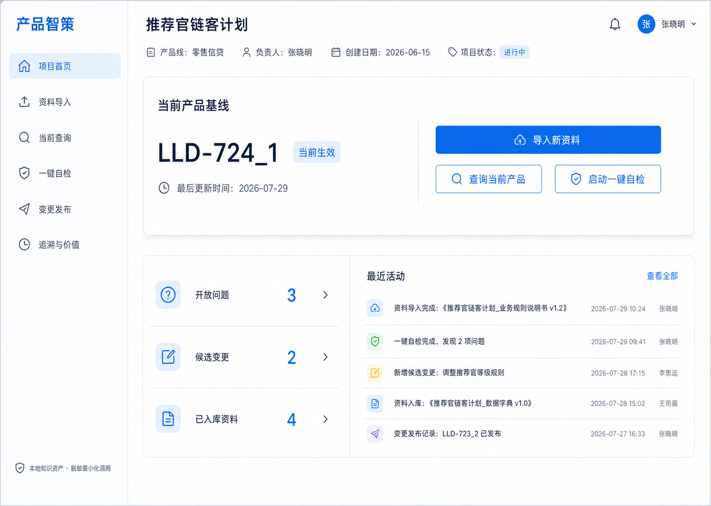

# 产品智策：轻量交付版产品与界面设计文档

## 版本信息

| 项目 | 内容 |
|---|---|
| 文档版本 | v1.0 |
| 编制日期 | 2026 年 7 月 29 日 |
| 适用版本 | 8 月 24 日轻量交付版、8 月 30 日实时演示正式版 |
| 目标终端 | 桌面端 Web 应用，优先适配 1440×1024 演示环境 |
| 主要用户 | 比赛版产品经理／演示操作员 |
| 视觉基准 | `assets/产品智策_基线工作台_视觉基准_v1.0.png` |
| 产品范围依据 | `产品智策_8月24日轻量交付版方案_v1.0.md` |
| 技术实现依据 | `产品智策_轻量交付版_技术开发文档_v1.0.md` |

> 本文档是工程开发和界面验收的唯一设计依据。视觉基准图用于确认整体气质；若图片细节与本文档的尺寸、字段、交互或状态不一致，以本文档为准。

---

## 一、设计目标

### 1.1 用户进入系统后要立即理解

1. 当前项目是什么；
2. 哪个产品版本正在生效；
3. 是否存在开放问题或候选变更；
4. 下一步最重要的操作是什么；
5. 所有产品变化都需要人工批准。

### 1.2 核心体验主线

```text
看清当前基线
→ 导入新资料
→ 查询当前规则
→ 一键发现冲突
→ 人工会议决策
→ 检查并发布变更
→ 追溯来源和价值
```

### 1.3 设计关键词

- 简约；
- 可信；
- 克制；
- 清晰；
- 可审计；
- 金融科技；
- 白底；
- 冷蓝主色；
- 中等信息密度；
- 一个页面一个主任务。

### 1.4 明确避免

- 深色大屏；
- 渐变主背景；
- 玻璃拟态；
- 发光 AI 元素；
- 银行大楼、货币或机器人配图；
- 每个指标单独一张卡片；
- 卡片嵌套卡片；
- 无意义的图表和动画；
- 只用颜色表达状态；
- 大段模型推理文本；
- 将候选内容和生效内容混在一个视觉层级；
- 将二期能力伪装为可点击功能。

---

## 二、视觉基准



### 2.1 必须继承的特征

- 固定左侧导航；
- 白色页面主背景；
- 蓝色用于主操作和选中状态；
- 深蓝黑用于标题和重要业务数据；
- 当前产品基线是首页最大视觉对象；
- 主操作“导入新资料”明显高于辅助操作；
- 指标使用分组列表，不做三个独立大卡；
- 最近活动使用轻量表格行；
- 底部持续显示安全口径；
- 圆角、描边和阴影克制。

### 2.2 图片中仅为示意、不作为正式需求的内容

- 示例人员姓名；
- 示例创建日期；
- 示例活动文案；
- 示例数量；
- 示例文件版本。

正式界面必须从系统真实状态读取，不在页面代码中写死。

---

## 三、信息架构

### 3.1 六个一级工作区

| 顺序 | 页面名称 | 页面 ID | 路由 | 主任务 |
|---:|---|---|---|---|
| 1 | 项目首页 | `home` | `/home` | 看清当前产品基线和项目状态 |
| 2 | 资料导入 | `ingest` | `/ingest` | 确认材料属性并完成知识编译 |
| 3 | 当前查询 | `query` | `/query` | 获取有引用的当前规则答案 |
| 4 | 一键自检 | `lint` | `/lint` | 发现问题并完成会议决策 |
| 5 | 变更发布 | `release` | `/release` | 检查、批准和发布新基线 |
| 6 | 追溯与价值 | `trace` | `/trace` | 查看关系链、审计和实测价值 |

### 3.2 导航规则

- 导航固定在左侧；
- 顺序不可调整；
- 页面名称使用上述四至六字短名称；
- 当前页使用浅蓝背景、蓝色图标和蓝色文字；
- 非当前页使用透明背景、深灰文字；
- 每项高度 52px；
- 相邻项垂直间距 8px；
- 图标尺寸 20px；
- 图标与文字间距 14px；
- 点击整行均可导航；
- 禁止只让图标可点击；
- 二期功能不进入导航。

### 3.3 页面间跳转

| 来源 | 操作 | 目标 |
|---|---|---|
| 首页 | 导入新资料 | 资料导入 |
| 首页 | 查询当前产品 | 当前查询 |
| 首页 | 启动一键自检 | 一键自检 |
| 资料导入 | 查看编译问题 | 一键自检，并带入本次运行 ID |
| 当前查询 | 查看开放冲突 | 一键自检，并定位问题 |
| 一键自检 | 接受迭代 | 当前问题保留，生成决策并进入变更发布 |
| 变更发布 | 发布成功 | 项目首页，显示新基线 |
| 任意详情 | 查看完整追溯 | 追溯与价值，并定位实体 |

---

## 四、全局页面框架

### 4.1 桌面布局

以 1440×1024 为设计基准：

| 区域 | 规格 |
|---|---|
| 左侧导航 | 固定宽度 256px，最小高度 100vh |
| 主内容 | 左侧从 256px 开始，宽度为剩余视口 |
| 页面内边距 | 上 32px、右 36px、下 36px、左 36px |
| 内容最大宽度 | 1440 环境下铺满可用区；超过 1680 时最大 1400px |
| 顶部标题区 | 最小高度 92px |
| 页面标题 | 30px／40px，字重 650 |
| 页面副信息 | 14px／22px |
| 主内容纵向间距 | 24px |

### 4.2 左侧导航

从上至下：

1. 产品文字标识“产品智策”；
2. 32px 间距；
3. 六个导航项；
4. 自动伸展空白区；
5. 安全口径“本地知识资产 · 脱敏最小化调用”；
6. 底部 24px 间距。

文字标识：

- 字号 28px；
- 字重 700；
- 主色蓝；
- 不额外设计图形 Logo；
- 不使用渐变字。

### 4.3 顶部项目区

所有页面顶部统一显示：

- 项目名称；
- 当前产品版本；
- 当前生效／历史／草稿状态；
- 页面级主标题；
- 可选的演示操作员信息。

非首页不得重复展示大号基线卡，只使用一行紧凑项目上下文。

### 4.4 页面宽度规则

- 表单类页面正文最大宽度 1120px；
- 问题和变更详情采用 38%／62% 双栏；
- 长文本阅读区最大宽度 820px；
- 引用原文单行最大 72 个中文字符；
- 超出内容折叠，默认展示三行。

---

## 五、设计 Token

### 5.1 色彩

#### 主色

| Token | 色值 | 用途 |
|---|---|---|
| `color-primary-700` | `#0F4FB8` | 主按钮按下、深色强调 |
| `color-primary-600` | `#1769E0` | 主按钮、当前导航、关键链接 |
| `color-primary-500` | `#2D7BE8` | 悬停和图标强调 |
| `color-primary-100` | `#DCEBFF` | 选中背景、轻提示 |
| `color-primary-050` | `#EEF5FF` | 页面局部分区背景 |

#### 文字

| Token | 色值 | 用途 |
|---|---|---|
| `color-text-strong` | `#102A43` | 页面标题、版本号 |
| `color-text-default` | `#243B53` | 正文 |
| `color-text-muted` | `#627D98` | 辅助信息 |
| `color-text-disabled` | `#9FB3C8` | 禁用 |
| `color-text-inverse` | `#FFFFFF` | 主按钮文字 |

#### 中性色

| Token | 色值 | 用途 |
|---|---|---|
| `color-bg-page` | `#FFFFFF` | 主背景 |
| `color-bg-subtle` | `#F7FAFC` | 次级背景 |
| `color-border-default` | `#D9E2EC` | 默认描边 |
| `color-border-light` | `#E9EFF5` | 行分隔 |
| `color-icon-default` | `#526D82` | 普通图标 |

#### 状态色

| 状态 | 主色 | 浅背景 | 使用范围 |
|---|---|---|---|
| 成功／生效 | `#238636` | `#EAF7EE` | 当前生效、发布成功 |
| 警告／待决策 | `#B7791F` | `#FFF8E6` | 待决策、证据不足 |
| 错误／阻断 | `#C2413B` | `#FFF0EF` | 阻断、安全失败 |
| 信息／候选 | `#1769E0` | `#EEF5FF` | 候选变更、处理中 |
| 历史／替代 | `#627D98` | `#F2F5F8` | 历史、已替代 |

状态不得只用颜色。必须同时显示文字，必要时增加图标。

### 5.2 字体

```css
font-family:
  -apple-system,
  BlinkMacSystemFont,
  "PingFang SC",
  "Microsoft YaHei",
  "Noto Sans CJK SC",
  "Noto Sans SC",
  Arial,
  sans-serif;
```

| 样式 | 字号／行高 | 字重 | 用途 |
|---|---|---:|---|
| `display` | 44／56px | 700 | 首页版本号 |
| `h1` | 30／40px | 650 | 页面标题 |
| `h2` | 22／32px | 650 | 区块标题 |
| `h3` | 18／28px | 600 | 卡片标题 |
| `body-lg` | 16／26px | 400 | 重要正文 |
| `body` | 14／22px | 400 | 默认正文 |
| `label` | 14／20px | 550 | 表单和按钮 |
| `caption` | 12／18px | 400 | 时间、辅助信息 |

### 5.3 间距

基础单位为 4px：

```text
4 / 8 / 12 / 16 / 20 / 24 / 32 / 40 / 48 / 64
```

常用规则：

- 页面区块：24px；
- 卡片内边距：28–32px；
- 表单字段纵向间距：20px；
- 标签与控件：8px；
- 按钮组：12px；
- 图标与文字：10–14px；
- 列表行内边距：16px 12px。

### 5.4 圆角

| Token | 数值 | 用途 |
|---|---:|---|
| `radius-sm` | 6px | 标签、输入框 |
| `radius-md` | 8px | 按钮、列表选中 |
| `radius-lg` | 10px | 主容器 |
| `radius-pill` | 999px | 仅状态标签 |

### 5.5 阴影

只允许两个级别：

```css
shadow-subtle: 0 1px 3px rgba(16, 42, 67, 0.06);
shadow-raised: 0 6px 20px rgba(16, 42, 67, 0.08);
```

- 普通容器不用阴影，只用描边；
- 首页当前基线容器使用 `shadow-raised`；
- 弹窗使用 `shadow-raised`；
- 不使用更强阴影。

### 5.6 动效

| 场景 | 动效 |
|---|---|
| 按钮悬停 | 120ms，颜色变化 |
| 页面切换 | 不使用整页转场 |
| 展开引用 | 160ms，高度过渡 |
| 状态刷新 | 150ms，轻淡入 |
| 进度步骤 | 200ms，状态切换 |

禁止持续闪烁、呼吸光和装饰性加载动画。

---

## 六、通用组件规范

### 6.1 按钮

#### 主按钮

- 高度 48px；
- 左右内边距 24px；
- 背景 `color-primary-600`；
- 文字白色；
- 字号 15px；
- 字重 600；
- 圆角 8px；
- 一页最多一个主按钮；
- 危险操作不使用主蓝色。

状态：

| 状态 | 表现 |
|---|---|
| 默认 | 蓝底白字 |
| 悬停 | `#125BC4` |
| 按下 | `#0F4FB8` |
| 禁用 | `#D9E2EC`＋`#829AB1` |
| 加载 | 保留按钮宽度，左侧 16px 加载图标 |

#### 次按钮

- 高度 44px；
- 白底；
- 1px 主蓝描边；
- 主蓝文字；
- 不使用阴影。

#### 三级按钮

- 文字按钮；
- 用于“查看全部”“展开引用”“返回”；
- 不承担批准、发布或删除动作。

### 6.2 状态标签

- 高度 28px；
- 内边距 0 10px；
- 圆角 999px；
- 字号 13px；
- 图标可选 14px；
- 不使用全大写英文。

固定文案：

| 状态 | 文案 |
|---|---|
| `effective` | 当前生效 |
| `candidate` | 候选变更 |
| `conflict` | 存在冲突 |
| `superseded` | 历史版本 |
| `ai_inferred` | AI 推定 |
| `human_confirmed` | 人工确认 |
| `rejected` | 已驳回 |
| `blocking` | 阻断 |
| `pending_decision` | 待决策 |
| `pending_info` | 待补充 |

### 6.3 输入框和选择器

- 高度 44px；
- 圆角 6px；
- 1px `color-border-default`；
- 聚焦描边 2px `color-primary-500`；
- 标签始终显示在控件上方；
- 必填使用“必填”文字，不只显示星号；
- 错误提示显示在控件下方；
- 同一行最多三个短字段；
- 长文本最小高度 104px。

### 6.4 文件上传区

- 高度 180px；
- 浅蓝虚线描边；
- 中心显示上传图标、主文案和支持格式；
- 支持点击和拖拽；
- 已选择文件后转换为文件摘要行；
- 文件摘要显示名称、大小、哈希前 8 位、删除按钮；
- 未完成安全确认前，“开始编译”不可用。

### 6.5 分组列表

用于首页指标、问题列表和活动记录：

- 一个外层容器；
- 行与行之间使用 `color-border-light` 分隔；
- 行高不低于 64px；
- 左侧图标 36px；
- 主要文字 14–16px；
- 右侧数字或时间右对齐；
- 整行可点击时显示轻微悬停背景；
- 不将每行做成单独卡片。

### 6.6 引用块

必须包含：

- 原始文件名；
- 来源编号；
- 文件版本；
- 日期；
- 原文片段；
- 适用范围；
- 权威等级。

默认显示三行原文，支持展开。引用块左侧使用 3px 蓝色竖线，不使用引号装饰。

### 6.7 决策条

固定显示在问题详情下方：

- “接受迭代”；
- “维持现状”；
- “暂缓讨论”；
- “判定误报”。

要求：

- 四项为单选；
- 选中后显示相应说明字段；
- “接受迭代”需要填写责任方和验证条件；
- “暂缓讨论”需要填写下次处理时间；
- “判定误报”需要填写理由；
- 提交按钮统一为“记录会议结论”；
- 提交后不可在当前界面直接删除记录。

### 6.8 变更对比

采用左右对比：

- 左侧“修改前”；
- 右侧“修改后”；
- 删除内容红色浅底；
- 新增内容绿色浅底；
- 未变化内容不高亮；
- 下方显示依据、影响对象、目标版本和应批准角色；
- 禁止只显示整段 diff 而不说明业务字段。

### 6.9 Toast 和页面消息

| 类型 | 使用场景 | 持续方式 |
|---|---|---|
| Toast | 轻量成功反馈 | 3 秒后消失 |
| 行内提示 | 表单校验、缓存状态 | 持续显示 |
| 页面横幅 | 安全阻断、发布失败 | 用户处理前持续显示 |
| 确认弹窗 | 发布新基线、重置演示 | 必须人工关闭 |

---

## 七、页面设计

### 7.1 项目首页

### 页面目标

用户在 5 秒内确认当前版本和下一步操作。

### 页面结构

```text
项目标题与元信息
当前产品基线主容器
  左：版本、状态、更新时间
  右：主操作和两个辅助操作
项目概况列表｜最近活动
```

### 顶部信息

- 项目名称：推荐官链客计划；
- 产品线；
- 演示操作员；
- 创建日期；
- 项目状态。

### 当前基线主容器

规格：

- 最小高度 300px；
- 1px `color-border-default`；
- 10px 圆角；
- `shadow-raised`；
- 内边距 32px；
- 48%／52% 双栏；
- 中间 1px 竖分隔线。

左栏：

- 标题“当前产品基线”；
- 版本号 44px；
- “当前生效”状态标签；
- 最近更新时间；
- 点击版本号进入当前基线详情抽屉。

右栏：

- 48px 主按钮“导入新资料”；
- 下方两个 44px 次按钮；
- 主按钮占满右栏；
- 次按钮各占 50%，间距 12px。

### 项目概况

固定三行：

1. 开放问题；
2. 候选变更；
3. 已入库资料。

数字可点击：

- 开放问题 → `/lint?filter=open`；
- 候选变更 → `/release?filter=candidate`；
- 已入库资料 → `/ingest?view=history`。

### 最近活动

最多显示 5 条：

- 图标；
- 动作描述；
- 时间；
- 操作人。

操作类型：

- 资料导入；
- 自检完成；
- 新增候选变更；
- 发布新基线；
- 判定误报；
- 使用缓存结果。

### 首页状态

| 状态 | 页面表现 |
|---|---|
| 正常 | 显示当前基线和真实统计 |
| 无基线 | 主容器显示“尚未建立产品基线”，主按钮改为“导入当前产品方案” |
| 加载 | 保留布局骨架，不使用全屏加载 |
| 读取失败 | 顶部错误横幅＋“重新读取” |
| 历史查看 | 顶部灰色横幅“正在查看历史版本”，发布和导入操作禁用 |

### 首页验收

- 1440×1024 无纵向滚动即可看到三个核心操作和概况列表；
- 当前版本号和生效状态为首屏最强信息；
- 页面只有一个主蓝按钮；
- 安全口径在左侧底部持续可见；
- 不出现横向滚动。

---

### 7.2 资料导入

### 页面目标

用户不写 Prompt，通过三步完成材料确认和 AI 编译。

### 步骤

1. 上传文件；
2. 确认属性；
3. 编译结果。

### 页面结构

```text
页面标题＋当前基线上下文
三步进度条
主内容区
底部操作区
```

### 第一步：上传文件

显示：

- 文件上传区；
- 支持格式：PDF、DOCX、TXT、MD；
- 单文件最大 20MB；
- 比赛版每次只处理 1 个文件；
- 数据安全说明。

选择文件后显示：

- 文件名；
- 文件大小；
- SHA-256 前 8 位；
- 本地保存位置使用业务名称，不暴露绝对路径；
- “重新选择”。

### 第二步：确认属性

字段：

| 字段 | 控件 | 是否必填 |
|---|---|---:|
| 材料类型 | 单选 | 是 |
| 权威等级 | 单选 | 是 |
| 来源部门 | 下拉＋可输入 | 是 |
| 提供人 | 短文本 | 否 |
| 文件日期 | 日期 | 是 |
| 文件版本 | 短文本 | 是 |
| 适用产品版本 | 下拉 | 是 |
| 资料安全等级 | 单选 | 是 |
| 已完成脱敏 | 复选确认 | 是 |
| 允许外部模型调用 | 开关 | 是 |
| 测试沙盘材料 | 开关 | 是 |

规则：

- L3 或 L4 自动关闭外部调用；
- 未勾选“已完成脱敏”时外部调用开关禁用；
- “测试沙盘材料”开启后，顶部显示紫色“模拟材料”标记；
- AI 预识别值显示“AI 推定”，用户确认后显示“人工确认”。

### 第三步：编译过程

步骤状态：

1. 本地保存；
2. 文本提取；
3. 脱敏和授权检查；
4. AI 分析；
5. 结构校验；
6. 写入知识库。

每步显示：

- 等待；
- 处理中；
- 完成；
- 失败。

实时调用超过阈值时显示：

> 实时模型仍在处理。您可以继续等待，或使用与当前文件一致的演示缓存。

按钮：

- “继续等待”；
- “使用缓存结果”；
- “取消本次处理”。

### 编译结果

顶部摘要：

- 新增知识；
- 候选变更；
- 冲突问题；
- 信息缺口。

下方为分组结果列表，每项展示：

- 类型；
- 摘要；
- 对应产品章节；
- 来源引用；
- 当前处理状态。

主按钮：

- 有冲突时：“查看并处理问题”；
- 无冲突时：“完成并返回首页”。

### 页面验收

- 用户无需输入 Prompt；
- 未完成安全确认不能启动；
- 实时和缓存结果视觉上可区分；
- 编译失败不显示“已写入”；
- 测试材料不与正式材料混淆。

---

### 7.3 当前查询

### 页面目标

用最短路径获得当前生效规则，并明确引用和争议。

### 页面结构

```text
问题输入区
查询范围
常用问题
回答区
引用与候选／冲突提示
```

### 问题输入

- 单行输入＋“查询”主按钮；
- 支持自然语言；
- 最大 500 字；
- Enter 提交，Shift+Enter 换行；
- 查询进行中禁用重复提交。

### 查询范围

分段控件：

1. 当前生效，默认；
2. 当前＋候选提示；
3. 指定历史版本。

指定历史版本后显示版本下拉。禁止使用模糊的“全部”入口。

### 常用问题

最多显示 6 个文本按钮。点击后直接填入输入框，不自动提交。

### 回答区层级

1. 直接答案；
2. 当前生效规则；
3. 版本和更新时间；
4. 候选变化／冲突提示；
5. 来源引用；
6. 证据充分度。

直接答案使用 18px，控制在 3–6 行。不得显示模型思维过程。

### 回答状态

| 状态 | 展示 |
|---|---|
| 充分 | 正常答案＋引用 |
| 有候选 | 蓝色信息提示 |
| 有冲突 | 黄色提示＋“查看问题” |
| 证据不足 | 明确说明缺少什么 |
| 实时超时 | 提示继续等待或使用缓存 |
| 历史查询 | 灰色“历史版本”横幅 |

### 页面验收

- 默认范围为当前生效；
- 回答顶部显示产品版本；
- 每个关键结论至少一个可展开引用；
- 候选内容不混入当前答案正文；
- 证据不足不生成公司事实。

---

### 7.4 一键自检

### 页面目标

把 AI 发现的问题转成会议可以直接处理的议题。

### 页面结构

采用 38%／62% 双栏：

左栏：

- 运行自检；
- 筛选；
- 问题列表。

右栏：

- 问题详情；
- 双方引用；
- 影响范围；
- 处理选项；
- 决策条。

### 自检操作

主按钮“启动一键自检”。

范围：

- 当前基线；
- 本次新导入资料；
- 全部当前资料。

比赛现场默认选择“当前基线＋本次新资料”。

### 问题列表

每项显示：

- 问题编号；
- 类型；
- 一句话描述；
- 等级；
- 状态；
- 影响专业；
- 更新时间。

筛选：

- 全部开放；
- 阻断；
- 待决策；
- 待补充；
- 已处理；
- 误报。

默认按等级、更新时间排序。

### 问题详情

顺序固定：

1. 问题结论；
2. 为什么需要处理；
3. 依据 A；
4. 依据 B；
5. 影响范围；
6. AI 选项和建议；
7. 不确定性；
8. 决策条。

AI 推荐必须标记“AI 建议”，不能使用“系统决定”。

### 决策提交

提交后：

- 生成 Decision；
- “接受迭代”生成候选 ChangeRequest；
- 页面顶部显示成功反馈；
- 问题状态更新；
- 提供“前往变更发布”。

### 页面验收

- 重大问题必须同时显示双方依据；
- 决策四选一；
- 每个决策记录责任方和验证条件；
- 误报不删除；
- 处理完成后状态立即更新。

---

### 7.5 变更发布

### 页面目标

让用户在一屏内看清改什么、为什么改、影响什么，再人工批准发布。

### 页面结构

```text
候选变更列表
变更详情
修改前／修改后
依据与影响
批准信息
发布操作
```

### 候选变更列表

显示：

- 变更编号；
- 目标规则；
- 来源问题；
- 状态；
- 目标版本；
- 创建时间。

默认只显示待审批和退回补充。

### 变更详情

必须包含：

- 修改前；
- 修改后；
- 修改理由；
- 原始依据；
- 会议决定；
- 影响的产品章节和规则卡；
- 市场证据检查；
- 轻量成本联动结果；
- 当前演示确认人；
- 正式应批准角色；
- 目标生效时间。

### 发布操作

操作：

- 批准并发布；
- 驳回；
- 暂缓；
- 退回补充。

“批准并发布”前必须：

- 勾选“我已检查修改前后、依据和影响”；
- 输入发布说明，20–200 字；
- 通过版本一致性预检。

确认弹窗文案：

> 即将发布新产品基线。发布后，新版本将成为后续查询和自检的默认基准，原版本转为历史版本。是否继续？

确认按钮：

> 确认发布新基线

### 发布结果

成功页显示：

- 新版本；
- 父版本；
- 发布人；
- 发布时间；
- 变更单；
- 差异摘要；
- “查看新基线”；
- “查看完整追溯”。

失败时：

- 红色页面横幅；
- 明确说明旧版本仍然生效；
- 显示失败步骤；
- 提供“重新校验”；
- 不显示新版本成功状态。

### 页面验收

- 未审批不能发布；
- 修改前后清晰；
- 正式应批准角色可见；
- 成本影响只使用确定性计算；
- 发布失败不切换首页版本；
- 成功后首页立即显示新版本。

---

### 7.6 追溯与价值

### 页面目标

证明每条产品变化有来源、有决定、有版本，并展示系统实际价值。

### 页面结构

使用三个标签页：

1. 完整追溯；
2. 价值验证；
3. 调用审计。

### 完整追溯

比赛版不做自由拖拽的大型知识图谱，采用可读的水平关系链：

```text
原始资料
→ 产品规则
→ 冲突问题
→ 会议决策
→ 产品变更单
→ 新产品基线
```

每个节点显示：

- 编号；
- 名称；
- 状态；
- 日期；
- 点击展开详情。

关系线显示关系类型：

- 来源于；
- 冲突于；
- 建议修改；
- 批准形成；
- 替代。

### 市场证据缺口

显示一个代表性检查：

- 当前判断；
- 证据类型；
- 证据充分度；
- 缺失材料；
- 建议验证方式；
- 不显示“市场已认可”等无证据结论。

### 轻量成本联动

显示：

- 参数名称；
- 原值和新值；
- 来源；
- 公式；
- 计算结果；
- “仅供业务影响提示，正式口径需财务确认”。

### 价值验证

最多显示 6 个实测指标：

- 人工查询耗时；
- 系统查询耗时；
- 有效冲突数量；
- 误报数量；
- 变更单形成耗时；
- 引用完整度。

未完成实测的指标不显示，不使用空白占位或估算值。

### 调用审计

表格列：

- 调用编号；
- 任务；
- 模型；
- 来源文件；
- 授权状态；
- 脱敏状态；
- 实时／缓存；
- 开始时间；
- 耗时；
- 结果状态。

默认隐藏敏感片段正文，只显示摘要。

### 页面验收

- 主故事关系链一屏可读；
- 每个节点可回到详情；
- 正式和模拟材料有明确标记；
- 成本联动显示公式和参数来源；
- 调用密钥和完整敏感片段不展示。

---

## 八、全局状态与反馈

### 8.1 加载

- 使用区块级骨架；
- 不使用全屏遮罩；
- 超过 2 秒显示正在执行的业务步骤；
- 超过实时阈值显示降级选项。

### 8.2 空状态

空状态必须包含：

- 当前为什么为空；
- 用户下一步；
- 一个主操作；
- 不使用装饰性插画。

示例：

> 暂无开放问题。您可以导入新资料，或对当前产品启动一次自检。

### 8.3 错误

错误必须包含：

- 发生在哪一步；
- 是否影响当前基线；
- 用户可以做什么；
- 错误编号。

不得直接把 Python 堆栈或模型原始错误展示给用户。

### 8.4 实时与缓存

实时结果：

- 蓝色信息标识“实时生成”；
- 显示调用时间。

缓存结果：

- 黄色信息标识“演示缓存”；
- 显示对应文件哈希前 8 位和原生成时间；
- 所有后续人工操作仍按真实流程执行。

### 8.5 只读

历史版本、已发布变更和已完成决定采用只读模式：

- 控件禁用；
- 顶部显示只读原因；
- 可查看追溯；
- 不允许通过前端修改数据库状态。

---

## 九、文案规范

### 9.1 语气

- 专业；
- 直接；
- 不夸张；
- 不使用营销形容词替代事实；
- 不把 AI 建议描述成人工决定；
- 不使用“零风险”“完全准确”“自动审批”。

### 9.2 固定文案

| 场景 | 文案 |
|---|---|
| 无足够依据 | 证据不足，暂不能形成公司事实 |
| AI 内容 | AI 推定，等待人工确认 |
| 缓存结果 | 当前展示同一材料的演示缓存结果 |
| 外调禁止 | 该资料不满足外部模型调用条件 |
| 发布前 | 所有产品变化均需人工批准 |
| 发布失败 | 发布未完成，原产品版本仍然生效 |
| 测试数据 | 模拟／沙盘材料，不代表正式部门意见 |
| 成本结果 | 仅供业务影响提示，正式口径需财务确认 |

### 9.3 日期和数字

- 日期统一 `YYYY-MM-DD`；
- 时间统一 `YYYY-MM-DD HH:mm`；
- 版本号保持原始格式；
- 金额默认使用人民币符号和千分位；
- 比率保留一位小数；
- 未测量数据不显示 `0`，而是不展示该指标；
- “不适用”和“数值为 0”必须区分。

---

## 十、图标

使用统一线性图标库，工程实现优先采用 Material Symbols Rounded 或 Lucide 的同类图标。

建议映射：

| 功能 | 图标语义 |
|---|---|
| 项目首页 | home |
| 资料导入 | upload |
| 当前查询 | search |
| 一键自检 | shield-check |
| 变更发布 | send／git-commit |
| 追溯与价值 | history |
| 当前生效 | check-circle |
| 候选变更 | file-edit |
| 冲突 | alert-triangle |
| 引用 | quote／file-text |
| 安全 | shield |
| 缓存 | database-backup |

规则：

- 同一语义只使用一个图标；
- 图标不使用彩色渐变；
- 不使用 Emoji 代替产品图标；
- 按钮图标 18px；
- 导航图标 20px；
- 状态图标 16px。

---

## 十一、无障碍与可用性

- 正文与背景对比度至少 4.5:1；
- 大号文字至少 3:1；
- 所有操作可通过键盘完成；
- 聚焦状态使用 2px 蓝色描边；
- 点击目标最小 44×44px；
- 不只依赖颜色区分状态；
- 表单错误与字段关联；
- 弹窗打开后焦点进入弹窗；
- 关闭弹窗后焦点返回原操作；
- 表格列有文字表头；
- 图标按钮必须有辅助标签；
- 页面标题层级保持 H1 → H2 → H3；
- 动画遵循减少动态偏好。

---

## 十二、响应式与演示设备

### 12.1 支持范围

| 宽度 | 处理 |
|---:|---|
| ≥1440px | 标准布局 |
| 1280–1439px | 缩小内容间距，保持侧栏 |
| 1024–1279px | 侧栏收起为图标栏，详情双栏改 34%／66% |
| <1024px | 不作为比赛版验收终端，显示最小宽度提示 |

### 12.2 演示设备要求

- 浏览器缩放 100%；
- 分辨率不低于 1440×900；
- 首选 1440×1024 或 1920×1080；
- 系统字体缩放 100%；
- 现场前关闭浏览器自动翻译；
- 现场前确认所有关键页面无需横向滚动。

---

## 十三、设计到开发映射

### 13.1 页面文件

| 页面 ID | 建议文件 |
|---|---|
| `home` | `src/ui/pages/home.py` |
| `ingest` | `src/ui/pages/ingest.py` |
| `query` | `src/ui/pages/query.py` |
| `lint` | `src/ui/pages/lint.py` |
| `release` | `src/ui/pages/release.py` |
| `trace` | `src/ui/pages/trace.py` |

### 13.2 共享组件

| 组件 | 建议文件 |
|---|---|
| 页面头部 | `src/ui/components/page_header.py` |
| 项目上下文 | `src/ui/components/project_context.py` |
| 当前基线 | `src/ui/components/baseline_hero.py` |
| 状态标签 | `src/ui/components/status_badge.py` |
| 引用块 | `src/ui/components/citation_block.py` |
| 问题列表 | `src/ui/components/issue_list.py` |
| 决策条 | `src/ui/components/decision_bar.py` |
| 变更对比 | `src/ui/components/change_diff.py` |
| 追溯链 | `src/ui/components/trace_chain.py` |
| 状态消息 | `src/ui/components/feedback.py` |
| 主题样式 | `src/ui/theme/tokens.css` |

### 13.3 Streamlit 实现约束

- 使用 `st.navigation` 管理六页；
- 使用 `st.session_state` 保存页面间临时选择，不保存正式业务状态；
- 正式业务状态只从领域服务读取；
- 所有按钮设置稳定、唯一的 key；
- 避免隐藏标签页继续执行昂贵任务；
- 自定义 CSS 只能引用本文档 Token；
- 不在页面文件中直接拼接 SQL；
- 不在页面文件中直接调用 Dify；
- 页面只调用 application/use-case 层。

---

## 十四、设计验收清单

### 全局

- [ ] 白底＋蓝色主调与视觉基准一致；
- [ ] 六个导航顺序正确；
- [ ] 当前状态不只依赖颜色；
- [ ] 每页只有一个主操作；
- [ ] 无卡片嵌套；
- [ ] 无开发调试信息；
- [ ] 无未经确认的真实敏感信息；
- [ ] 1440×1024 无横向滚动。

### 首页

- [ ] 当前版本是最强视觉信息；
- [ ] 主按钮为“导入新资料”；
- [ ] 两个辅助按钮为查询和自检；
- [ ] 三项概况使用分组列表；
- [ ] 最近活动最多五条。

### 导入

- [ ] 三步清晰；
- [ ] 安全字段完整；
- [ ] 未脱敏不能外调；
- [ ] 实时和缓存区分；
- [ ] 测试材料显著标记。

### 查询

- [ ] 默认当前生效；
- [ ] 回答有版本；
- [ ] 关键结论有引用；
- [ ] 候选不混入当前答案；
- [ ] 证据不足明确。

### 自检

- [ ] 重大问题有双方引用；
- [ ] 四种决策可操作；
- [ ] AI 建议有标识；
- [ ] 误报保留；
- [ ] 接受后生成变更。

### 发布

- [ ] 修改前后清晰；
- [ ] 人工审批明显；
- [ ] 正式应批准角色可见；
- [ ] 发布失败旧版仍生效；
- [ ] 发布成功显示父版本。

### 追溯

- [ ] 主故事关系链一屏可读；
- [ ] 市场证据缺口不夸大；
- [ ] 成本联动有公式和来源；
- [ ] 审计不暴露密钥；
- [ ] 未实测指标不显示。
