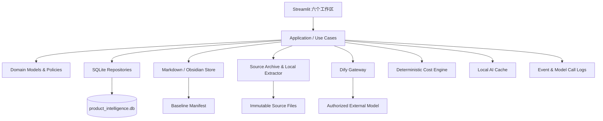

# 产品智策：轻量交付版技术开发文档

## 版本信息

| 项目 | 内容 |
|---|---|
| 文档版本 | v1.0 |
| 编制日期 | 2026 年 7 月 29 日 |
| 适用版本 | 8 月 24 日轻量交付版、8 月 30 日实时演示正式版 |
| 架构形态 | 本地优先的模块化单体 |
| 前端 | Streamlit |
| AI 编排 | Dify Workflow |
| 知识资产 | Markdown／Obsidian Vault |
| 结构化状态 | SQLite |
| 产品与界面依据 | `产品智策_轻量交付版_产品与界面设计文档_v1.0.md` |
| 范围依据 | `产品智策_8月24日轻量交付版方案_v1.0.md` |

> 本文档面向工程师，定义可直接实施的代码结构、数据模型、服务接口、工作流契约、安全规则、测试和部署方式。未在本文档定义的完整市场、损益、会计、多角色和生产集成能力不得进入轻量版。

---

## 一、技术目标与关键决策

### 1.1 技术目标

系统必须稳定完成：

```text
建立当前产品基线
→ 导入脱敏材料
→ Ingest 编译知识
→ Query 查询当前规则
→ Lint 检查冲突
→ 人工记录会议决定
→ 生成产品变更单
→ 原子发布新基线
→ 追溯来源、决定和版本
```

### 1.2 架构决策

| 编号 | 决策 | 原因 |
|---|---|---|
| ADR-001 | 采用模块化单体，不拆独立后端微服务 | 单用户、短周期，减少部署和接口故障 |
| ADR-002 | Streamlit 页面只能调用 application/use-case 层 | 避免页面直接操作 SQL、文件和 Dify |
| ADR-003 | Dify 仅承担 Ingest、Query、Lint 三个工作流 | AI 分析与业务状态治理分离 |
| ADR-004 | 原始资料不可修改 | 保证事实来源可追溯 |
| ADR-005 | `Baseline Manifest` 是当前生效版本唯一权威 | 避免 Markdown、SQLite 和页面各自判断 |
| ADR-006 | SQLite 是运行状态和索引，不是正式产品内容唯一存储 | 保持 Markdown 知识资产可读、可迁移 |
| ADR-007 | 发布使用文件锁＋临时目录＋原子替换 | 防止半发布状态 |
| ADR-008 | Lint 使用确定性规则＋LLM 语义检查 | 可解释、可测试并兼顾语义能力 |
| ADR-009 | 实时调用和同材料缓存使用同一输出 Schema | 降级后仍能继续真实业务流程 |
| ADR-010 | 轻量成本联动使用本地确定性函数 | 不让 LLM 自由计算 |

### 1.3 不采用

- 不引入独立 FastAPI 服务；
- 不引入消息队列；
- 不引入图数据库；
- 不引入向量数据库作为当前基线权威；
- 不引入前后端分离框架；
- 不引入 Kubernetes；
- 不在 Dify 中保存正式审批状态；
- 不把 Streamlit Session State 当数据库。

---

## 二、范围

### 2.1 必须实现

1. 六个 Streamlit 工作区；
2. 项目和当前基线读取；
3. PDF、DOCX、TXT、MD 单文件导入；
4. 文件哈希、元数据、安全标签和外调授权；
5. 本地文本提取和基础脱敏；
6. Dify Ingest、Query、Lint；
7. 结构化输出校验；
8. 当前／候选／冲突／历史状态隔离；
9. 问题、决定、变更和发布；
10. 版本差异和完整追溯；
11. 市场证据缺口代表性检查；
12. 一条轻量成本联动；
13. 实时／缓存切换；
14. 模型调用日志；
15. 演示初始化、重置和冻结快照；
16. 黄金测试和人工对照记录。

### 2.2 明确不实现

- 自动授信、定额或拒绝；
- 未脱敏客户数据处理；
- 完整市场调研；
- 项目损益、会计分录和敏感性分析；
- 多角色登录和电子会签；
- 生产系统接口；
- 自动批量导入；
- 多租户；
- 大规模并发；
- 在线编辑完整 Markdown；
- 通用图谱编辑器；
- 自动发布风险或财务政策。

---

## 三、非功能要求

### 3.1 性能目标

| 操作 | 目标 | 超时处理 |
|---|---:|---|
| 首页读取 | 3 秒内 | 读取本地冻结快照 |
| 文件本地处理 | 10 秒内 | 失败并保留原文件 |
| Ingest | 45 秒内 | 60 秒提供缓存切换 |
| Query | 20 秒内 | 30 秒提供缓存切换 |
| Lint | 45 秒内 | 60 秒提供缓存切换 |
| 会议决定 | 3 秒内 | 本地事务回滚 |
| 变更单生成 | 3 秒内 | 本地事务回滚 |
| 发布新基线 | 5 秒内 | 旧版继续生效 |
| 演示重置 | 30 秒内 | 从冻结快照恢复 |

### 3.2 可靠性

- 任一 AI 调用失败不能破坏当前基线；
- 任一发布步骤失败不能改变 Manifest；
- 重复导入同一文件必须识别；
- 重复提交同一决定必须幂等；
- 重复发布同一变更单必须阻断；
- 所有写操作记录 EventLog；
- 本地数据库和 Manifest 可备份恢复。

### 3.3 安全

- Dify API Key 仅保存在服务端配置；
- 前端和日志不输出密钥；
- 未授权、未脱敏、L3、L4 文件不得外调；
- 文件路径必须限制在项目目录；
- 上传文件名必须清洗；
- 模型输入只包含授权后的最小片段；
- 日志只保存片段摘要和哈希，不默认保存完整外调正文；
- 生产敏感资料不进入比赛仓库。

### 3.4 可测试性

- 领域层不依赖 Streamlit；
- application 层通过 Protocol 注入 Repository 和 ModelGateway；
- Dify 客户端可替换为 Fake；
- 时间和 ID 生成器可注入；
- 发布服务可在临时目录测试；
- 所有状态转换有单元测试。

---

## 四、总体架构



### 4.1 分层

| 层 | 责任 | 禁止 |
|---|---|---|
| UI | 展示、收集输入、调用用例 | SQL、文件写入、直接调用 Dify |
| Application | 编排用例和事务边界 | 定义视觉、自由生成业务状态 |
| Domain | 对象、状态机、治理规则 | 依赖 Streamlit、SQLite、HTTP |
| Infrastructure | SQLite、文件、Dify、缓存、日志 | 决定产品是否批准 |

### 4.2 运行方式

轻量版使用一个 Python 进程：

```text
streamlit run streamlit_app.py
```

Streamlit 进程内实例化 application 服务。Dify 通过 HTTPS 调用。SQLite、Markdown、原始资料和缓存全部位于本地项目数据目录。

---

## 五、技术栈与依赖

### 5.1 运行环境

- Python `>=3.11,<3.13`；
- Streamlit `>=1.60,<1.61`；
- SQLite 使用 Python 标准库 `sqlite3`；
- Dify 使用已发布 Workflow App 的 Service API；
- 包管理使用 `uv`；
- 依赖精确版本写入 `uv.lock`；
- 开发和演示必须使用同一锁文件。

### 5.2 Python 依赖

建议 `pyproject.toml`：

```toml
[project]
name = "product-intelligence"
version = "0.1.0"
requires-python = ">=3.11,<3.13"
dependencies = [
  "streamlit>=1.60,<1.61",
  "pydantic>=2.10,<3",
  "httpx>=0.28,<1",
  "tenacity>=9,<10",
  "pypdf>=6,<7",
  "python-docx>=1.2,<2",
  "PyYAML>=6,<7",
  "filelock>=3.16,<4",
]

[dependency-groups]
dev = [
  "pytest>=9,<10",
  "pytest-cov>=6,<7",
  "ruff>=0.12,<1",
]
```

首次安装后必须提交 `uv.lock`，后续不浮动升级。

### 5.3 官方实现依据

- Streamlit 使用 `st.navigation` 管理多页，入口文件作为统一框架；
- Streamlit Session State 只保存跨页面临时 UI 状态；
- 密钥使用 `st.secrets` 或环境变量，并且只在服务端读取；
- Dify App API Key 只从后端调用；
- Dify Workflow 支持工作流运行、运行详情、日志和流式事件。

参考：

- [Streamlit st.navigation](https://docs.streamlit.io/develop/api-reference/navigation/st.navigation)
- [Streamlit caching and state](https://docs.streamlit.io/develop/api-reference/caching-and-state)
- [Streamlit secrets](https://docs.streamlit.io/develop/api-reference/connections/st.secrets)
- [Dify API get started](https://docs.dify.ai/en/api-reference/guides/get-started)
- [Dify Workflow API](https://docs.dify.ai/en/api-reference/guides/workflow)

---

## 六、工程目录

工程师应按以下目录创建，不得将全部逻辑写入 `streamlit_app.py`。

```text
product-intelligence/
├── streamlit_app.py
├── pyproject.toml
├── uv.lock
├── README.md
├── .env.example
├── .gitignore
├── .streamlit/
│   ├── config.toml
│   └── secrets.toml.example
├── config/
│   ├── app.yaml
│   ├── schema.yaml
│   ├── lint_rules.yaml
│   ├── redaction_rules.yaml
│   └── common_questions.yaml
├── src/
│   ├── application/
│   │   ├── container.py
│   │   ├── dto.py
│   │   ├── errors.py
│   │   └── use_cases/
│   │       ├── get_dashboard.py
│   │       ├── import_source.py
│   │       ├── run_query.py
│   │       ├── run_lint.py
│   │       ├── record_decision.py
│   │       ├── create_change_request.py
│   │       ├── review_change_request.py
│   │       ├── publish_baseline.py
│   │       ├── build_trace.py
│   │       └── reset_demo.py
│   ├── domain/
│   │   ├── enums.py
│   │   ├── models.py
│   │   ├── policies/
│   │   │   ├── authority_policy.py
│   │   │   ├── security_policy.py
│   │   │   ├── state_transition.py
│   │   │   └── release_policy.py
│   │   └── services/
│   │       ├── deterministic_lint.py
│   │       ├── cost_impact.py
│   │       └── citation_validator.py
│   ├── infrastructure/
│   │   ├── db/
│   │   │   ├── connection.py
│   │   │   ├── migrations.py
│   │   │   └── repositories.py
│   │   ├── files/
│   │   │   ├── archive.py
│   │   │   ├── extractor.py
│   │   │   ├── redactor.py
│   │   │   ├── manifest_store.py
│   │   │   └── markdown_store.py
│   │   ├── gateways/
│   │   │   ├── dify_client.py
│   │   │   ├── ingest_gateway.py
│   │   │   ├── query_gateway.py
│   │   │   └── lint_gateway.py
│   │   ├── cache/
│   │   │   └── ai_cache.py
│   │   ├── recovery/
│   │   │   ├── reconciliation_service.py
│   │   │   └── release_guard.py
│   │   └── observability/
│   │       ├── event_logger.py
│   │       └── model_call_logger.py
│   └── ui/
│       ├── navigation.py
│       ├── pages/
│       │   ├── home.py
│       │   ├── ingest.py
│       │   ├── query.py
│       │   ├── lint.py
│       │   ├── release.py
│       │   └── trace.py
│       ├── components/
│       │   ├── page_header.py
│       │   ├── project_context.py
│       │   ├── baseline_hero.py
│       │   ├── status_badge.py
│       │   ├── citation_block.py
│       │   ├── issue_list.py
│       │   ├── decision_bar.py
│       │   ├── change_diff.py
│       │   ├── trace_chain.py
│       │   └── feedback.py
│       └── theme/
│           ├── loader.py
│           └── tokens.css
├── data/
│   ├── source_archive/
│   ├── obsidian_vault/
│   │   ├── 00_Governance/
│   │   ├── 01_Source_Index/
│   │   ├── 02_Current_Baseline/
│   │   ├── 03_Product_Cards/
│   │   ├── 04_Evidence_Opinions/
│   │   ├── 05_Conflicts_Gaps/
│   │   ├── 06_Decisions_Changes/
│   │   ├── 07_History/
│   │   ├── 08_Metrics_Reviews/
│   │   ├── index.md
│   │   └── log.md
│   ├── local_state/
│   │   ├── product_intelligence.db
│   │   ├── current_baseline.json
│   │   ├── cache/
│   │   ├── locks/
│   │   └── quarantine/
│   └── demo_snapshots/
│       ├── initial/
│       └── frozen/
├── scripts/
│   ├── bootstrap_demo.py
│   ├── reset_demo.py
│   ├── validate_data.py
│   ├── export_snapshot.py
│   └── import_dify_workflows.md
└── tests/
    ├── unit/
    ├── integration/
    ├── e2e/
    ├── security/
    └── fixtures/
        ├── sources/
        ├── gold_query.json
        ├── gold_lint.json
        └── expected_baselines/
```

---

## 七、配置

### 7.1 环境变量

`.env.example`：

```dotenv
APP_ENV=development
APP_DATA_DIR=./data
APP_TIMEZONE=America/Los_Angeles
APP_DEMO_OPERATOR=产品经理

DIFY_BASE_URL=https://api.dify.ai/v1
DIFY_INGEST_API_KEY=
DIFY_QUERY_API_KEY=
DIFY_LINT_API_KEY=

MODEL_PROVIDER_LABEL=external
MODEL_NAME_LABEL=configured-in-dify

ALLOW_EXTERNAL_MODEL_DEFAULT=false
MAX_UPLOAD_MB=20
MAX_OUTBOUND_COVERAGE=0.25
MODEL_TIMEOUT_SECONDS=60
QUERY_TIMEOUT_SECONDS=30
```

规则：

- `.env` 和 `.streamlit/secrets.toml` 不提交；
- 比赛设备使用本地环境变量或 `st.secrets`；
- 三个 Workflow 使用三个独立 App API Key；
- 日志不得记录 API Key；
- `DIFY_BASE_URL` 可切换到自托管实例；
- 模型名称只用于审计展示，不写死业务逻辑。

### 7.2 `config/app.yaml`

```yaml
app:
  name: 产品智策
  project_id: LLD
  default_query_scope: effective
  max_upload_mb: 20
  accepted_extensions: [pdf, docx, txt, md]
  demo_mode: true

timeouts:
  ingest_seconds: 60
  query_seconds: 30
  lint_seconds: 60

cache:
  enabled: true
  require_exact_key_match: true

release:
  require_human_approval: true
  require_impact_review: true
```

### 7.3 `config/schema.yaml`

记录：

- Schema 版本；
- 对象名称；
- 字段名称；
- 状态枚举；
- 关系类型；
- 编号前缀；
- Dify 输出版本。

应用启动时读取并校验。Schema 不合法时应用进入只读模式。

---

## 八、领域枚举

`src/domain/enums.py` 必须定义：

```python
from enum import StrEnum


class KnowledgeStatus(StrEnum):
    AI_INFERRED = "ai_inferred"
    HUMAN_CONFIRMED = "human_confirmed"
    CANDIDATE = "candidate"
    CONFLICT = "conflict"
    EFFECTIVE = "effective"
    SUPERSEDED = "superseded"
    REJECTED = "rejected"


class AuthorityLevel(StrEnum):
    FORMAL_EFFECTIVE = "formal_effective"
    FORMAL_DECISION = "formal_decision"
    PROFESSIONAL_OPINION = "professional_opinion"
    DISCUSSION_REFERENCE = "discussion_reference"


class SecurityLevel(StrEnum):
    L1_PUBLIC_SIMULATED = "L1"
    L2_INTERNAL = "L2"
    L3_CONFIDENTIAL = "L3"
    L4_RESTRICTED = "L4"


class IssueSeverity(StrEnum):
    BLOCKING = "blocking"
    PENDING_DECISION = "pending_decision"
    PENDING_INFO = "pending_info"


class IssueStatus(StrEnum):
    OPEN = "open"
    DECIDED = "decided"
    DEFERRED = "deferred"
    FALSE_POSITIVE = "false_positive"
    CLOSED = "closed"


class EvidenceSide(StrEnum):
    CURRENT_BASELINE = "current_baseline"
    CHALLENGING_SOURCE = "challenging_source"


class DecisionAction(StrEnum):
    ACCEPT_CHANGE = "accept_change"
    KEEP_CURRENT = "keep_current"
    DEFER = "defer"
    FALSE_POSITIVE = "false_positive"


class ChangeStatus(StrEnum):
    DRAFT = "draft"
    PENDING_APPROVAL = "pending_approval"
    APPROVED = "approved"
    REJECTED = "rejected"
    DEFERRED = "deferred"
    NEEDS_INFO = "needs_info"
    PUBLISHED = "published"


class ChangeReviewAction(StrEnum):
    APPROVE = "approve"
    REJECT = "reject"
    DEFER = "defer"
    REQUEST_INFO = "request_info"


class BaselineStatus(StrEnum):
    DRAFT = "draft"
    EFFECTIVE = "effective"
    SUPERSEDED = "superseded"
    FAILED = "failed"


class CallResultMode(StrEnum):
    REALTIME = "realtime"
    CACHE = "cache"
    LOCAL_ONLY = "local_only"
```

禁止在其他文件创建同义字符串状态。

---

## 九、领域模型

使用 Pydantic 模型。所有 ID 使用字符串，业务 ID 与数据库自增 ID 分离。

### 9.1 Project

```python
class Project(BaseModel):
    id: str
    name: str
    product_line: str
    stage: str
    current_baseline_id: str | None
    allow_external_model: bool
    created_at: datetime
    updated_at: datetime
```

### 9.2 SourceRecord

```python
class SourceRecord(BaseModel):
    id: str
    project_id: str
    original_filename: str
    archive_path: str
    sha256: str
    mime_type: str
    size_bytes: int
    source_type: str
    authority_level: AuthorityLevel
    source_department: str
    provider: str | None
    document_date: date
    document_version: str
    applicable_baseline_version: str
    security_level: SecurityLevel
    is_redacted: bool
    allow_external_model: bool
    is_sandbox: bool
    ingest_status: str
    created_at: datetime
```

### 9.3 KnowledgeCard

```python
class KnowledgeCard(BaseModel):
    id: str
    project_id: str
    card_type: str
    title: str
    content: str
    status: KnowledgeStatus
    product_version: str
    applicable_scope: str
    source_refs: list[str]
    authority_level: AuthorityLevel
    owner: str
    confidence: float | None
    created_at: datetime
    updated_at: datetime
```

### 9.4 Relation

```python
class Relation(BaseModel):
    id: str
    project_id: str
    source_id: str
    relation_type: Literal[
        "derived_from",
        "supports",
        "conflicts_with",
        "proposes_change_to",
        "approved_as",
        "supersedes",
        "impacts",
        "to_be_verified_by",
    ]
    target_id: str
    source_ref: str | None
    created_at: datetime
```

### 9.5 Baseline

```python
class Baseline(BaseModel):
    id: str
    project_id: str
    version: str
    parent_baseline_id: str | None
    status: BaselineStatus
    full_document_path: str
    card_snapshot_path: str
    manifest_sha256: str
    change_request_id: str | None
    approved_by: str
    effective_at: datetime | None
    created_at: datetime
```

### 9.6 IssueCard

```python
class IssueEvidence(BaseModel):
    source_id: str
    citation_id: str
    excerpt: str
    document_version: str
    page_or_section: str
    side: EvidenceSide


class IssueCard(BaseModel):
    id: str
    project_id: str
    issue_type: str
    severity: IssueSeverity
    status: IssueStatus
    title: str
    description: str
    evidence: list[IssueEvidence]
    impacted_domains: list[str]
    options: list[dict[str, str]]
    ai_recommendation: str | None
    ai_confidence: float | None
    uncertainty: str | None
    owner: str | None
    due_at: datetime | None
    created_at: datetime
    updated_at: datetime
```

重大问题 `severity in {blocking, pending_decision}` 时，`evidence` 至少两条、至少两个不同来源，并且必须同时包含 `current_baseline` 与 `challenging_source` 两侧证据；信息缺口允许一条或零条，但必须写明缺失内容。

### 9.7 Decision

```python
class Decision(BaseModel):
    id: str
    project_id: str
    issue_id: str
    action: DecisionAction
    conclusion: str
    confirmed_by: str
    responsible_party: str | None
    due_at: datetime | None
    verification_condition: str | None
    created_at: datetime
```

### 9.8 ChangeRequest

```python
class ChangeRequest(BaseModel):
    id: str
    project_id: str
    issue_id: str
    decision_id: str
    target_card_id: str
    before_content: str
    after_content: str
    rationale: str
    evidence_refs: list[str]
    impacted_objects: list[str]
    responsible_domain: str
    required_approver_role: str
    demo_confirmer: str
    status: ChangeStatus
    review_action: ChangeReviewAction | None
    reviewed_by: str | None
    review_comment: Annotated[str, Field(min_length=10, max_length=200)] | None
    review_idempotency_key: str | None
    reviewed_at: datetime | None
    target_version: str
    effective_condition: str
    created_at: datetime
    updated_at: datetime
```

### 9.9 QueryResponse

```python
class Citation(BaseModel):
    id: str
    source_id: str
    filename: str
    document_version: str
    section: str
    excerpt: str
    authority_level: AuthorityLevel


class QueryResponse(BaseModel):
    answer: str
    effective_rules: list[str]
    citations: list[Citation]
    candidate_notice: str | None
    conflict_notice: str | None
    baseline_version: str
    evidence_sufficiency: Literal["sufficient", "partial", "insufficient"]
    result_mode: CallResultMode
    model_call_id: str | None
```

### 9.10 用例结果与 Manifest 模型

```python
class IngestReport(BaseModel):
    source_id: str
    duplicate: bool
    summary: str
    created_card_ids: list[str]
    created_relation_ids: list[str]
    created_issue_ids: list[str]
    candidate_count: int
    conflict_count: int
    result_mode: CallResultMode
    model_call_id: str | None


class LintReport(BaseModel):
    issues: list[IssueCard]
    deterministic_count: int
    semantic_count: int
    result_mode: CallResultMode
    model_call_id: str | None


class DecisionResult(BaseModel):
    decision: Decision
    change_request: ChangeRequest | None


class RepairResult(BaseModel):
    success: bool
    repaired_entities: list[str]
    error_code: str | None


class BaselineManifest(BaseModel):
    schema_version: str
    project_id: str
    current_baseline_id: str
    current_version: str
    parent_baseline_id: str | None
    full_document_path: str
    card_snapshot_path: str
    full_document_sha256: str
    card_snapshot_sha256: str
    change_request_id: str | None
    approved_by: str
    published_at: datetime
```

### 9.11 ModelCallLog

```python
class ModelCallLog(BaseModel):
    id: str
    project_id: str
    task_type: Literal["ingest", "query", "lint"]
    source_ids: list[str]
    baseline_version: str
    model_label: str
    prompt_version: str
    schema_version: str
    authorized: bool
    redacted: bool
    outbound_chars: int
    outbound_coverage: float
    result_mode: CallResultMode
    status: Literal["started", "succeeded", "failed", "timeout"]
    started_at: datetime
    finished_at: datetime | None
    elapsed_ms: int | None
    error_code: str | None
```

---

## 十、SQLite Schema

SQLite 开启：

```sql
PRAGMA foreign_keys = ON;
PRAGMA journal_mode = WAL;
PRAGMA synchronous = FULL;
PRAGMA busy_timeout = 5000;
```

### 10.1 建表

```sql
CREATE TABLE IF NOT EXISTS projects (
    id TEXT PRIMARY KEY,
    name TEXT NOT NULL,
    product_line TEXT NOT NULL,
    stage TEXT NOT NULL,
    current_baseline_id TEXT,
    allow_external_model INTEGER NOT NULL DEFAULT 0 CHECK (allow_external_model IN (0, 1)),
    created_at TEXT NOT NULL,
    updated_at TEXT NOT NULL
);

CREATE TABLE IF NOT EXISTS source_records (
    id TEXT PRIMARY KEY,
    project_id TEXT NOT NULL REFERENCES projects(id),
    original_filename TEXT NOT NULL,
    archive_path TEXT NOT NULL,
    sha256 TEXT NOT NULL,
    mime_type TEXT NOT NULL,
    size_bytes INTEGER NOT NULL CHECK (size_bytes >= 0),
    source_type TEXT NOT NULL,
    authority_level TEXT NOT NULL,
    source_department TEXT NOT NULL,
    provider TEXT,
    document_date TEXT NOT NULL,
    document_version TEXT NOT NULL,
    applicable_baseline_version TEXT NOT NULL,
    security_level TEXT NOT NULL,
    is_redacted INTEGER NOT NULL CHECK (is_redacted IN (0, 1)),
    allow_external_model INTEGER NOT NULL CHECK (allow_external_model IN (0, 1)),
    is_sandbox INTEGER NOT NULL CHECK (is_sandbox IN (0, 1)),
    ingest_status TEXT NOT NULL,
    created_at TEXT NOT NULL,
    UNIQUE(project_id, sha256)
);

CREATE TABLE IF NOT EXISTS baselines (
    id TEXT PRIMARY KEY,
    project_id TEXT NOT NULL REFERENCES projects(id),
    version TEXT NOT NULL,
    parent_baseline_id TEXT REFERENCES baselines(id),
    status TEXT NOT NULL,
    full_document_path TEXT NOT NULL,
    card_snapshot_path TEXT NOT NULL,
    manifest_sha256 TEXT NOT NULL,
    change_request_id TEXT,
    approved_by TEXT NOT NULL,
    effective_at TEXT,
    created_at TEXT NOT NULL,
    UNIQUE(project_id, version)
);

CREATE TABLE IF NOT EXISTS knowledge_cards (
    id TEXT PRIMARY KEY,
    project_id TEXT NOT NULL REFERENCES projects(id),
    card_type TEXT NOT NULL,
    title TEXT NOT NULL,
    content TEXT NOT NULL,
    status TEXT NOT NULL,
    product_version TEXT NOT NULL,
    applicable_scope TEXT NOT NULL,
    source_refs_json TEXT NOT NULL,
    authority_level TEXT NOT NULL,
    owner TEXT NOT NULL,
    confidence REAL,
    created_at TEXT NOT NULL,
    updated_at TEXT NOT NULL
);

CREATE TABLE IF NOT EXISTS relations (
    id TEXT PRIMARY KEY,
    project_id TEXT NOT NULL REFERENCES projects(id),
    source_id TEXT NOT NULL,
    relation_type TEXT NOT NULL,
    target_id TEXT NOT NULL,
    source_ref TEXT,
    created_at TEXT NOT NULL,
    UNIQUE(project_id, source_id, relation_type, target_id)
);

CREATE TABLE IF NOT EXISTS issue_cards (
    id TEXT PRIMARY KEY,
    project_id TEXT NOT NULL REFERENCES projects(id),
    issue_type TEXT NOT NULL,
    severity TEXT NOT NULL,
    status TEXT NOT NULL,
    title TEXT NOT NULL,
    description TEXT NOT NULL,
    evidence_json TEXT NOT NULL,
    impacted_domains_json TEXT NOT NULL,
    options_json TEXT NOT NULL,
    ai_recommendation TEXT,
    ai_confidence REAL,
    uncertainty TEXT,
    owner TEXT,
    due_at TEXT,
    created_at TEXT NOT NULL,
    updated_at TEXT NOT NULL
);

CREATE TABLE IF NOT EXISTS decisions (
    id TEXT PRIMARY KEY,
    project_id TEXT NOT NULL REFERENCES projects(id),
    issue_id TEXT NOT NULL REFERENCES issue_cards(id),
    action TEXT NOT NULL,
    conclusion TEXT NOT NULL,
    confirmed_by TEXT NOT NULL,
    responsible_party TEXT,
    due_at TEXT,
    verification_condition TEXT,
    idempotency_key TEXT NOT NULL UNIQUE,
    created_at TEXT NOT NULL
);

CREATE TABLE IF NOT EXISTS change_requests (
    id TEXT PRIMARY KEY,
    project_id TEXT NOT NULL REFERENCES projects(id),
    issue_id TEXT NOT NULL REFERENCES issue_cards(id),
    decision_id TEXT NOT NULL REFERENCES decisions(id),
    target_card_id TEXT NOT NULL,
    before_content TEXT NOT NULL,
    after_content TEXT NOT NULL,
    rationale TEXT NOT NULL,
    evidence_refs_json TEXT NOT NULL,
    impacted_objects_json TEXT NOT NULL,
    responsible_domain TEXT NOT NULL,
    required_approver_role TEXT NOT NULL,
    demo_confirmer TEXT NOT NULL,
    status TEXT NOT NULL,
    review_action TEXT,
    reviewed_by TEXT,
    review_comment TEXT,
    review_idempotency_key TEXT UNIQUE,
    reviewed_at TEXT,
    target_version TEXT NOT NULL,
    effective_condition TEXT NOT NULL,
    created_at TEXT NOT NULL,
    updated_at TEXT NOT NULL
);

CREATE TABLE IF NOT EXISTS model_call_logs (
    id TEXT PRIMARY KEY,
    project_id TEXT NOT NULL REFERENCES projects(id),
    task_type TEXT NOT NULL,
    source_ids_json TEXT NOT NULL,
    baseline_version TEXT NOT NULL,
    model_label TEXT NOT NULL,
    prompt_version TEXT NOT NULL,
    schema_version TEXT NOT NULL,
    authorized INTEGER NOT NULL CHECK (authorized IN (0, 1)),
    redacted INTEGER NOT NULL CHECK (redacted IN (0, 1)),
    outbound_chars INTEGER NOT NULL DEFAULT 0,
    outbound_coverage REAL NOT NULL DEFAULT 0,
    result_mode TEXT NOT NULL,
    status TEXT NOT NULL,
    started_at TEXT NOT NULL,
    finished_at TEXT,
    elapsed_ms INTEGER,
    error_code TEXT
);

CREATE TABLE IF NOT EXISTS cache_entries (
    cache_key TEXT PRIMARY KEY,
    task_type TEXT NOT NULL,
    source_sha256 TEXT NOT NULL,
    baseline_version TEXT NOT NULL,
    prompt_version TEXT NOT NULL,
    model_label TEXT NOT NULL,
    schema_version TEXT NOT NULL,
    response_json TEXT NOT NULL,
    response_sha256 TEXT NOT NULL,
    created_at TEXT NOT NULL
);

CREATE TABLE IF NOT EXISTS event_logs (
    id TEXT PRIMARY KEY,
    project_id TEXT NOT NULL REFERENCES projects(id),
    event_type TEXT NOT NULL,
    entity_type TEXT NOT NULL,
    entity_id TEXT NOT NULL,
    actor TEXT NOT NULL,
    payload_json TEXT NOT NULL,
    created_at TEXT NOT NULL
);

CREATE INDEX IF NOT EXISTS idx_source_project_created
    ON source_records(project_id, created_at DESC);
CREATE INDEX IF NOT EXISTS idx_card_project_status
    ON knowledge_cards(project_id, status);
CREATE INDEX IF NOT EXISTS idx_issue_project_status
    ON issue_cards(project_id, status, severity);
CREATE INDEX IF NOT EXISTS idx_change_project_status
    ON change_requests(project_id, status);
CREATE INDEX IF NOT EXISTS idx_event_entity
    ON event_logs(project_id, entity_type, entity_id, created_at);
```

### 10.2 JSON 字段

SQLite JSON 字段统一：

- 写入前使用 Pydantic 校验；
- 使用 UTF-8 JSON；
- `ensure_ascii=False`；
- `sort_keys=True`；
- 禁止存储无法恢复的 Python repr；
- 读取后再次校验。

---

## 十一、Baseline Manifest

文件：

```text
data/local_state/current_baseline.json
```

Schema：

```json
{
  "schema_version": "1.0",
  "project_id": "LLD",
  "current_baseline_id": "BASE-LLD-724_1",
  "current_version": "LLD-724_1",
  "parent_baseline_id": null,
  "full_document_path": "data/obsidian_vault/02_Current_Baseline/LLD-724_1/full.md",
  "card_snapshot_path": "data/obsidian_vault/02_Current_Baseline/LLD-724_1/cards.json",
  "full_document_sha256": "sha256-value",
  "card_snapshot_sha256": "sha256-value",
  "change_request_id": null,
  "approved_by": "产品经理",
  "published_at": "2026-07-29T00:00:00-07:00"
}
```

规则：

- 首页、Query 和 Lint 先读取 Manifest；
- SQLite 的 `projects.current_baseline_id` 是镜像索引；
- 二者不一致时，系统进入只读错误状态；
- 只有 ReleaseService 可以替换 Manifest；
- 替换使用同目录临时文件和 `Path.replace()`；
- Manifest 更新成功后再更新 SQLite 镜像；
- SQLite 镜像失败时记录错误并重试，不回滚已成功的原子 Manifest；启动校验负责修复镜像。

---

## 十二、文件存储

### 12.1 原始资料

```text
data/source_archive/{project_id}/{source_id}/{safe_filename}
```

要求：

- 文件只追加，不覆盖；
- 保存后计算 SHA-256；
- 同项目相同 SHA-256 拒绝重复导入；
- `safe_filename` 只保留字母、数字、中文、点、横线和下划线；
- 路径解析后必须位于 `source_archive` 内；
- 不使用用户文件名作为目录名；
- 不直接向 Dify 上传原始未处理文件。

### 12.2 文本提取

| 格式 | 实现 |
|---|---|
| PDF | `pypdf.PdfReader`，记录页码 |
| DOCX | `python-docx`，记录段落序号和标题 |
| TXT | UTF-8，失败后尝试 UTF-8-SIG |
| MD | UTF-8，保留标题层级 |

输出：

```python
class ExtractedChunk(BaseModel):
    chunk_id: str
    source_id: str
    locator: str
    text: str
    char_start: int
    char_end: int
```

比赛版按标题、段落和最大 2000 中文字符切分，重叠 150 字。不得将整个文件逐片全部外调；由任务选择器只选择与当前产品要素有关的必要片段。

### 12.3 脱敏

本地规则至少覆盖：

- 身份证号；
- 手机号；
- 银行卡号；
- 邮箱；
- 客户姓名字典；
- 公司内部核心策略字段字典；
- 真实损益和资金成本字段；
- 领导姓名和未发布决定。

输出：

```python
class RedactionResult(BaseModel):
    redacted_text: str
    findings: list[dict[str, str]]
    original_chars: int
    redacted_chars: int
    safe_for_external_model: bool
```

L3、L4 无论脱敏结果如何，比赛版默认 `safe_for_external_model=False`。

---

## 十三、Repository 接口

领域层使用 Protocol：

```python
class ProjectRepository(Protocol):
    def get(self, project_id: str) -> Project: ...
    def update_current_baseline(self, project_id: str, baseline_id: str) -> None: ...


class SourceRepository(Protocol):
    def add(self, source: SourceRecord) -> None: ...
    def get(self, source_id: str) -> SourceRecord: ...
    def find_by_sha256(self, project_id: str, sha256: str) -> SourceRecord | None: ...
    def list_for_project(self, project_id: str) -> list[SourceRecord]: ...


class KnowledgeRepository(Protocol):
    def upsert_cards(self, cards: list[KnowledgeCard]) -> None: ...
    def list_effective(self, project_id: str, version: str) -> list[KnowledgeCard]: ...
    def get_card(self, card_id: str) -> KnowledgeCard: ...


class IssueRepository(Protocol):
    def add_many(self, issues: list[IssueCard]) -> None: ...
    def get(self, issue_id: str) -> IssueCard: ...
    def list_open(self, project_id: str) -> list[IssueCard]: ...
    def update_status(self, issue_id: str, status: IssueStatus) -> None: ...


class ChangeRepository(Protocol):
    def add(self, change: ChangeRequest) -> None: ...
    def get(self, change_id: str) -> ChangeRequest: ...
    def find_by_review_idempotency_key(
        self,
        idempotency_key: str,
    ) -> ChangeRequest | None: ...
    def record_review(
        self,
        change_id: str,
        action: ChangeReviewAction,
        reviewed_by: str,
        comment: str,
        idempotency_key: str,
        reviewed_at: datetime,
        target_status: ChangeStatus,
    ) -> ChangeRequest: ...
    def update_status(self, change_id: str, status: ChangeStatus) -> None: ...
    def list_pending(self, project_id: str) -> list[ChangeRequest]: ...
```

所有 SQLite 写操作使用显式事务：

```python
with connection:
    ...
```

---

## 十四、Application 用例

### 14.1 `GetDashboard`

输入：

```python
class GetDashboardInput(BaseModel):
    project_id: str
```

输出：

```python
class DashboardView(BaseModel):
    project: Project
    current_baseline: Baseline | None
    open_issue_count: int
    candidate_change_count: int
    source_count: int
    recent_events: list[dict[str, Any]]
    integrity_ok: bool
```

逻辑：

1. 读取 Manifest；
2. 校验文件哈希；
3. 校验 SQLite 镜像；
4. 聚合计数和最近五条事件；
5. 不一致时 `integrity_ok=False`。

### 14.2 `ImportSource`

输入：

```python
class ImportSourceInput(BaseModel):
    project_id: str
    uploaded_name: str
    uploaded_bytes: bytes
    source_type: str
    authority_level: AuthorityLevel
    source_department: str
    provider: str | None
    document_date: date
    document_version: str
    applicable_baseline_version: str
    security_level: SecurityLevel
    is_redacted_confirmed: bool
    allow_external_model: bool
    is_sandbox: bool
    preferred_mode: Literal["realtime", "cache"] = "realtime"
```

流程：

1. 校验扩展名和大小；
2. 生成 SHA-256；
3. 查重：已完成记录返回原导入报告；`realtime_failed`／`validation_failed` 记录允许从原归档继续；
4. 新文件保存原始文件并创建 SourceRecord；恢复处理不得重复保存原文件；
5. 本地提取；
6. 本地脱敏；
7. SecurityPolicy 决定外调；
8. 按 `preferred_mode` 运行实时 Ingest、精确缓存或本地检查；
9. 校验输出；
10. 写入卡片、关系和问题；
11. 写 EventLog；
12. 返回 IngestReport。

实时超时必须把 SourceRecord 的 `ingest_status` 更新为 `realtime_failed`，但不得删除 Archive。用户选择缓存后，以同一 `source_id`、同一 SHA-256 和同一基线继续处理；缓存成功后更新为 `completed`。任何模式下不得为同一文件创建第二条 SourceRecord。

### 14.3 `RunQuery`

输入：

```python
class RunQueryInput(BaseModel):
    project_id: str
    question: str
    scope: Literal["effective", "effective_with_notices", "historical"]
    historical_version: str | None
```

规则：

- `effective` 只提供生效卡片；
- `effective_with_notices` 仍只用生效卡片回答，另附候选和冲突提示；
- `historical` 必须传版本；
- 上下文引用只来自当前选择版本；
- 回答后执行 CitationValidator；
- 引用不支持结论时返回证据不足。

### 14.4 `RunLint`

输入：

```python
class RunLintInput(BaseModel):
    project_id: str
    scope: Literal["current", "current_plus_source", "all_current_sources"]
    source_id: str | None
```

流程：

1. 执行结构和治理确定性规则；
2. 构建最小语义比较包；
3. 根据安全策略调用 Dify Lint；
4. 合并结果；
5. 按指纹去重；
6. 校验重大问题引用；
7. 写入 IssueCard；
8. 返回 LintReport。

### 14.5 `RecordDecision`

输入：

```python
class RecordDecisionInput(BaseModel):
    issue_id: str
    action: DecisionAction
    conclusion: str
    confirmed_by: str
    responsible_party: str | None
    due_at: datetime | None
    verification_condition: str | None
    idempotency_key: str
```

校验：

- `accept_change` 必须有责任方和验证条件；
- `defer` 必须有 `due_at`；
- `false_positive` 的 `conclusion` 必须写明误报原因；
- 同一 `idempotency_key` 返回原决定；
- 接受迭代后，在修改前、修改后、依据、影响对象和目标版本均校验通过时，直接生成状态为 `pending_approval` 的 ChangeRequest；
- 轻量版不提供在线编辑草稿页，`draft` 状态只用于导入／恢复未完成记录，不进入正常演示主线。

### 14.6 `ReviewChangeRequest`

输入：

```python
class ReviewChangeRequestInput(BaseModel):
    change_request_id: str
    action: ChangeReviewAction
    reviewed_by: str
    comment: str
    idempotency_key: str
```

规则：

- 只有 `pending_approval` 状态可以执行首次复核；
- `comment` 必须为 10–200 个字符；
- `approve` 转为 `approved`；
- `reject` 转为 `rejected`；
- `defer` 转为 `deferred`；
- `request_info` 转为 `needs_info`；
- 同一 `idempotency_key` 返回原结果，不重复写状态和事件；
- 比赛版 `reviewed_by` 是当前演示操作员，页面仍必须展示 `required_approver_role`；
- 该动作只记录演示确认，不代表生产环境正式电子会签。

“批准并发布”按钮必须按以下顺序调用：

```text
ReviewChangeRequest(action=approve)
→ Review 成功
→ PublishBaseline
```

如发布失败，ChangeRequest 保持 `approved`，允许在重新校验后重试发布；不得为了重试重复创建批准记录。

### 14.7 `PublishBaseline`

输入：

```python
class PublishBaselineInput(BaseModel):
    project_id: str
    change_request_id: str
    approved_by: str
    impact_reviewed: bool
    release_note: str
```

前置：

- ChangeRequest 状态为 `approved`；
- `impact_reviewed=True`；
- 发布说明 20–200 字；
- 目标版本不存在；
- 当前 Manifest 完整性通过。

发布算法见第十九章。

---

## 十五、Dify Gateway

### 15.1 统一接口

```python
class WorkflowGateway(Protocol):
    def run(
        self,
        *,
        inputs: dict[str, Any],
        user: str,
        timeout_seconds: int,
    ) -> dict[str, Any]: ...
```

`DifyClient`：

- 使用 `httpx.Client`；
- Base URL 从配置读取；
- `Authorization: Bearer {API_KEY}`；
- API Key 不传 UI；
- 每个工作流独立客户端；
- 默认 blocking；
- 正式演示可使用 streaming 更新步骤，但最终仍聚合为统一输出；
- 429、502、503、504 可重试；
- 400、401、403 不重试；
- 最多自动重试一次；
- 记录工作流运行 ID。

### 15.2 Dify 输入共同字段

```json
{
  "schema_version": "1.0",
  "project_id": "LLD",
  "baseline_version": "LLD-724_1",
  "task_id": "TASK-...",
  "language": "zh-CN"
}
```

### 15.3 Ingest Workflow

输入：

```json
{
  "schema_version": "1.0",
  "project_id": "LLD",
  "baseline_version": "LLD-724_1",
  "source": {
    "id": "SRC-LLD-001",
    "type": "risk_opinion",
    "authority_level": "professional_opinion",
    "document_version": "v1.0",
    "document_date": "2026-07-29",
    "applicable_scope": "一期"
  },
  "baseline_rules": [
    {
      "id": "RULE-LLD-001",
      "title": "目标客群",
      "content": "脱敏后的当前规则",
      "status": "effective"
    }
  ],
  "source_chunks": [
    {
      "chunk_id": "CHUNK-SRC-001-01",
      "locator": "第2页/客群要求",
      "text": "脱敏后的必要片段"
    }
  ]
}
```

输出：

```json
{
  "schema_version": "1.0",
  "task_id": "TASK-...",
  "summary": "本次资料编译摘要",
  "items": [
    {
      "item_id": "INGEST-ITEM-001",
      "item_type": "professional_opinion",
      "title": "客群限制意见",
      "content": "结构化内容",
      "target_card_id": "RULE-LLD-001",
      "result_type": "conflict_discussion",
      "status": "conflict",
      "source_citations": [
        {
          "source_id": "SRC-LLD-001",
          "chunk_id": "CHUNK-SRC-001-01",
          "locator": "第2页/客群要求",
          "excerpt": "支持该结论的脱敏原文"
        }
      ],
      "confidence": 0.86,
      "uncertainty": "权威等级为专业意见，需会议确认"
    }
  ],
  "relations": [
    {
      "source_id": "INGEST-ITEM-001",
      "relation_type": "conflicts_with",
      "target_id": "RULE-LLD-001"
    }
  ]
}
```

约束：

- Dify 不输出 `effective`；
- 无引用的 item 不写入；
- 讨论参考不能输出正式决定；
- `confidence` 只用于提示，不决定状态。

### 15.4 Query Workflow

输入：

```json
{
  "schema_version": "1.0",
  "project_id": "LLD",
  "baseline_version": "LLD-724_1",
  "scope": "effective_with_notices",
  "question": "当前目标客群是什么？",
  "effective_cards": [
    {
      "id": "RULE-LLD-001",
      "title": "目标客群",
      "content": "当前生效规则",
      "source_citations": ["CIT-SRC-001-01"]
    }
  ],
  "notices": [
    {
      "type": "conflict",
      "id": "ISSUE-LLD-001",
      "summary": "存在待决策专业意见"
    }
  ],
  "citations": [
    {
      "id": "CIT-SRC-001-01",
      "source_id": "SRC-LLD-BASE",
      "filename": "当前产品方案.md",
      "document_version": "LLD-724_1",
      "section": "目标客群",
      "excerpt": "支持当前规则的脱敏原文",
      "authority_level": "formal_effective"
    }
  ]
}
```

输出必须符合 `QueryResponse`。

约束：

- answer 不超过 500 中文字符；
- 不返回思维过程；
- `citations` 只能引用输入引用 ID；
- `evidence_sufficiency=insufficient` 时不得给出确定性公司事实；
- 候选内容只能进入 notice。

### 15.5 Lint Workflow

输入：

```json
{
  "schema_version": "1.0",
  "project_id": "LLD",
  "baseline_version": "LLD-724_1",
  "baseline_rules": [],
  "comparison_items": [],
  "deterministic_findings": [],
  "allowed_issue_types": [
    "conflict",
    "omission",
    "stale",
    "not_synchronized",
    "insufficient_evidence"
  ]
}
```

输出：

```json
{
  "schema_version": "1.0",
  "issues": [
    {
      "issue_type": "conflict",
      "severity": "pending_decision",
      "title": "产品方案与风险意见的客群边界不一致",
      "description": "需要会议确认当前执行口径",
      "evidence": [
        {
          "source_id": "SRC-BASE",
          "citation_id": "CIT-BASE-001",
          "excerpt": "当前方案原文",
          "document_version": "LLD-724_1",
          "page_or_section": "目标客群",
          "side": "current_baseline"
        },
        {
          "source_id": "SRC-RISK-001",
          "citation_id": "CIT-RISK-001",
          "excerpt": "风险意见原文",
          "document_version": "v1.0",
          "page_or_section": "客群限制",
          "side": "challenging_source"
        }
      ],
      "impacted_domains": ["产品", "风险", "技术"],
      "options": [
        {
          "code": "A",
          "label": "采纳专业意见",
          "impact": "需要修改产品规则并复核技术实现"
        },
        {
          "code": "B",
          "label": "维持当前规则",
          "impact": "需要记录维持依据"
        }
      ],
      "ai_recommendation": "A",
      "ai_confidence": 0.78,
      "uncertainty": "专业意见尚未形成正式决定"
    }
  ]
}
```

约束：

- 重大问题至少包含当前基线侧与挑战来源侧各一条引用；
- 不把所有差异都判为冲突；
- 必须考虑版本、日期和适用范围；
- AI 不输出 Decision 或 ChangeRequest。

---

## 十六、输出校验

### 16.1 通用校验

1. JSON 可解析；
2. `schema_version` 匹配；
3. 必填字段齐全；
4. 枚举合法；
5. 所有引用 ID 存在；
6. 来源属于当前项目；
7. 产品版本与请求一致；
8. 不出现非法 `effective`；
9. 文本长度在限制内；
10. 不出现未脱敏敏感字段。

### 16.2 引用支持性

`CitationValidator`：

- 先验证引用存在；
- 再用关键词和规则字段验证直接支持性；
- Query 关键结论无支持引用时降级为证据不足；
- Lint 重大问题缺一方依据时降级为待补充；
- 不允许模型自行创建不存在的文件名、页码或版本。

### 16.3 去重指纹

Issue 指纹：

```text
sha256(
  normalized_issue_type
  + sorted(evidence citation ids)
  + sorted(impacted domains)
  + target rule id
)
```

已有开放 Issue 指纹相同时更新 `updated_at` 和最新分析，不创建重复问题。

---

## 十七、确定性 Lint

`config/lint_rules.yaml`：

```yaml
rules:
  - id: STR-001
    type: structure
    severity: pending_info
    description: 知识卡缺少来源
  - id: STR-002
    type: structure
    severity: pending_info
    description: 当前卡片引用不存在
  - id: GOV-001
    type: governance
    severity: blocking
    description: 非 effective 内容进入当前基线
  - id: GOV-002
    type: governance
    severity: blocking
    description: 未授权资料产生外部模型调用
  - id: GOV-003
    type: governance
    severity: pending_decision
    description: 正式会议决定未映射到产品变更
  - id: VER-001
    type: version
    severity: blocking
    description: 当前基线引用历史产品规则
  - id: VER-002
    type: version
    severity: pending_decision
    description: 技术方案对应产品版本落后
  - id: MKT-001
    type: market
    severity: pending_info
    description: 市场判断没有证据或验证计划
  - id: COST-001
    type: cost
    severity: pending_decision
    description: 影响成本的产品参数变化后未重算
```

确定性检查必须先于 LLM 语义检查执行，并将结果传入 Lint Workflow 避免重复。

---

## 十八、轻量成本联动

唯一支持的通用接口：

```python
class CostImpactInput(BaseModel):
    parameter_name: str
    old_value: Decimal
    new_value: Decimal
    projected_valid_referrals: int
    source_refs: list[str]


class CostImpactResult(BaseModel):
    formula: str
    old_cost: Decimal
    new_cost: Decimal
    delta: Decimal
    source_refs: list[str]
    disclaimer: str
```

公式：

```python
old_cost = old_value * projected_valid_referrals
new_cost = new_value * projected_valid_referrals
delta = new_cost - old_cost
```

规则：

- 使用 `Decimal`；
- 金额量化到分；
- 参数必须有来源；
- 缺少任一参数返回不可计算，不让 LLM补值；
- 正式材料没有参数时只能使用 `is_sandbox=True` 数据；
- 固定免责声明：

```text
仅供业务影响提示，正式口径需财务确认。
```

---

## 十九、发布事务

### 19.1 前置校验

1. 读取当前 Manifest；
2. 校验当前文件哈希；
3. 获取已批准 ChangeRequest；
4. 校验目标卡存在；
5. 校验目标版本未存在；
6. 校验影响已复核；
7. 校验正式／沙盘边界；
8. 获取项目发布锁。

### 19.2 发布目录

```text
data/obsidian_vault/02_Current_Baseline/{target_version}/
├── full.md
├── cards.json
├── diff.md
└── release.json
```

### 19.3 发布算法

```python
def publish_baseline(command: PublishBaselineInput) -> Baseline:
    with FileLock(release_lock_path):
        current = manifest_store.read_and_validate()
        change = change_repo.get(command.change_request_id)
        release_policy.validate(command, current, change)
        final_dir = None
        manifest_replaced = False

        temp_dir = markdown_store.create_release_temp_dir()
        try:
            new_full_doc = markdown_store.apply_change(
                current.full_document_path,
                change,
                temp_dir,
            )
            new_cards = markdown_store.apply_card_change(
                current.card_snapshot_path,
                change,
                temp_dir,
            )

            new_manifest = manifest_store.build_candidate(
                current=current,
                command=command,
                change=change,
                full_document=new_full_doc,
                cards=new_cards,
            )
            manifest_store.validate_candidate(new_manifest)

            final_dir = markdown_store.commit_release_dir(
                temp_dir,
                change.target_version,
            )
            manifest_store.atomic_replace(new_manifest)
            manifest_replaced = True

            try:
                with db.transaction():
                    baseline_repo.mark_superseded(current.current_baseline_id)
                    baseline_repo.add(new_manifest.to_baseline(final_dir))
                    change_repo.update_status(change.id, ChangeStatus.PUBLISHED)
                    project_repo.update_current_baseline(
                        command.project_id,
                        new_manifest.current_baseline_id,
                    )
                    event_repo.add_release_event(...)
            except Exception:
                repair = reconciliation_service.rebuild_current_from_manifest()
                if not repair.success:
                    release_guard.block("manifest_sqlite_mismatch")
                    raise DomainError("RELEASE_MIRROR_REPAIR_REQUIRED")

            return baseline_repo.get(new_manifest.current_baseline_id)
        except Exception:
            if final_dir is not None and not manifest_replaced:
                markdown_store.quarantine_unreferenced_release(final_dir)
            else:
                markdown_store.discard_temp_dir_if_exists(temp_dir)
            raise
```

### 19.4 失败处理

| 失败点 | 处理 |
|---|---|
| 取得锁失败 | 返回 `RELEASE_LOCKED` |
| 变更校验失败 | 不创建临时目录 |
| 文件生成失败 | 删除临时目录，Manifest 不变 |
| 候选校验失败 | 保留错误日志，Manifest 不变 |
| 最终目录提交失败 | Manifest 不变 |
| Manifest 替换失败 | 旧 Manifest 保持，未引用版本目录移入隔离区 |
| SQLite 镜像失败且自动修复成功 | Manifest 已生效，按 Manifest 重建当前镜像后返回成功 |
| SQLite 镜像失败且自动修复失败 | Manifest 已生效，返回 `RELEASE_MIRROR_REPAIR_REQUIRED` 并阻止再次发布 |

发布结果页面必须以 Manifest 为准。

启动时必须执行 `reconciliation_service.validate_manifest_mirror()`。如发现 Manifest 与 SQLite 当前基线不一致，先按 Manifest 幂等重建 `projects.current_baseline_id`、`baselines` 和 ChangeRequest 发布状态；修复成功前，查询可按 Manifest 只读运行，变更发布按钮禁用。

---

## 二十、缓存

### 20.1 Cache Key

```text
sha256(
  task_type
  + source_sha256
  + baseline_version
  + prompt_version
  + model_label
  + schema_version
)
```

Query 额外加入规范化后的问题文本。

### 20.2 使用规则

- 实时失败后由用户主动选择缓存；
- 不自动静默切换；
- 只使用完全匹配的 key；
- 缓存响应再次经过当前 Schema 校验；
- 页面显示 `result_mode=cache`；
- 缓存只替代 AI 分析结果；
- 决策、变更和发布仍实时写入；
- 8 月 30 日冻结后不自动刷新缓存。

### 20.3 缓存文件

```text
data/local_state/cache/{cache_key}.json
```

SQLite `cache_entries` 保存索引和哈希。

---

## 二十一、安全策略

### 21.1 外调决策

```python
def can_call_external_model(project: Project, source: SourceRecord) -> bool:
    return all(
        [
            project.allow_external_model,
            source.allow_external_model,
            source.is_redacted,
            source.security_level in {
                SecurityLevel.L1_PUBLIC_SIMULATED,
                SecurityLevel.L2_INTERNAL,
            },
            not source.is_sandbox or source.security_level == SecurityLevel.L1_PUBLIC_SIMULATED,
        ]
    )
```

沙盘材料允许外调不代表可以进入正式基线。

### 21.2 累计出域覆盖率

```text
本文件已外调的唯一字符区间长度
÷ 本文件提取文本总长度
```

超过 `MAX_OUTBOUND_COVERAGE`：

- 阻止自动调用；
- 显示需要人工确认；
- 比赛版不提供“强制继续”按钮；
- 可以选择缓存或本地确定性检查。

### 21.3 Prompt Injection 防护

原始资料属于数据，不属于指令：

- Dify System Prompt 明确忽略材料中的操作指令；
- 材料内容使用结构化字段传入；
- 禁止模型调用写文件、发网络请求或执行工具；
- 模型输出必须通过白名单 Schema；
- 来源文本中的“改变状态”“发布版本”等内容只作为材料事实；
- Dify 不能直接访问 SQLite 和本地文件系统。

### 21.4 文件安全

- 扩展名白名单；
- MIME 与扩展名交叉检查；
- 最大 20MB；
- PDF 最大 200 页；
- DOCX 最大 100,000 段落字符；
- 不解压用户 ZIP；
- 不执行宏；
- 上传保存时使用随机业务 ID；
- 路径遍历直接拒绝。

---

## 二十二、错误模型

### 22.1 应用错误

```python
class AppError(Exception):
    code: str
    user_message: str
    retryable: bool
```

### 22.2 错误码

| 错误码 | 用户文案 | 可重试 |
|---|---|---:|
| `FILE_TYPE_NOT_ALLOWED` | 不支持该文件格式 | 否 |
| `FILE_TOO_LARGE` | 文件超过 20MB | 否 |
| `DUPLICATE_SOURCE` | 该文件已导入 | 否 |
| `EXTRACTION_FAILED` | 无法读取文件内容 | 是 |
| `REDACTION_REQUIRED` | 资料尚未完成脱敏确认 | 否 |
| `EXTERNAL_CALL_DENIED` | 该资料不满足外部模型调用条件 | 否 |
| `MODEL_TIMEOUT` | 实时模型响应超时 | 是 |
| `MODEL_OUTPUT_INVALID` | 模型结果未通过结构校验 | 是 |
| `CACHE_NOT_FOUND` | 没有与当前材料完全匹配的缓存 | 否 |
| `CITATION_INVALID` | 结论引用无法验证 | 否 |
| `BASELINE_INTEGRITY_FAILED` | 当前基线完整性校验失败 | 否 |
| `DECISION_INVALID` | 会议决定信息不完整 | 否 |
| `CHANGE_NOT_APPROVED` | 变更尚未批准 | 否 |
| `RELEASE_LOCKED` | 另一个发布操作正在执行 | 是 |
| `RELEASE_FAILED` | 发布未完成，原产品版本仍然生效 | 是 |

UI 只显示 `user_message` 和错误编号，完整异常写本地日志。

---

## 二十三、日志与审计

### 23.1 结构化日志

文件：

```text
data/local_state/app.log.jsonl
```

每行：

```json
{
  "timestamp": "2026-07-29T10:00:00-07:00",
  "level": "INFO",
  "event": "source_ingest_completed",
  "project_id": "LLD",
  "entity_id": "SRC-LLD-001",
  "actor": "产品经理",
  "correlation_id": "CORR-...",
  "duration_ms": 1234
}
```

### 23.2 关联 ID

每次用户主操作生成 `correlation_id`，贯穿：

- UI；
- application 用例；
- ModelCallLog；
- EventLog；
- 错误日志。

### 23.3 禁止记录

- API Key；
- 未脱敏完整原文；
- 客户身份信息；
- 完整外调 Prompt；
- 密码和本地密钥；
- Python 对象 repr 中的敏感字段。

---

## 二十四、Streamlit 实现

### 24.1 入口

`streamlit_app.py`：

```python
import streamlit as st

from src.application.container import build_container
from src.ui.navigation import build_navigation
from src.ui.theme.loader import load_theme


st.set_page_config(
    page_title="产品智策",
    page_icon=None,
    layout="wide",
    initial_sidebar_state="expanded",
)

load_theme()
container = build_container()
page = build_navigation(container)
page.run()
```

### 24.2 Navigation

使用：

```python
st.navigation(
    [
        st.Page(home.render, title="项目首页", url_path="home"),
        st.Page(ingest.render, title="资料导入", url_path="ingest"),
        st.Page(query.render, title="当前查询", url_path="query"),
        st.Page(lint.render, title="一键自检", url_path="lint"),
        st.Page(release.render, title="变更发布", url_path="release"),
        st.Page(trace.render, title="追溯与价值", url_path="trace"),
    ],
    position="sidebar",
)
```

图标通过统一组件或受控 CSS 实现，不在各页面自行选择。

### 24.3 Session State

只允许保存：

- 当前项目 ID；
- 当前页面选择的实体 ID；
- 临时表单状态；
- 本次 correlation ID；
- 是否选择缓存；
- 页面筛选条件。

禁止保存：

- 当前正式基线内容；
- 已批准状态；
- API Key；
- 完整原始文件；
- 唯一业务事实。

### 24.4 页面调用

页面：

```python
def render(container: AppContainer) -> None:
    view = container.get_dashboard.execute(GetDashboardInput(project_id="LLD"))
    ...
```

不得：

```python
# 禁止
sqlite3.connect(...)
httpx.post(...)
Path(...).write_text(...)
```

---

## 二十五、测试

### 25.1 单元测试

必须覆盖：

- 权威等级转换；
- 安全外调策略；
- 所有状态转换；
- Query Scope；
- 引用校验；
- Issue 去重；
- 成本计算；
- Cache Key；
- 版本号生成；
- 发布前置校验；
- 文件名清洗；
- 路径限制。

目标：领域层和 application 层行覆盖率不低于 85%。

### 25.2 集成测试

必须覆盖：

- SQLite migration；
- Repository CRUD；
- PDF／DOCX／TXT／MD 提取；
- Markdown 写入；
- Manifest 原子替换；
- Fake Dify 成功、超时、非法 JSON；
- 实时转缓存；
- EventLog 和 ModelCallLog；
- 发布成功和失败回滚。

### 25.3 端到端测试

场景一：完整成功

```text
初始基线
→ 导入风险意见
→ 生成冲突
→ Query 当前规则
→ Lint
→ 接受迭代
→ 批准变更
→ 发布新版本
→ 首页显示新版本
→ 历史仍可查询
```

场景二：实时模型超时

```text
导入材料
→ Dify 超时
→ 用户选择缓存
→ 缓存标识正确
→ 后续决策和发布成功
```

场景三：发布失败

```text
已批准变更
→ 注入文件写入失败
→ 发布失败
→ 原 Manifest 不变
→ 首页仍显示原版本
```

场景四：安全阻断

```text
L3 文件
→ 勾选允许外调
→ SecurityPolicy 阻断
→ 无 ModelCallLog started 记录
→ 可执行本地确定性检查
```

### 25.4 黄金测试

Query：

- 10 个问题；
- 目标准确率 ≥90%；
- 当前／候选／历史区分 100%；
- 关键结论引用覆盖 100%。

Lint：

- 8–10 个问题；
- 目标识别率 ≥80%；
- 重大问题双方引用 100%；
- 记录误报和漏报。

### 25.5 UI 验收

按《产品与界面设计文档》第十四章逐项验收。

---

## 二十六、演示数据与快照

### 26.1 初始化

`scripts/bootstrap_demo.py`：

1. 创建目录；
2. 运行 migration；
3. 校验正式演示材料；
4. 建立初始产品基线；
5. 生成 Manifest；
6. 预生成黄金缓存；
7. 运行完整性检查；
8. 导出 initial snapshot。

### 26.2 重置

`scripts/reset_demo.py`：

- 只允许从 `demo_snapshots/frozen` 恢复；
- 恢复前校验快照哈希；
- 先备份当前演示状态；
- 恢复数据库、Vault、Manifest 和缓存索引；
- 不删除 source_archive 中正式原始材料；
- 完成后运行 `validate_data.py`。

### 26.3 快照清单

```json
{
  "app_version": "0.1.0",
  "schema_version": "1.0",
  "baseline_version": "LLD-724_1",
  "database_sha256": "value",
  "manifest_sha256": "value",
  "vault_sha256": "value",
  "cache_index_sha256": "value",
  "created_at": "2026-08-30T00:00:00-07:00"
}
```

---

## 二十七、启动与部署

### 27.1 本地开发

```bash
uv sync --group dev
cp .env.example .env
uv run python scripts/bootstrap_demo.py
uv run streamlit run streamlit_app.py
```

### 27.2 演示启动

```bash
uv sync --frozen
uv run python scripts/validate_data.py
uv run streamlit run streamlit_app.py \
  --server.headless true \
  --browser.gatherUsageStats false
```

### 27.3 `.streamlit/config.toml`

```toml
[theme]
base = "light"
primaryColor = "#1769E0"
backgroundColor = "#FFFFFF"
secondaryBackgroundColor = "#F7FAFC"
textColor = "#243B53"
font = "sans-serif"

[server]
maxUploadSize = 20
headless = true

[browser]
gatherUsageStats = false
```

### 27.4 演示设备

- 使用锁定依赖；
- 使用本地数据库和 Vault；
- 缓存和备用视频本地保存；
- 现场前完成网络测试；
- 现场前完成重置；
- 浏览器缩放 100%；
- 禁止现场更新依赖。

---

## 二十八、开发顺序

### 阶段 1：骨架和领域

1. 初始化项目和依赖；
2. 创建目录；
3. 实现枚举和 Pydantic 模型；
4. 实现 SQLite migration；
5. 实现 Manifest Store；
6. 实现 Repository；
7. 完成领域单元测试。

完成标志：

> 可建立和读取初始项目与基线。

### 阶段 2：资料导入和 Ingest

1. 文件安全校验；
2. Archive；
3. Extractor；
4. Redactor；
5. SecurityPolicy；
6. DifyClient；
7. IngestGateway；
8. ImportSource；
9. 导入页面；
10. Fake／缓存测试。

完成标志：

> 可导入一份风险意见并生成结构化结果。

### 阶段 3：Query 和 Lint

1. QueryGateway；
2. CitationValidator；
3. Query 页面；
4. Deterministic Lint；
5. LintGateway；
6. Issue 去重；
7. 自检页面；
8. 黄金测试第一轮。

完成标志：

> 能回答当前规则并生成有双方依据的问题。

### 阶段 4：决定和发布

1. Decision 状态机；
2. RecordDecision；
3. ChangeRequest；
4. ReviewChangeRequest 和四种复核动作；
5. 变更发布页面；
6. ReleasePolicy；
7. 原子发布；
8. 失败回滚；
9. 首页刷新；
10. 历史版本查询。

完成标志：

> 完整走通人工决策和新基线发布。

### 阶段 5：追溯、成本和审计

1. TraceService；
2. 水平关系链；
3. 市场证据缺口；
4. CostImpactService；
5. ModelCallLog；
6. 价值验证页面；
7. EventLog。

完成标志：

> 主故事可完整追溯并显示一条成本联动。

### 阶段 6：稳定和冻结

1. 实时／缓存切换；
2. 演示初始化和重置；
3. E2E；
4. 安全测试；
5. 黄金测试；
6. UI 验收；
7. 性能优化；
8. 正式快照和锁文件冻结。

完成标志：

> 最近连续三次全流程无阻断。

---

## 二十九、工程验收

### 29.1 功能

- [ ] 六个页面可用；
- [ ] 四类材料可导入；
- [ ] 当前 Query 有引用；
- [ ] Lint 有重大问题双方依据；
- [ ] 四种会议操作可记录；
- [ ] 接受迭代生成 ChangeRequest；
- [ ] 批准、驳回、暂缓和退回补充可审计且幂等；
- [ ] 未批准不能发布；
- [ ] 发布生成新 Manifest；
- [ ] 历史版本可查询；
- [ ] 追溯链完整；
- [ ] 轻量成本联动可运行；
- [ ] 实时和缓存可切换。

### 29.2 数据一致性

- [ ] Manifest 和 Markdown 哈希一致；
- [ ] SQLite 当前基线镜像一致；
- [ ] 完整方案和卡片版本一致；
- [ ] 原始资料未修改；
- [ ] 重复文件不重复导入；
- [ ] 重复决定不重复写入；
- [ ] 重复发布被阻断。

### 29.3 安全

- [ ] 密钥不在前端；
- [ ] 未脱敏文件不外调；
- [ ] L3／L4 不外调；
- [ ] 路径遍历被阻断；
- [ ] 日志不含完整敏感原文；
- [ ] 外调覆盖率可计算；
- [ ] 模拟材料不进入正式基线。

### 29.4 质量

- [ ] 领域和 application 覆盖率 ≥85%；
- [ ] Query 准确率 ≥90%；
- [ ] Lint 识别率 ≥80%；
- [ ] 重大引用覆盖率 100%；
- [ ] 发布失败旧版仍生效；
- [ ] 最近连续三次 E2E 无阻断；
- [ ] 1440×1024 UI 通过设计验收。

---

## 三十、开发开始前需要的外部输入

以下均为环境或材料输入，不改变本文档架构：

1. 脱敏后的当前产品方案；
2. 脱敏后的风险意见；
3. 脱敏后的会议纪要；
4. 脱敏后的技术方案／需求评审；
5. Dify Base URL；
6. 三个已发布 Workflow App 的 API Key；
7. 比赛演示操作员显示名称；
8. 初始产品基线版本号；
9. 正式演示设备信息。

材料未到位时，工程师使用 `tests/fixtures/sources/` 的明确沙盘数据开发；正式数据到位后只替换 fixture 和初始化快照，不修改领域模型和页面结构。
